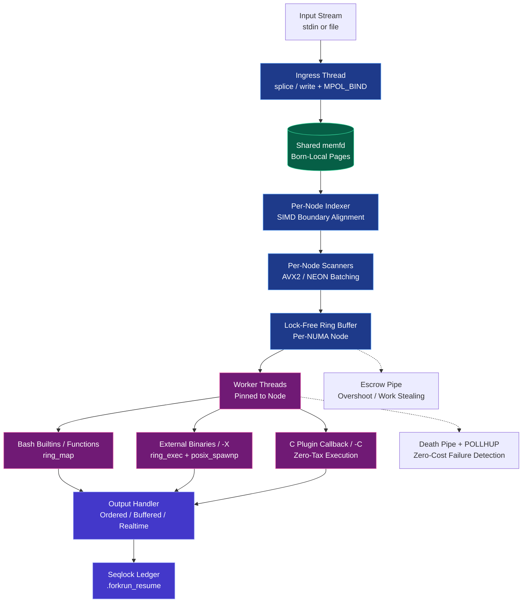

# forkrun Architecture

**High-performance, NUMA-aware, resilient stream parallelization for Linux.**

forkrun is a specialized dataflow engine designed from the ground up for **maximum single-node throughput** on massive streaming workloads, while maintaining strong correctness and resilience guarantees.

## Design Philosophy

> **"Make the fast path boring. Put complexity only where it is required."**

forkrun achieves extreme performance by:
- Eliminating unnecessary work on the happy path
- Treating data locality and monotonic progress as first-class invariants
- Using optimistic execution with cheap recovery instead of heavy coordination
- Leveraging physical hardware constraints (NUMA, cache hierarchy, memory bandwidth)

## Core Architecture Diagram

---

## Major Subsystems

### 1. Born-Local NUMA Pipeline
Proactive data placement ensures that data is physically allocated on the NUMA node that will consume it. This eliminates the vast majority of cross-socket memory traffic that plagues traditional tools.

→ [`BORN_LOCAL_NUMA.md`](BORN_LOCAL_NUMA.md)

### 2. Lock-Free Ring Buffer Core
A carefully designed single-producer, multi-consumer ring per NUMA node with monotonic indices and minimal synchronization.

→ [`DESIGN.md`](DESIGN.md) and [`INVARIANTS.md`](INVARIANTS.md)

### 3. Adaptive Intelligent Batching
A multi-phase controller (warmup → geometric ramp → steady-state) that dynamically tunes batch sizes based on real-time system behavior.

→ [`PHYSICS.md`](PHYSICS.md)

### 4. Resilience & Exactly-Once Protocol
Optimistic execution with near-zero happy-path overhead, instant failure detection via Death Pipe, per-worker recovery, and resume capability.

→ [`RESILIENCE_PROTOCOL.md`](RESILIENCE_PROTOCOL.md) and [`EOF_PROTOCOL.md`](EOF_PROTOCOL.md)

### 5. Execution Backends

| Backend                  | Speed                  | Use Case                          |
|--------------------------|------------------------|-----------------------------------|
| Bash builtins/functions  | Very Fast              | General shell usage               |
| `posix_spawnp` (`-X`)    | Significantly Faster   | External binaries                 |
| C Plugin (`-C`)          | **Fastest**            | Maximum performance callbacks     |

## Documentation Map

- [`FORKRUN_OVERVIEW.md`](FORKRUN_OVERVIEW.md) — High-level introduction and benchmarks
- [`ECONOMIC_IMPACT.md`](ECONOMIC_IMPACT.md) — Value proposition for HPC centers
- [`DESIGN.md`](DESIGN.md) — Engineering blueprint
- [`PHYSICS.md`](PHYSICS.md) — Intuitive mental model
- [`BORN_LOCAL_NUMA.md`](BORN_LOCAL_NUMA.md) — NUMA architecture
- [`RESILIENCE_PROTOCOL.md`](RESILIENCE_PROTOCOL.md) — Failure handling & guarantees
- [`INVARIANTS.md`](INVARIANTS.md) — Formal rules that must never be broken
- [`FLAGS.md`](FLAGS.md) — Command-line reference
- [`EOF_PROTOCOL.md`](EOF_PROTOCOL.md) — End-of-file and stream termination

---
