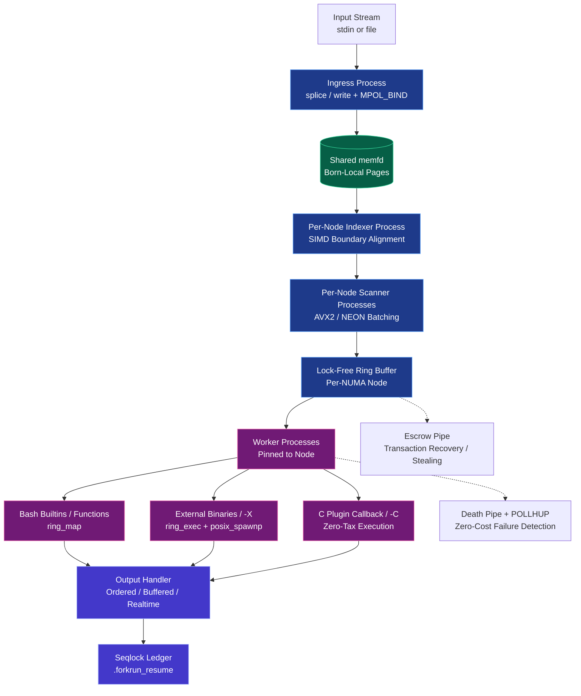

# forkrun Architecture

**High-performance, NUMA-aware, resilient stream parallelization for Linux.**

forkrun is a specialized dataflow engine designed from the ground up for **maximum single-node throughput** on massive streaming workloads, while maintaining strong correctness and resilience guarantees.

## Design Philosophy

> **"Make the fast path boring. Put complexity only where it is required."**

forkrun achieves extreme performance by:
- Eliminating unnecessary work on the happy path
- Treating data locality and monotonic progress as first-class invariants
- Using optimistic execution with cheap recovery instead of heavy coordination
- Leveraging physical hardware constraints (NUMA, cache hierarchy, memory bandwidth)

---

## Core Invariant: The Universal Linear Coordinate System

A cornerstone of `forkrun`'s performance and resilience is the **Universal Coordinate Plane**. All subsystems agree on a single, linear, 64-bit integer byte address space:

```
  0 ───────────────────────────────────────────────────────────────────► ∞
  [── Fallowed (Hole-Punched) ──][── Active Workers ──][── Ingest / Scanner ──]
  0                     Fallow Horizon            Write Head           EOF
```

1. **Zero-Copy Invariance:** Raw data bytes are written into the shared `memfd` once at ingest. No data is ever copied between intermediate queues.
2. **Metadata-Only Routing:** Ingress, Indexers, Scanners, Rings, Workers, and Escrow communicate exclusively by passing lightweight integer slices `[start_offset, end_offset)`.
3. **Entropy Export without Coordinate Collapse:** As workers finish batches, the background fallow thread punches physical holes via `fallocate(FALLOC_FL_PUNCH_HOLE)` behind the consumption horizon. Physical RAM is returned to the OS, but the absolute coordinate scale remains intact.
4. **Deterministic Checkpointing:** The Seqlock crash ledger (`.forkrun_resume`) simply records the completed coordinate frontier (`resume_horizon` + `resume_jagged`). Resuming a pipeline is as simple as skipping previously committed byte intervals on the invariant coordinate plane.

---

## Core Architecture Diagram


```mermaid
flowchart TD
    Input[Input Stream\nstdin or file] 
    --> Ingest[Ingress Process\nsplice / write + MPOL_BIND]

    Ingest --> Memfd[(Shared memfd\nBorn-Local Pages)]

    Memfd --> Indexer[Per-Node Indexer Process\nSIMD Boundary Alignment]
    Indexer --> Scanner[Per-Node Scanner Processes\nAVX2 / NEON Batching]

    Scanner --> Ring[Lock-Free Ring Buffer\nPer-NUMA Node]
    Ring --> Workers[Worker Processes\nPinned to Node]

    Workers --> Backend1[Bash Builtins / Functions\nring_map]
    Workers --> Backend2[External Binaries / -X\nring_exec + posix_spawnp]
    Workers --> Backend3[C Plugin Callback / -C\nZero-Tax Execution]

    Backend1 & Backend2 & Backend3 --> Output[Output Handler\nOrdered / Buffered / Realtime]
    Output --> Checkpoint[Seqlock Ledger\n.forkrun_resume]

    Ring -.-> Escrow[Escrow Pipe\nTransaction Recovery / Stealing]
    Workers -.-> DeathPipe[Death Pipe + POLLHUP\nZero-Cost Failure Detection]

    classDef core fill:#1e3a8a,stroke:#60a5fa,color:white
    classDef memory fill:#065f46,stroke:#34d399,color:white
    classDef path fill:#701a75,stroke:#f472b6,color:white
    classDef output fill:#4338ca,stroke:#a5b4fc,color:white

    class Ingest,Indexer,Scanner,Ring core
    class Memfd memory
    class Workers,Backend1,Backend2,Backend3 path
    class Output,Checkpoint output
```

---

## Major Subsystems

### 1. Born-Local NUMA Pipeline
Proactive data placement ensures that data is physically allocated on the NUMA node that will consume it. This eliminates the vast majority of cross-socket memory traffic that plagues traditional tools.

→ [`BORN_LOCAL_NUMA.md`](BORN_LOCAL_NUMA.md)

### 2. Lock-Free Ring Buffer Core
A carefully designed single-producer, multi-consumer ring per NUMA node with monotonic indices and minimal synchronization.

→ [`DESIGN.md`](DESIGN.md) and [`INVARIANTS.md`](INVARIANTS.md)

### 3. Adaptive Intelligent Batching
An intelligent controller that uses a Pre-Flight SIMD Popcount to compute the globally optimal batch size during orchestrator fork latency, then enters PID steady-state immediately. A geometric fallback engages if a worker spawns before the scan completes. Workers always claim exactly one slot regardless of phase.

→ [`PHYSICS.md`](PHYSICS.md)

### 4. Resilience & Exactly-Once Protocol
Optimistic execution with near-zero happy-path overhead, instant failure detection via Death Pipe, per-worker recovery, and hardened multi-layer resume capability.

- **Crash Escrow:** Lock-free transaction rollback channel for worker transient failures.
- **Seqlock Ledger:** Monotonic `resume_horizon` and jagged-edge interval tracking.
- **3-Layer Resume Security (v3.5.0+):** Parent-shell UID/permission provenance gate (with interactive command preview for shared scratch directories) → `PATH=''` restricted sandbox subprocess → Setup authorization gate.

→ [`RESILIENCE_PROTOCOL.md`](RESILIENCE_PROTOCOL.md) and [`EOF_PROTOCOL.md`](EOF_PROTOCOL.md)

### 5. Execution Backends

| Backend                  | Speed                  | Use Case                          |
|--------------------------|------------------------|-----------------------------------|
| Bash builtins/functions  | Very Fast              | General shell usage               |
| `posix_spawnp` / vfork (`-X`) | Significantly Faster   | External binaries (glibc `posix_spawnp` uses `CLONE_VFORK`) |
| C Plugin (`-C`)          | **Fastest**            | Maximum performance callbacks     |

## Documentation Map

- [`FORKRUN_OVERVIEW.md`](FORKRUN_OVERVIEW.md) — High-level introduction and benchmarks
- [`ECONOMIC_IMPACT.md`](ECONOMIC_IMPACT.md) — Value proposition for HPC centers
- [`DESIGN.md`](DESIGN.md) — Engineering blueprint
- [`PHYSICS.md`](PHYSICS.md) — Intuitive mental model
- [`BORN_LOCAL_NUMA.md`](BORN_LOCAL_NUMA.md) — NUMA architecture
- [`RESILIENCE_PROTOCOL.md`](RESILIENCE_PROTOCOL.md) — Failure handling & guarantees
- [`INVARIANTS.md`](INVARIANTS.md) — Formal rules that must never be broken
- [`FLAGS.md`](FLAGS.md) — Command-line reference
- [`EOF_PROTOCOL.md`](EOF_PROTOCOL.md) — End-of-file and stream termination

---


## Cross-file Contracts (maintainer note)

- **H1:** C writes `RING_NUM_KILLS`/`RING_POISONED`/`RING_BATCH_IDX` only when `num_kills > 0`; wrapper must reset after every ack.
- **M1:** Zero-length sentinel batches must be acked but not executed (`[[ "$REPLY" != "0" ]]` guard).
- **FRUN_CLAIM_BYTES:** EXIT trap escrow deposit gated by claim-active flag to avoid double-deposit.
- **ACTUAL_END OWNERSHIP:** In normal/byte mode, Indexer publishes `actual_end`; in `-L` mode, Indexer skips publication and Scanner publishes in the handoff chain.
- **GATE-RESOLVING WAKEUPS:** Any process publishing `actual_end` or `cum_lines` must execute a SEQ_CST memory barrier and write to `evfd_meta` if `meta_waiters > 0`.
- **CROSS-PROCESS WAIT ESCAPE:** Every cross-process wait must re-check terminal flags (`limit_cutoff_major`, `emergency_abort`) on every loop and use bounded polling (`poll(..., 100)`).
