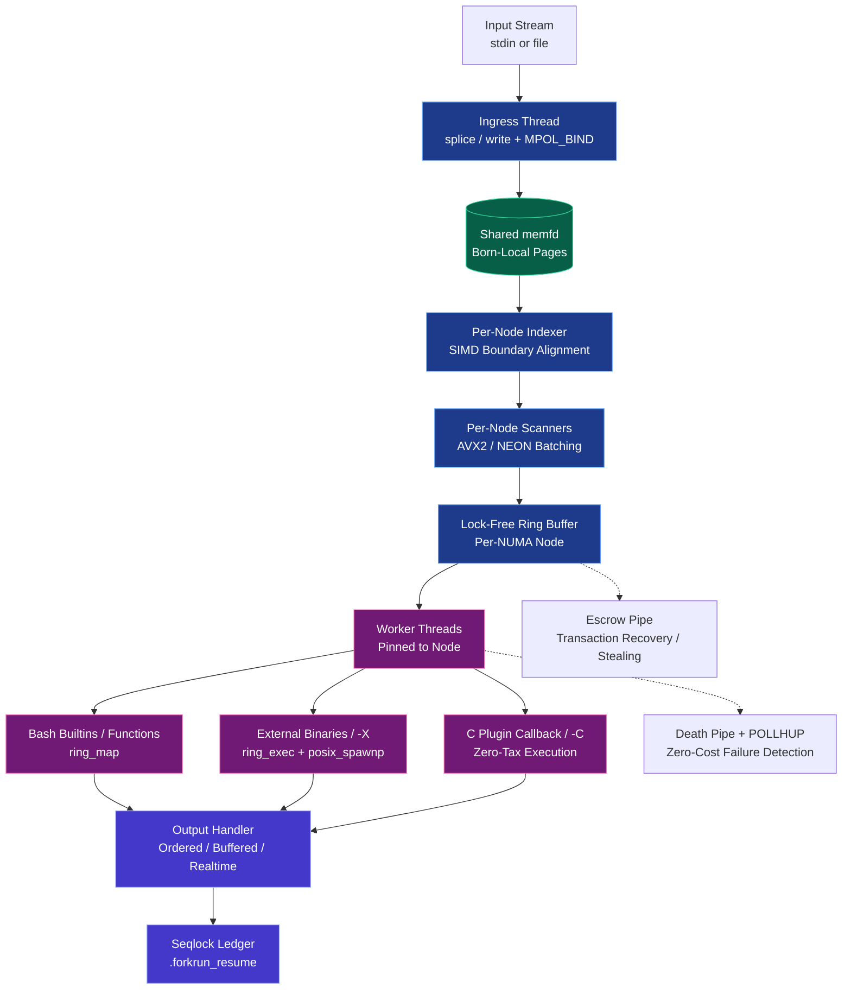

-----------------------------------------
#ARCHITECTURE.md

# forkrun Architecture

**High-performance, NUMA-aware, resilient stream parallelization for Linux.**

forkrun is a specialized dataflow engine designed from the ground up for **maximum single-node throughput** on massive streaming workloads, while maintaining strong correctness and resilience guarantees.

## Design Philosophy

> **"Make the fast path boring. Put complexity only where it is required."**

forkrun achieves extreme performance by:
- Eliminating unnecessary work on the happy path
- Treating data locality and monotonic progress as first-class invariants
- Using optimistic execution with cheap recovery instead of heavy coordination
- Leveraging physical hardware constraints (NUMA, cache hierarchy, memory bandwidth)

## Core Architecture Diagram



---

## Major Subsystems

### 1. Born-Local NUMA Pipeline
Proactive data placement ensures that data is physically allocated on the NUMA node that will consume it. This eliminates the vast majority of cross-socket memory traffic that plagues traditional tools.

→ [`BORN_LOCAL_NUMA.md`](BORN_LOCAL_NUMA.md)

### 2. Lock-Free Ring Buffer Core
A carefully designed single-producer, multi-consumer ring per NUMA node with monotonic indices and minimal synchronization.

→ [`DESIGN.md`](DESIGN.md) and [`INVARIANTS.md`](INVARIANTS.md)

### 3. Adaptive Intelligent Batching
An intelligent controller that uses a Pre-Flight SIMD Popcount to compute the globally optimal batch size during orchestrator fork latency, then enters PID steady-state immediately. A geometric fallback engages if a worker spawns before the scan completes. Workers always claim exactly one slot regardless of phase.

→ [`PHYSICS.md`](PHYSICS.md)

### 4. Resilience & Exactly-Once Protocol
Optimistic execution with near-zero happy-path overhead, instant failure detection via Death Pipe, per-worker recovery, and resume capability.

→ [`RESILIENCE_PROTOCOL.md`](RESILIENCE_PROTOCOL.md) and [`EOF_PROTOCOL.md`](EOF_PROTOCOL.md)

### 5. Execution Backends

| Backend                  | Speed                  | Use Case                          |
|--------------------------|------------------------|-----------------------------------|
| Bash builtins/functions  | Very Fast              | General shell usage               |
| `posix_spawnp` (`-X`)    | Significantly Faster   | External binaries                 |
| C Plugin (`-C`)          | **Fastest**            | Maximum performance callbacks     |

## Documentation Map

- [`FORKRUN_OVERVIEW.md`](FORKRUN_OVERVIEW.md) — High-level introduction and benchmarks
- [`ECONOMIC_IMPACT.md`](ECONOMIC_IMPACT.md) — Value proposition for HPC centers
- [`DESIGN.md`](DESIGN.md) — Engineering blueprint
- [`PHYSICS.md`](PHYSICS.md) — Intuitive mental model
- [`BORN_LOCAL_NUMA.md`](BORN_LOCAL_NUMA.md) — NUMA architecture
- [`RESILIENCE_PROTOCOL.md`](RESILIENCE_PROTOCOL.md) — Failure handling & guarantees
- [`INVARIANTS.md`](INVARIANTS.md) — Formal rules that must never be broken
- [`FLAGS.md`](FLAGS.md) — Command-line reference
- [`EOF_PROTOCOL.md`](EOF_PROTOCOL.md) — End-of-file and stream termination

---

-----------------------------------------
#BORN_LOCAL_NUMA.md

### `BORN_LOCAL_NUMA.md`

# FORKRUN BORN-LOCAL NUMA ARCHITECTURE

This document defines the physical memory-routing architecture of `forkrun`. 

On modern multi-socket HPC systems (e.g., AMD EPYC, Intel Xeon), cross-socket memory access over the Infinity Fabric or QPI link is a primary performance bottleneck. Traditional parallelizers use reactive work-stealing, causing severe cross-socket memory migration. `forkrun` eliminates this via **Born-Local NUMA Placement**, ensuring that data is physically instantiated on the RAM banks of the socket that will process it, and structurally guaranteeing that workers never read across NUMA boundaries.

---

## §1. The Ingress Chunker (Proactive Placement)

The NUMA pipeline begins with a single Ingest thread that divides the input stream into chunks (up to 2 MB) and routes them to specific NUMA nodes *before* they are scanned or processed.

### 1.1 The "First-Touch" Allocation
In NUMA mode, the Ingress thread bypasses zero-copy `splice()` and explicitly uses standard `read()` and `write()` syscalls. 
Before writing a chunk to the shared `memfd`, the thread calls `set_mempolicy(MPOL_BIND)` to bind itself to a specific physical NUMA node. In Linux, the "First-Touch" memory policy dictates that physical RAM pages are instantiated on the node of the thread that first writes to them. By pinning itself, writing the chunk, and then re-pinning itself to the next node, the Ingress thread effectively stripes the `memfd` across the physical topography of the motherboard.

### 1.2 Backpressure & The Geometric Accumulation Ramp
Chunks are not distributed blindly. 
1. **The 1MB Pipe Resize:** If `stdin` is a kernel pipe, `forkrun` expands the kernel pipe buffer to 1 MB to allow massive reads and reduce syscall overhead.
2. **Geometric Accumulation:** To prevent kernel memory-policy thrashing on small pipe reads, the Ingest thread buffers data to the current NUMA node before switching. It starts at a 64 KB floor and geometrically doubles (up to 2 MB). This ensures tiny files are perfectly distributed across all sockets, while massive streams pool into deep 2 MB reservoirs.
3. **Starvation Backpressure:** If any other NUMA node completely empties its local queue, the Ingest thread cuts the accumulation phase short to immediately feed the starving node.
4. **Dynamic Buffer Scaling:** The Ingest thread maintains a "read-ahead" buffer limit. Using a bounded Infinite Impulse Response (IIR) filter, it scales this limit dynamically between 4 and 128 chunks.

---

## §2. The Per-Node Indexers (Boundary Alignment)

Because the Ingress chunker splits data arbitrarily at physical 2 MB byte boundaries, a chunk will almost always split a record (e.g., a line of text) in half. 

To resolve this, each NUMA node has a dedicated Indexer thread pinned to its socket. 
1. The Indexer uses SIMD-accelerated `memrchr` to scan backwards from the end of its assigned 2 MB chunk to find the final delimiter.
2. This delimiter becomes the *real* logical end of the chunk. 
3. The *real* logical start of the chunk is simply the real end of the previous chunk.

**The Physics Trade-off:** By doing this, a node's Indexer must read a few dozen bytes belonging to the adjacent chunk (which physically resides on a different NUMA socket). `forkrun` intentionally trades this microscopic penalty (~100 bytes of cross-socket traffic per 2 MB chunk) for the absolute guarantee that chunk boundaries perfectly align with record delimiters. 

---

## §3. The Per-Node Scanners

Once the Indexers establish the exact logical boundaries, the per-node Scanners (also pinned to their respective sockets) find the internal record boundaries and publish work batches.

Scanners in NUMA mode differ from standard UMA scanners in three ways:
1. **No Tail Cooldown:** NUMA scanners do not artificially ramp down batch sizes at the end of a chunk. They operate at maximum throughput until the chunk boundary is hit, at which point the final partial batch is published as a normal single-slot entry with `FLAG_MAJOR_EOF` set in `minor_ring`. Workers claim it identically to any other slot.
2. **The Scanner Shield:** Scanners are strictly limited in how far they can read ahead of the worker pool. This prevents a fast scanner from blowing out the L2/L3 cache with metadata while workers are still processing older batches.
3. **Topology-Aware Stealing:** If a Scanner runs out of local chunks, it is allowed to steal an unprocessed chunk from another NUMA node. However, to prevent thrashing, it will only steal if the victim node has a backlog exceeding a topological threshold: `1 + (NUMA_distance / 10)`. Under extreme starvation (e.g., EOF is reached and no new data will ever arrive), this threshold collapses to `1`, allowing full cluster drain.

---

## §4. The Worker Pools & The Structural Guarantee

Workers are pinned to specific NUMA nodes and consume work exclusively from their local Scanner's ring buffer (or Escrow pipe). 

### 4.1 The `FLAG_MAJOR_EOF` Chunk-End Marker

To ensure workers and the ordering subsystem can detect the end of each NUMA chunk, the Scanner sets bit 31 (`FLAG_MAJOR_EOF = 1U << 31`) in the `minor_ring` entry of the **last batch in every chunk**. The `minor_ring` field otherwise holds the batch's within-chunk sequence number (bits 30–0), used by `ring_order` for global merge ordering.

The old `stride_ring` / `FLAG_CHUNK_BOUNDARY` mechanism (which embedded line counts and a boundary flag in a 16-bit field) has been replaced by the `offset_ring` + `end_ring` pair (explicit start/end byte offsets) and `FLAG_MAJOR_EOF` in `minor_ring`. The Scanner now fully determines all batch boundaries before publishing to the ring, so workers never need to detect a boundary mid-claim.

When a worker executes its lock-free claim (`atomic_fetch_add` of exactly 1), it receives a single ring slot covering a byte range `[offset_ring[slot], end_ring[slot])`. A slot marked with `FLAG_MAJOR_EOF` is processed identically to any other slot — the flag is only consumed by the `ring_order` output-ordering thread to advance its major sequence counter.

### 4.2 The Ultimate Structural Guarantee
Because:
1. Indexers perfectly align chunk boundaries with record delimiters.
2. Scanners bound every batch within a single chunk and mark the final batch with `FLAG_MAJOR_EOF` in `minor_ring`.
3. Workers claim exactly one slot at a time; a single-slot claim by definition cannot span two chunks.

...`forkrun` provides a **mathematical, structural guarantee that no worker will ever receive a batch that spans two non-contiguous chunks.**

Because chunks are guaranteed to be isolated to a single physical NUMA socket via the Ingress thread's `MPOL_BIND` First-Touch allocation, **a worker will never execute a memory read that physically crosses a NUMA boundary** (unless explicitly stealing due to starvation). 

---

## §5. Architectural Trade-offs: Exact Batch Sizing (`-L`)

This architecture enforces one strict limitation: **`forkrun` cannot guarantee exactly *N* lines per batch in NUMA mode.**

Because the Ingress chunker carves the stream based on physical byte sizes (2 MB) rather than logical line counts, a chunk will contain an arbitrary number of lines. Guaranteeing exactly *N* lines per batch would require every chunk to magically contain an integer multiple of *N* lines. 

If a user's workload strictly requires exactly *N* lines per batch (`-L` flag), fulfilling the exact-batch contract at a chunk boundary would require the worker to pull the remaining $N - M$ lines from the next chunk (which physically resides on a different NUMA socket), violating the Born-Local structural guarantee and triggering heavy cross-socket memory traffic.

**The Resolution:** 
If a user's workload strictly requires exactly *N* lines per batch (`-L` flag), `forkrun` automatically demotes the pipeline to the traditional UMA (Uniform Memory Access) architecture. While UMA mode still benefits from the ultra-fast C-ring and zero-copy `posix_spawnp` execution paths, it will incur the standard cross-socket memory migration tax inherent to all traditional shell parallelizers.

-----------------------------------------
#C_PLUGIN.md

### `C_PLUGIN.md`

# NATIVE C PLUGINS: "Zero-Tax" Execution (v3.2.1+)

For workloads where absolute maximum throughput is required, `forkrun` can bypass both the Bash AST and external `vfork`/`exec` overhead entirely by loading a native C function and executing it directly inside the persistent worker threads.

We call this **"Zero-Tax" Execution**. It is the fastest possible way to process data in `forkrun`.

When you run an external binary (e.g., `frun -X /bin/my_tool`), the OS still has to `posix_spawnp` a new process for *every single batch*. While `forkrun` makes this incredibly fast, process creation still has a physical limit in the Linux kernel. With the `-C` flag, your C function is loaded via `dlopen`. When a batch is claimed, the worker simply invokes a function pointer. **Process creation overhead drops to literally zero.**

---

## §1. The Basic Interface: Drop-In Replacement

To make porting existing tools as simple as possible, `forkrun` expects your C callback to use the standard POSIX `main`-style signature.

### 1. Write the Plugin (`plugin.c`)
Here is a minimal example. You can literally rename `main` to `my_plugin` in existing C utilities, and they will immediately scale across 64+ cores with zero IPC overhead.

```c
#include <stdio.h>

// Standard signature - acts exactly like a normal CLI program
int my_plugin(int argc, char **argv) {
    // Process each item in the batch
    for (int i = 0; i < argc; i++) {
        // Your blazing-fast data transform here
    }
    
    // Return 0 on success. 
    // Returning 200 (or returning any non-zero code while the -E flag is active) automatically triggers forkruns resilience machinery.
    return 0; 
}
```

### 2. Compile as a Shared Library
Compile your C file into an optimized, position-independent shared object (`.so`):

```bash
gcc -O3 -shared -fPIC plugin.c -o plugin.so
```

### 3. Execute with forkrun
Use the `-C` flag and pass the path to your shared object. Append `:function_name` so `forkrun` knows which symbol to load.

```bash
# Syntax: frun -C /path/to/plugin.so:<function_name> < inputs

# Example:
frun -C ./plugin.so:my_plugin < massive_dataset.txt
```

---

## §2. Advanced Usage: The Execution Context

If your native C code needs to know *which* batch it is processing, its byte offset in the file, or if it is recovering from a crash, `forkrun` can pass a detailed context struct directly to your function as a 3rd argument. 

Because `forkrun` is a zero-dependency, single-file deployment, we provide two ways to access this struct:

### Option A: The Header File (For structured projects)
Download `forkrun_plugin.h` from the repository and include it in your project.

```c
#include "forkrun_plugin.h"

// 1. Opt-in flag: Tell forkrun to pass the context pointer
int forkrun_use_ctx = 1;

// 2. Define your function with the 3-argument signature
int my_func(int argc, char **argv, const struct forkrun_ctx *ctx) {
    
    printf("Worker %u processing batch %lu\n", ctx->worker_id, ctx->batch_index);
    return 0;
}
```

### Option B: Copy-Paste (For single-file scripts / restricted nodes)
You do not actually *need* the header file. Because C only cares about memory layout, you can simply paste the struct definition directly into the top of your `plugin.c` file. This allows you to write, compile, and run C-plugins on highly restricted HPC login nodes without managing include paths.

```c
#include <stdint.h>
#include <stdio.h>

// 1. Opt-in flag: Tell forkrun we want the context!
int forkrun_use_ctx = 1;

// 2. The Context Struct (Matches forkrun v3.3.0+ layout)
struct forkrun_ctx {
    uint64_t batch_index;       // Global batch sequence number
    uint64_t batch_offset;      // Byte offset in the shared memfd
    uint64_t batch_byte_length; // Length of the current batch in bytes
    uint32_t version;           // Struct version (currently 1)
    uint32_t worker_id;         // Internal Worker ID (0 to N)
    uint32_t node_id;           // NUMA node ID
    uint32_t num_kills;         // Retry count (if batch previously failed)
    uint32_t numa_major;        // NUMA major sequence (0 if UMA)
    uint32_t numa_minor;        // NUMA minor sequence (0 if UMA)
    int32_t  fd_in;             // Read-only file descriptor to the memfd
    char     delimiter;         // The record delimiter character
    uint8_t  cfg_state[3];      // Global configuration state (unpacked from 24-bit cfg_state)
};

// 3. Process the data
int my_func(int argc, char **argv, const struct forkrun_ctx *ctx) {
    
    // Safely check ABI version before accessing newer fields
    if (ctx->version >= 1) {
        printf("Worker %u mapping %lu bytes at offset %lu\n", 
               ctx->worker_id, ctx->batch_byte_length, ctx->batch_offset);
    }
    
    return 0;
}
```

---

## §3. How the ABI Trick Works (Under the Hood)

If you are a systems hacker, you might wonder how `forkrun` handles dynamically loading functions that might have 2 arguments OR 3 arguments without corrupting the stack.

`forkrun` uses `dlsym` to inspect the loaded `.so` for the `forkrun_use_ctx` variable. 
* If it finds the flag and it equals `1`, `forkrun` executes the callback using the 3-argument signature, passing the context pointer. 
* If it does not find the flag, it falls back to the standard 2-argument signature.

This guarantees total POSIX compliance and avoids Undefined Behavior, while giving power-users zero-overhead access to `forkrun`'s internal ring metadata. Furthermore, the `cfg_state[3]` array exposes the engine's internal configuration state while maintaining strictly aligned 8-byte memory boundaries regardless of underlying hardware architecture, and the `version` tag allows us to expand the context in future v3.x releases without breaking older plugins.

-----------------------------------------
#DESIGN.md

### `DESIGN.md`

# forkrun Ring Architecture – Design Overview

## 1. Purpose

This document explains the internal architecture of **forkrun**’s ring-based execution engine. It focuses on *why* each mechanism exists, the invariants it maintains, and how the pieces interact under load. It is intended for readers who want to understand or extend the system.

The core goals are:

* Extremely high throughput on streaming workloads
* Minimal overhead on the fast path
* Correctness under bursty, skewed, or adversarial input
* Pure Bash compatibility with optional native accelerators

The guiding philosophy is:

> **Fast path is boring. Slow path is where complexity belongs.**

---

## 2. High-Level Model

forkrun consists of four cooperating roles (three in legacy flat mode, four when NUMA is active):

1. **NUMA Ingest** – Zero-copy splice from stdin into the shared memfd, routing data to the correct socket via `set_mempolicy`.
2. **Indexers / Scanners** – Identify line boundaries and publish availability into per-node rings.
3. **Workers** – Claim batches and execute user commands.
4. **Coordinator State** – Per-node shared-memory rings + global coordination primitives.

All coordination is done through shared memory, atomic operations, and kernel primitives (eventfd + pipes). No locks are taken on the fast path.

When `--nodes=1` (or auto-detected as single node) the system falls back to the classic flat pipeline while preserving every invariant.

---

## 3. The Ring Buffer

### 3.1 What the Ring Represents

The ring does *not* contain data. It contains **offset markers** into an append-only backing file (typically on tmpfs).

Each ring entry represents:

* A boundary where new data becomes visible
* Optionally, a marker that the batch is partial

This allows:

* Zero-copy data sharing
* Arbitrarily large inputs
* Workers to operate independently

### 3.2 Ring Entry Encoding

Each ring slot is described by up to four parallel arrays:

* `offset_ring` (64-bit): Start byte offset of the batch in the backing memfd.
* `end_ring` (64-bit): End byte offset of the batch. The worker's data range is `[offset_ring[slot], end_ring[slot])`. No line count is stored; the byte range is sufficient.
* `major_ring` (32-bit, NUMA only): The NUMA chunk sequence number this batch belongs to, used by `ring_order` to merge per-node streams into global output order.
* `minor_ring` (32-bit, NUMA only): The batch's sequence number within its chunk.
  * **Bit 31 (`FLAG_MAJOR_EOF = 1U << 31`)**: Set on the *last* batch of a NUMA chunk, signaling the ordering subsystem to advance to the next major sequence. Clear on all other batches.
  * **Bits 30–0**: The minor (within-chunk) batch index.

### 3.3 Atomic Invariants

* `write_idx` monotonically increases
* `read_idx` monotonically increases
* Each ring slot is written once, read once
* Readers never observe an uninitialized slot

Memory ordering:

* Scanner publishes ring entries with **release** semantics
* Workers consume them with **acquire** semantics

In NUMA mode each socket has its own independent `SharedState` ring; the invariants hold per node.

---

## 4. Claiming Work

### 4.1 Fast Path Claim

The fast path is intentionally simple:

1. Load `write_idx`
2. Atomically increment `read_idx` by exactly **1**
3. Compute offsets from the single claimed ring slot
4. Execute batch

No polling, no blocking, no branching beyond bounds checks. The scanner has already pre-calculated the byte/line boundaries for this slot. If sufficient data exists, the worker never sleeps.

### 4.2 Waiting (Case 1)

If `read_idx >= write_idx`, the worker:

* Increments a waiter counter
* Polls an eventfd
* Sleeps until the scanner publishes more data

Wakeups are advisory; spurious wakeups are harmless.

---

## 5. Transaction Recovery and Fault Tolerance

### 5.1 The Single-Slot Claim Invariant

*Note: In versions prior to v3.3.0, workers could speculatively over-claim multiple batches and divide them. This complex overshoot mechanism was permanently excised in favor of the Single-Slot Claim Invariant (see INVARIANTS.md).*

A worker always claims exactly 1 slot (1 batch) per atomic operation. Because the scanner completely pre-calculates boundaries, there is no longer a concept of partial remainders or subdivision.

### 5.2 The Escrow Recovery Queue

To handle fault-resilience, forkrun repurposes the **escrow** pipe:

* A non-blocking anonymous pipe (per-node in NUMA mode)
* Entries contain: starting offset + line count of the aborted batch

If a worker process crashes, is killed by OOM, or explicitly fails, its active transaction is rolled back:

1. It is caught by the parent or trap handler
2. The exact single-slot bounds are published to escrow
3. Availability is signaled via `evfd_data`

### 5.3 Escrow Stealing

Idle workers:

* Check escrow before touching the ring
* If work exists, steal it
* Consume the recovered batch exactly as normal

This ensures fault tolerance without requiring complex rollback tracking in the core scanner logic.

---

## 6. Eventfd Usage

Eventfds are used strictly as **wake signals**, never as state.

There are multiple eventfds:

* Data availability (per-node)
* Worker spawning
* Escrow recovery notifications
* EOF signaling

Properties:

* Semaphore mode prevents counter overflow
* Spurious wakeups are allowed
* Missed wakeups are impossible due to monotonic indices

This keeps the design robust and simple.

---

## 7. Scanner Control Logic (Two-Phase Model with Geometric Fallback)

The scanner operates in two primary phases, with a geometric fallback if the preferred pre-flight path is interrupted.

### Phase 0: Pre-Flight Popcount (Latency Hiding)

During the Bash orchestrator's fork latency window — while workers are being spawned — the scanner uses a SIMD `fast_count_delim` (AVX2/NEON) pass to count the total lines already present in the backing file. If it reaches `Wmax * Lmax` lines (or EOF arrives first), it computes the globally optimal initial batch size `L = total_lines / W` and jumps directly to Phase 2 (PID steady-state).

This converts orchestrator latency from dead time into useful calibration work. When workers begin claiming, the batch size is already at its optimal value.

### Phase 1: Geometric Fallback (Interrupted Pre-Flight)

If a worker spawns before the pre-flight scan reaches `Wmax * Lmax` lines, the scanner hot-swaps its simulated batch size `sim_L` into the live state and resumes doubling (`L *= 2`) to quickly converge on the optimal size. This achieves O(log L) convergence and halts immediately on input stall.

**Workers are completely oblivious to this phase.** The scanner changes the contents of ring slots (larger batches per slot); workers always claim exactly 1 slot regardless.

### Phase 2: PID-like Steady State (Adaptive Equilibrium)

Scanner periodically measures:
* Input publish rate
* Consumption rate
* Backlog depth
* Active worker count

Batch size is adjusted conservatively toward a target. Adjustments are slow to avoid oscillation.

**Tail handling**: once EOF is imminent, the scanner stops changing batch size and publishes final partial batches as normal single-slot entries bounded by chunk/EOF boundaries. Workers drain the tail identically to normal operation — no special-case logic required.

### Phase 2b: Early Partial Flush (Low-Latency Trickle Mode)

Under normal load the scanner accumulates a full batch of `L` lines before publishing. However, when stdin is arriving slowly *and* workers are sitting idle, holding a partial batch in the scanner adds latency without benefit. The scanner detects this condition and flushes early.

**The two signals:**

* `stall_meter` — exponential moving average of input-stall events. It grows each time a read attempt on the backing file returns no new data (stdin is not delivering), and decays each time a read succeeds. It reflects the *sustained* rate of input stalls.
* `starve_meter` — exponential moving average of worker-starvation events. It grows each time `active_waiters > 0` is observed at the natural meter-update point, and decays otherwise. It reflects whether workers have been *sustainedly* idle.

**Why both are required:**

* Stall only (no starve): workers are keeping up with or ahead of stdin — there is no idle worker waiting for the partial batch. No benefit to flushing early.
* Starve only (no stall): data is available in the backing file but workers are consuming faster than the scanner can scan. Flushing smaller partial batches increases the scanner's per-line overhead and makes this situation worse, not better.
* Both saturated: stdin is arriving slowly AND workers are idle. Flushing the partial batch reduces latency at no throughput cost.

**Implementation detail:**

Both meters use the same EWMA kernel (`meter = (meter + xLim) >> 1` to grow, `meter >>= 1` to decay) with threshold `xLim - 3 = W + DAMPING_OFFSET - 3`. Meters update at their natural observation points on every loop iteration — not at flush time — so they track ongoing system state independently of flush frequency. The stall signal is captured into an `experienced_stall` flag at detection time and passed to the control macro at flush time, ensuring the signal is correctly scoped to the interval between flushes.

---

## 8. NUMA Topology Pipeline

When multiple NUMA nodes are present:

```
stdin
  ↓ ring_numa_ingest (splice + set_mempolicy)
shared memfd
  ↓ index_pipe
ring_indexer_numa (boundary alignment + node routing)
  ↓ per-node pipes
ring_numa_scanner[N] (pinned to node)
  ↓ publish to per-node ring
Workers (claim from local ring or escrow)
```

Data is **born-local** at ingest time. Scanners are pinned. Workers inherit locality via `RING_NODE_ID`. Cross-socket traffic is minimized to the claim-pipe back-pressure and occasional escrow steals.

---

## 9. Memory Reclamation (Fallowing)

The backing file grows monotonically.

A background GC process:

* Observes the minimum active offset
* Punches holes behind it using `fallocate(PUNCH_HOLE)`

This:
* Preserves offsets
* Avoids fragmentation
* Requires no coordination with workers

---

## 10. Output Ordering

* `--realtime` / `--unbuffered`: direct to stdout
* `--ordered` / `--buffered`: per-worker memfd + `ring_order` (NUMA-aware major/minor merging using the ordering keys published by scanners)

The reorder path is the only place that may block.

---

## 11. Design Summary & Mental Model

Key properties of the architecture:

* Lock-free fast path
* Explicit slow paths
* Monotonic indices instead of condition variables
* Advisory wakeups
* Opportunistic load balancing
* Born-local NUMA data flow

**Mental model** (from PHYSICS.md):

> A speculative, cooperative work-stealing engine where correctness is enforced by monotonic progress, not locks — where the optimal batch size is computed during fork latency by a SIMD pre-flight scan — and where data is physically born on the correct socket.

Once that model clicks, the rest of the design follows naturally.

**See also:** `INVARIANTS.md` (the formal never-break list) and `PHYSICS.md` (the geophysics perspective).

-----------------------------------------
#ECONOMIC_IMPACT.md

# Reclaiming Exascale Capacity: The Economic Case for forkrun on Frontier

**Executive Summary**  
As exascale systems like Frontier push GPU solvers to extreme speeds, CPU-based data preparation and post-processing pipelines remain bottlenecked by tools designed for a pre-NUMA era. On Frontier, GNU Parallel’s single-threaded dispatcher leaves entire nodes operating at ~6% CPU utilization during data-prep phases while the GPUs sit idle waiting for input. This inefficiency wastes not only CPU cycles but also the far more expensive GPU resources and prevents other science teams from using the oversubscribed system.

**forkrun** is a NUMA-aware, contention-free parallelizer that replaces GNU Parallel and `xargs -P`. On Frontier it is expected to accelerate data-prep pipelines by **10×–1000×** while raising CPU utilization from ~6% to >95%. This directly reclaims massive amounts of wasted node-hours, increasing total scientific throughput without additional hardware. 

---

### The Hidden Cost of Data Prep on Exascale

Frontier is heavily oversubscribed. Every node-hour is a strictly constrained resource.  
Scientific campaigns routinely spend a significant fraction of their allocation simply preparing data (unzipping, filtering, reformatting, routing inputs to GPUs). Most users parallelize this work with GNU Parallel, whose single-threaded Perl dispatcher is oblivious to Frontier’s deep NUMA topology (4 NUMA domains per 64-core Trento CPU).

**The result is severe economic inefficiency:**  
When dispatching microsecond-scale tasks, GNU Parallel saturates one core while the remaining 63 CPUs — **and the expensive GPUs that depend on them** — sit largely idle. The node continues to consume full baseline power and facility resources while delivering only ~6% useful work. Meanwhile, other science teams are denied or delayed because Frontier’s node hours are being wasted on inefficient data preparation.

---

### Estimated Economic Impact

Frontier’s fully-loaded operational cost (power, staff, facility, hardware amortization) is approximately **$1M per day**. Even modest reductions in wasted data-prep time yield large returns:

| Scenario   | Data-prep share of allocation | Expected speedup on Frontier | Recovered capacity for actual science | Estimated annual value |
|------------|-------------------------------|------------------------------|---------------------------------------|------------------------|
| Floor      | 5%                            | 10×                          | ~4.5%                                 | $15–18M/year           |
| Moderate   | 15%                           | 20×                          | ~14.2%                                | $45–55M/year           |
| High       | 30%                           | 30×                          | ~29.0%                                | $100-110M/year         |

These figures assume conservative speedup ranges based on Frontier’s 64-core Trento CPUs and 4× NUMA domains. A short Director’s Discretionary validation run would quantify the exact numbers for Frontier workloads.

---

### The forkrun ROI: Efficiency, Throughput, and Accessibility

forkrun treats data flow as a physical system. Using born-local NUMA placement, lock-free claiming, and SIMD scanning, it eliminates dispatcher overhead and scales cleanly across all four NUMA domains on Frontier’s Trento CPUs — achieving >200,000 batch dispatches per second versus ~500 for GNU Parallel.

This directly improves four key metrics:

1. **Cost per Unit Science** — Compresses multi-hour data-prep jobs into minutes, amortizing fixed node costs over far more useful output.  
2. **Total Scientific Output** — Reclaims oversubscribed node-hours and returns them to the allocation pool for actual simulation.  
3. **Expanding the Parallelizable Surface Area** — Users can parallelize arbitrary multi-step shell functions with zero `fork`/`exec` overhead (`frun my_func < inputs`).  
4. **Zero Refactoring Cost** — Drop-in replacement. Existing workflows require only changing the command name.

---

### Proposed Next Steps

forkrun is currently an open-source (MIT) tool proven on both UMA and NUMA hardware. To bring it to production readiness on Frontier, I propose a targeted collaboration:

1. **Validation** — Use a Director’s Discretionary allocation to run synthetic benchmarks on Frontier’s Trento nodes and capture real NUMA telemetry (expected: near-zero cross-socket traffic).  
2. **Case Studies** — Partner with 2–3 existing OLCF user groups currently bottlenecked by `parallel` or `xargs` in their data-prep pipelines.  
3. **Rollout** — Quantify recovered node-hours from these studies to justify facility-level integration of forkrun into the OLCF software stack.

---

### Contact / Source

**Anthony Barone**  
BSc Geophysics (UC Berkeley) • MSc Geophysics (UT Austin — advised by Mrinal Sen)
Dandridge, TN (1 hour from ORNL) | anthonywbarone@gmail.com | (858) 735-2342
https://github.com/jkool702/forkrun
Background: Computational Geophysics & Inverse Theory

-----------------------------------------
#EOF_PROTOCOL.md

### `EOF_PROTOCOL.md`

# FORKRUN EOF PROTOCOL

This document defines the formal protocol by which forkrun detects end-of-input and guarantees clean termination without lost wakeups, premature exits, or deadlocks. This protocol is a first-principles design, not derived from existing systems.

> **Scope:** This protocol governs the Scanner→Worker boundary (`ring_claim`, `core_scanner_loop`). The Ingest→Scanner boundary uses a simplified 2-condition variant of the same rules.

---

## §1. The Three Conditions for EOF

EOF is determined by **three conditions simultaneously being true**, checked in the following **strict order**:

| # | Condition | Meaning |
|---|---|---|
| **C1** | Parent/supplier has declared EOF | The local work supplier has permanently finished. There will **never** be more local work arriving. |
| **C2** | No local work remains | The local ring is fully drained (`read_idx >= write_idx`). |
| **C3** | No non-local work remains | When applicable: no work available in the escrow pipe, and no chunks available to steal from other nodes. |

### Ordering Rules

- **C1 must be true before C2 matters.** If the supplier hasn't declared EOF, an empty ring simply means "wait for more data."
- **C1 and C2 must both be true before C3 matters.** If local work exists, the worker must consume it before checking non-local sources.
- **All three conditions must be re-verified in order.** If any condition fails during the sequential check, the worker must loop back and re-check from C1.

### Implementation

In the code, this manifests as:

```c
// C1: Has the supplier declared EOF permanently?
if (atomic_load_acquire(&local_state->scanner_finished)) {

    // C2: Re-verify local work is empty AFTER observing Supplier EOF
    if (atomic_load_acquire(&local_state->read_idx) <
        atomic_load_acquire(&local_state->write_idx)) {
        continue;  // Local work exists → loop back to C1
    }

    // C3: Re-verify non-local work (Escrow) is empty AFTER C1 & C2
    if (fd_escrow_r && fd_escrow_r[my_numa_node] >= 0) {
        struct pollfd pfd = {.fd = fd_escrow_r[my_numa_node], .events = POLLIN};
        if (poll(&pfd, 1, 0) > 0 && (pfd.revents & POLLIN)) {
            continue;  // Escrow work exists → loop back to C1
        }
    }

    // All 3 conditions met in order. Terminate.
    return 2;
}
```

**Reference:** `ring_claim_main()` in `forkrun_ring.c`.

---

## §2. The EOF eventfd

Each NUMA node (or the single UMA node) has a dedicated EOF eventfd (`evfd_eof_arr[node]`). This eventfd has special semantics that differ from the data eventfds.

### Rules

1. **Write-once.** The EOF evfd is written exactly once per node, immediately before the scanner exits. Once non-zero, it stays non-zero forever.

2. **Never consumed.** The EOF evfd is **polled but never read** (`sys_read` is never called on it). This ensures that once it becomes non-zero, every subsequent `poll()` call that includes it will return immediately with `POLLIN`.

3. **Written only after finalization.** The EOF evfd is written **only after** the scanner has:
   - Published all final work to the ring (`write_idx` updated with release semantics)
   - Set `scanner_finished = 1` (with release semantics)

   This guarantees that any worker woken by the EOF evfd will observe the fully published final state.

### Purpose

The EOF evfd exists solely to **break blocking polls**. Without it, a worker blocked in `poll(-1)` waiting for data would never wake up after the scanner finishes, because the data evfd might not fire again. The EOF evfd guarantees that all polls return instantly once there will never be more data.

### Implementation

**NUMA path:**
```c
atomic_store_release(&local_state->write_idx, local_scan_idx);   // 1. publish final work
atomic_store_release(&local_state->scanner_finished, 1);          // 2. declare EOF
uint64_t blast = 999999;
sys_write(evfd_eof_arr[my_node_id], &blast, 8);                   // 3. wake all polls
```

**UMA path:**
```c
atomic_store_release(&local_state->write_idx, local_scan_idx);   // 1. publish final work
atomic_store_release(&local_state->scanner_finished, 1);          // 2. declare EOF
uint64_t blast = 999999;
sys_write(evfd_eof_arr[0], &blast, 8);                            // 3. wake all polls
```

**Reference:** `core_scanner_loop()` finalization in `forkrun_ring.c`.

---

## §3. Simultaneous Polling Rules

When a worker or scanner blocks in `poll()` waiting for events, it must follow strict rules about **which eventfds are polled simultaneously** and **in what order events are processed**.

### Rule 3.1: Co-polling Requirements

Any poll that waits for a **lower-priority** event **must simultaneously poll all higher-priority events** until those higher-priority conditions are confirmed met.

| Poll waiting for... | Must also poll... | Rationale |
|---|---|---|
| Local data | EOF evfd | Must detect EOF to avoid infinite wait when no more data will arrive. |
| Non-local data (escrow) | Local data evfd **and** EOF evfd | Must detect local work (higher priority) and EOF. Local work must be consumed before non-local work. |

Once a higher-priority condition is confirmed (e.g., `scanner_finished` is true), the lower-priority poll no longer needs to actively wait for it — the EOF evfd ensures any subsequent poll returns instantly.

### Rule 3.2: Event Processing Priority

When a simultaneous poll returns with multiple events ready, they **must be processed in the following strict order**:

| Priority | Event | Action |
|---|---|---|
| **1 (highest)** | Local work evfd is non-zero | Consume (read) the evfd and loop back to claim local work. |
| **2** | Non-local work evfd is non-zero (when applicable) | Consume it and loop back to claim non-local work. |
| **3 (lowest)** | EOF evfd is non-zero | Exit **only** when the EOF evfd is non-zero **and** all work evfds are zero. |

This priority ordering prevents a race where a worker sees EOF and exits while there is still unconsumed work signaled by a data evfd that fired simultaneously.

### Rule 3.3: Optional Co-polling

When polling for **local** data, it is acceptable (but not required) to **also** poll for non-local data. If both return non-zero simultaneously, the standard priority rules from §3.2 apply: **local data is consumed first**.

This is in contrast to polling for **non-local** data, where simultaneously polling for local data is **mandatory** (Rule 3.1).

---

## §4. Escrow Priority Inversion

There is exactly one exception to the standard priority ordering defined in §3.2.

### The Exception

When a worker deposits a failed batch into the escrow pipe (due to a transient failure or crash recovery), **that specific worker** should temporarily **invert its priority** to check escrow **before** the local ring on its next claim attempt.

### Rationale

Without this inversion, the escrowed batch could sit in the pipe until all local ring work is exhausted. In ordered mode (`-k`), this means the orderer would be blocked waiting for a batch that exists but isn't being processed, limiting throughput and causing unnecessary head-of-line blocking.

By prioritizing escrow immediately after depositing, the depositing worker (or another worker, if the depositing worker's escrow was already consumed) recovers the batch quickly, keeping the output ordering pipeline flowing.

### Rules

1. The priority inversion is **per-worker** (thread-local). It does **not** affect any other worker's priority.
2. The inversion flag is **one-shot**: it is cleared unconditionally at the start of the next claim attempt, regardless of whether the escrow read succeeds.
3. If the escrow pipe is empty (another worker already consumed it), the worker falls through to the standard priority ordering with no penalty.
4. **Crash Validation**: Reclaimed escrow packets must NOT bypass the `write_idx` validation (which prevents reading uninitialized ring data when the scanner hasn't published the slots yet). Therefore, post-escrow jumps must target `evaluate_claim` instead of `check_boundaries`.

### Implementation

```c
// At top of restart_loop, BEFORE the normal ring check:
if (tl_recently_escrowed) {          // TLS flag, set when depositing into escrow
    tl_recently_escrowed = false;    // One-shot: clear unconditionally
    if (fd_escrow_r && fd_escrow_r[my_numa_node] >= 0) {
        struct EscrowPacket ep;
        ssize_t er;
        do {
            er = read(fd_escrow_r[my_numa_node], &ep, sizeof(ep));
        } while (er < 0 && errno == EINTR);
        if (er == sizeof(ep)) {
            // Safely jump to the write_idx check block. If this is an
            // crash-recovery packet, we MUST wait for the scanner to publish it!
            goto evaluate_claim;
        }
    }
}
// ... fall through to normal priority: ring first, then escrow
```

**Reference:** `ring_claim_main()` in `forkrun_ring.c`.

---

## §5. Scanner-Side EOF (Ingest → Scanner)

The Scanner uses a simplified 2-condition variant of this protocol to detect when the Ingest stage has finished writing data to the memfd.

| # | Condition | Mechanism |
|---|---|---|
| **C1** | Ingest has declared EOF | `ingest_complete` flag set via `atomic_store_release`, or `evfd_ingest_eof` fires |
| **C2** | No unscanned data remains | `pread()` returns 0 bytes (or ≤ previously available bytes) with `ingest_complete` true |

The scanner's wait poll simultaneously polls both the data evfd and the EOF evfd (2-way), with the data evfd taking priority:

```c
struct pollfd pfds[2] = {{.fd = evfd_ingest_data, .events = POLLIN},
                         {.fd = evfd_ingest_eof, .events = POLLIN}};
poll(pfds, 2, poll_timeout);

bool data_fired = (pfds[0].revents & POLLIN) != 0;
bool eof_fired = (pfds[1].revents & POLLIN) != 0;

if (data_fired) {
    uint64_t v;
    sys_read(evfd_ingest_data, &v, 8);     // Priority 1: consume data signal
}
else if (eof_fired) {
    atomic_store_release(&local_state->ingest_complete, 1);  // Priority 2: note EOF
}
```

When `ingest_complete` is observed, the scanner forces one final `pread()` to drain any data written between the last read and the EOF signal (`force_refill = true; continue;`). This prevents the last-byte-lost race.

**Reference:** `core_scanner_loop()` in `forkrun_ring.c`.

---

## §6. Audit Checklist

Use this checklist when modifying any code in `ring_claim_main()`, `core_scanner_loop()`, or the eventfd infrastructure.

- [ ] **Every blocking `poll()` that waits for data also polls the EOF evfd.** A poll that only waits for data without also watching for EOF will deadlock if the scanner finishes while the worker is blocked.

- [ ] **Every blocking `poll()` that waits for non-local work also polls the local data evfd.** Local work takes priority over non-local work. Failing to co-poll means the worker could process escrow while local ring data goes stale.

- [ ] **Event processing follows the strict priority cascade: local → non-local → EOF.** Reordering this cascade can cause premature exit (if EOF is checked before data) or head-of-line blocking (if escrow is checked before local).

- [ ] **The EOF evfd is never `sys_read()`.** Reading an eventfd resets its counter to zero. If any code reads the EOF evfd, subsequent polls on it will no longer return POLLIN, causing other workers to hang.

- [ ] **The EOF evfd is written only after `scanner_finished` is set with release semantics.** If the evfd fires before `scanner_finished` is visible, workers could observe the evfd, check `scanner_finished`, see it as false, and re-enter a blocking poll that never wakes.

- [ ] **The 3-condition EOF check re-verifies from C1 on any failure.** If a modification adds a `break` instead of `continue` when C2 or C3 fails, the worker could miss work that arrived between checks.

- [ ] **Escrow priority inversion is one-shot and thread-local.** If the `tl_recently_escrowed` flag is not cleared before the escrow read attempt, a failed read could cause an infinite escrow-priority loop. If it's made global (not TLS), it would affect all workers.

---

## §7. Relationship to Other Documents

| Document | Relationship |
|---|---|
| [INVARIANTS.md](INVARIANTS.md) | This protocol relies on Invariants §1 (monotonic indices), §2 (publish-before-claim), and §5 (escrow never required for progress). |
| [DESIGN.md](DESIGN.md) | The 4-stage pipeline (Ingest → Index → Scan → Claim) provides the architectural context for where these EOF conditions are checked. |
| [PHYSICS.md](PHYSICS.md) | The adaptive flow controller interacts with EOF via the stall/starve meters, but does not affect the correctness of EOF detection. |

-----------------------------------------
#FLAGS.md

# # # # # FORKRUN V3 FLAGS # # # # #

### DATA PASSING & DELIMITERS

- `<default>`                 : Pass arguments fully quoted via cmdline (`"${A[@]}"`). (no flag needed)
- `-U`, `--unsafe`            : Pass arguments unquoted via cmdline (`${A[*]}`). *(WARNING: This flag forces Bash AST array expansion. Do NOT use this flag to speed up external binaries, as it disables the ultra-fast C-level vfork engine!)*
- `-s`, `--stdin`             : Pass data to the worker via its `stdin` (instead of via cmdline arguments).
- `-b`, `--bytes <N>`         : Byte mode. Split the stream into `<N>`-byte chunks instead of using delimiters (implies `-s`). Supports standard prefixes (e.g., `-b 1M`).
- `-z`, `--null`              : Use NULL (`\0`) as the record delimiter instead of newline.
- `-d`, `--delim <char>`      : Use a custom single-character record delimiter.

### EXECUTION BACKENDS

- `-X`, `--external`          : Force external binary execution to enable the ultra-fast C-level vfork engine, which is FASTER than parallelizing the equivalent builtin command. If a command exists as both a builtin and a disk binary, this prefers the disk binary. *(NOTE: If -U or -i or -I are used, the ultra-fast-path is disabled, and this flag has no effect).*
- `-C`, `--plugin <so:fn>`    : Load a native C plugin for zero-tax execution. Format: `-C path/to/plugin.so:function_name`. If a .c file exists alongside the .so, it will be auto-compiled with `gcc -O3 -shared -fPIC`. See [`C_PLUGIN.md`](C_PLUGIN.md) for additional info.


### OUTPUT MODES

- `--buffered`                : (DEFAULT) Buffered / "atomic fan-in" mode. Output is stored in a memfd and printed once the whole batch finishes. 
- `-k`, `--ordered`           : Ordered mode. Same as buffered, but output is printed strictly in input-batch order.
- `-u`, `--realtime`          : Unbuffered/realtime mode. **WARNING: AVOID UNLESS ABSOLUTELY NECESSARY.** Workers write directly to `STDOUT` yields ~0 performance gain over `--buffered`, but risks severe I/O slowdowns, hopelessly scrambled output (byte-level interleaving), and duplicate lines on crash recovery. Use *only* for commands with guaranteed atomic writes where immediate terminal feedback is mandatory.
- `-o`, `--order <mode>`      : Explicitly set the mode (`buffered`, `ordered`, `realtime`).

### WORKER & BATCH SCALING (Dynamic Ranges)

*Syntax note: Options accepting `<init>:<max>` allow you to define the starting value and the upper bound for the dynamic PID controller. Setting `<init>` and `<max>` to `0` or `-1` has special meaning. Examples: `1:0` (DEFAULT) (start at 1, scale to default max) | `0:-1` (start at default max, scale to maximum allowed) | `4:16` (start at 4, scale to max of 16).*

- `-j`, `-P`, `--workers <W>` : Set the number of concurrent workers. Supports `<init>:<max>` (e.g., `-j 4:32`). Default max is the number of logical cores.
- `-l`, `--lines <L>`         : Set the batch size (lines per worker). Supports `<init>:<max>` (e.g., `-l 10:10000`). Default max is 4096.
- `-L`, `--exact-lines <N>`   : Force exactly `N` lines per batch. (Warning: Disables NUMA topological stealing to guarantee exact counts).
- `-t`, `--timeout <us>`      : Set the maximum wait time (in microseconds) for a partial batch before flushing early.

### STRING SUBSTITUTION

- `-i`, `--insert`            : Replace `{}` in the command string with the inputs passed on stdin.
- `-I`, `--insert-id`         : Replace `{ID}` in the command string with `[{NODE_NUM}.]{WORKER_NUM}.{BATCH_NUM}`. `{ID}` is unique per batch, and can be used to redirect output per batch.

### LIMITS & TOPOLOGY

- `-n`, `--limit <N>`         : Stop processing after exactly `N` records have been claimed.
- `--nodes`, `--numa <map>`   : Control NUMA topology mapping. Nodes that do not exist will be skipped (excluding for `@N`).
  - `auto` (default): Autodetect all physical online nodes.
  - `@N` : Oversubscribe / force `N` logical nodes.
  - `0,1`: Explicitly bind to physical NUMA nodes 0 and 1.
  - `0:3`: Explicitly bind to physical NUMA nodes 0 and 1 and 2 and 3.
- `-N`, `--dry-run`           : Dry run. Print the generated command strings instead of executing them.
- `-v`, `--verbose`           : Increase verbosity (prints timing and flag summaries to `stderr`). Implies --stats.
- `+v`, `--no-verbose`        : Decrease verbosity. Disables --stats.
- `-V`, `--version`           : Prints forkrun version number
-  `--stats`                  : Prints NUMA statistics to stderr (currently ignored for UMA)

### ERROR HANDLING & RETRIES

- `-E`, `--retry-nonzero-exit`    : Activate auto-retry machinery for commands returning non-zero exit codes. When active, `|| exit $?` is appended to the parallelized command, meaning any non-zero return triggers a worker kill and batch retry.
- `+E`, `--no-retry-nonzero-exit` : (DEFAULT) Deactivate auto-retry for non-zero exit codes.
  - *Note on subshells*: When parallelizing functions that spawn subshells without `-E` active, failures must be manually guarded to return `200` to trigger the retry machinery (along with `137` SIGKILL and `139` SIGSEGV). To protect the entire subshell, use the following pattern:
    ```bash
    ff() {
      # ...
      (
        # all subshell cmds
        true   # <--- ADD THIS AT THE VERY END OF THE SUBSHELL
      ) || return 200
      # ...
    }
    ```

### CHECKPOINT & RESUME

- `--resume <file>`           : Resume a previously aborted pipeline using the specified checkpoint file.
  - **Buffered/Ordered modes**: Provides "Exactly-Once" semantics. Ensure you truncate your output file to the byte count specified in the crash message before resuming.
  - **Realtime (-u) mode**: Provides "At-Least-Once" semantics. Resuming may result in a few duplicate lines at the failure boundary.
- `--checkpoint-file <file>`  : Specify a custom filename for the checkpoint file written in case of failure. (Default: .forkrun_resume)

### UNSETTING FLAGS

  - +U, +s, +N, +i, +I, +E, +X, +v, --no-stats : disables the corresponding flag listed above, restoring default behavior. If both +flag and -flag are used, the last one passed wins.

### ENVIRONMENT VARS

- `FORKRUN_RETRY_LIMIT` : Controls how many times a batch will be retried before it is declared poisoned. `0` means declared poisoned after the 1st failure. A negative value means it will never be declared poisoned (and could retry indefinitely). Default is 3.
- `FORKRUN_EXTRA_FUNCS` : Use this to specify required sub-functions to pass into frun's environment.
  - EXAMPLE: `hh() { echo "$@"; }; gg() { hh "$@"; }; ff() { gg "$@"; };`. If you call `frun ff <inputs` the definition for `ff` will automatically be available to `frun` but the definitions for `gg` and `hh` will not be. Instead, call `FORKRUN_EXTRA_FUNCS='gg hh' frun ff <inputs`.
- `FORKRUN_EXTRA_VARS`  : Use this to specify (environment) variables to pass into frun's environment.  NOTE: `FORKRUN_EXTRA_VARS='PATH [...]'` is required to propagate a custom PATH into frun's environment.
  - EXAMPLE: If your code depends on variable X and X is only defined in your current shell session (and not in the code you are running) then you need to call `frun` via `FORKRUN_EXTRA_VARS='X' frun ...`
- `FORKRUN_EXTRA_SETUP` : Use this to specify raw commands that need to be run in frun's environment during setup.
  - EXAMPLE: If you are running frun with a custom loadable builtin, then you would enable it via `FORKRUN_EXTRA_SETUP='enable -f "/path/to/custom_loadable.so" custom_loadable'`
- `FORKRUN_USE_HUGETLB` : Set to '1' to have forkrun attempt to use hugepages for memfd backing. WARNING: only enable this if you have sufficient available hugepages so that forkrun does NOT run out of memory to use.

-----------------------------------------
#FORKRUN_OVERVIEW.md

# forkrun — NUMA-Aware Contention-Free Streaming Parallelization for HPC Data Prep

**forkrun is a self-tuning, drop-in replacement for GNU Parallel that accelerates shell-based data preparation by 50×–400× on modern CPUs and scales linearly (or better) on NUMA systems like Frontier.**

**forkrun achieves:**

- **200,000+ batch dispatches/sec** (vs ~500 for GNU Parallel)
- **~95–99% CPU utilization** across all cores (vs ~6% for GNU Parallel)
- **Near-zero cross-socket memory traffic** (NUMA-aware “born-local” design)
- **Automatic recovery and retry** when a worker unexpectedly dies processing a batch

forkrun is built for high-frequency, low-latency workloads on NUMA hardware - a regime where existing tools leave most cores idle.

## The Problem

Data preparation on multi-socket HPC systems like Frontier means running millions of fast shell operations — format conversions, field extractions, validation checks, and file transforms — across inputs ranging from a few records to billions of lines. GNU Parallel and `xargs -P` were designed for long-running jobs, not microsecond-scale operations on NUMA hardware. At scale, their per-item fork overhead, cross-socket data migration, and lock contention become the bottleneck — not the work itself. 

forkrun, in its fastest mode, can distribute **200 000+ batches/sec** on a single node — while **GNU Parallel struggles to break 500**. On Frontier, this potentially reduces the cost of data prep (measured in total node time) from over 50% down to under 10%.

## What forkrun Is

**forkrun** is an **intra-node** drop-in shell parallelizer that replaces `xargs -P` and GNU Parallel for streaming workloads on a single machine. It is easy to use — source the script, and it can immediately parallelize native bash functions or external commands:

```bash
. frun.bash                                # sourcing frun.bash sets up *everything*
frun my_bash_func < inputs.txt             # parallelize custom bash functions!
cat file_list | frun -k sed 's/old/new/'   # pipe-based input, ordered output
frun -k -s sort < records.tsv              # stdin-passthrough, ordered output
frun -s -I 'gzip -c >{ID}.gz' < raw_logs   # stdin-passthrough, unique output names
```

Under the hood, forkrun is a **contention-free, NUMA-aware, dynamically self-tuning parallelization engine** implemented as a set of C loadable bash builtins. It coordinates workers through shared memory and atomic operations — no locks on the fast path, no cross-socket data migration, no per-item fork overhead.

## How It Works

**The data pipeline** has four stages, each designed to preserve locality:
1. **Ingest**: Data is `splice()`'d from stdin into a shared memfd. This is **PFS-friendly**, multiplexing data entirely in kernel space without generating filesystem metadata storms (no `stat()`/`open()` cascades). On multi-socket systems, `set_mempolicy(MPOL_BIND)` places each chunk's pages on a target NUMA node *before any worker touches them*. This placement is driven by real-time backpressure from the per-node indexers, making NUMA distribution completely self-load-balancing. Data is always **born-local**.
2. **Index**: Per-node indexers (pinned to their socket) find record boundaries using AVX2/NEON SIMD scanning at memory bandwidth, dynamically batch based on runtime conditions, then publish offset markers into a per-node lock-free ring buffer.
3. **Claim**: Workers claim batches via a single `atomic_fetch_add` — no CAS retry loops, no locks, no contention. If a worker process crashes, its transaction is safely rolled back and deposited into an escrow pipe for idle workers to steal.
4. **Reclaim**: A background fallow thread punches holes behind completed work via `fallocate(PUNCH_HOLE)`, bounding memory usage without breaking the offset coordinate system.

**Adaptive tuning** is fully automatic. During the Bash fork-latency window a SIMD Pre-Flight Popcount (AVX2/NEON) measures total available lines and computes the globally optimal initial batch size, jumping the scanner directly into PID steady-state before the first worker claims a slot. If data arrives too quickly for the pre-flight scan to complete, the scanner falls back to a geometric ramp that converges in O(log L) steps. Either way the worker fast-path is identical -- a single `atomic_fetch_add` claiming exactly one slot -- with no user `-n` or `-j` configuration required. forkrun runs efficiently whether it has 20 inputs from `ping` running on your laptop, or a billion lines from a file on a ramdisk running on a Frontier node.

## Benchmarks (14-core/28-thread i9-7940x, 100 M lines)

| Workload                                      | forkrun                 | GNU Parallel                 | Speedup    | Notes |
|-----------------------------------------------|-------------------------|------------------------------|------------|-------|
| Default (array + fully-quoted args, no-op)    | **25.0 M lines/s**      | 58 k lines/s                 | **~430×**  | forkrun default mode |
| Ordered output (`-k`, no-op)                  | **24.5 M lines/s**      | 57 k lines/s                 | **~430×**  | no measurable overhead |
| `echo` (line args)                            | **22.6 M lines/s**      | ~55 k lines/s                | **~410×**  | typical shell command |
| `printf '%s\n'` (I/O heavy)                   | **12.8 M lines/s**      | ~58 k lines/s                | **~220×**  | formatting + output |
| `-s` stdin passthrough (no-op)                | **1.04 B lines/s**      | 6.05 M lines/s (`--pipe`)    | **~172×**  | streaming / splice |
| `-b 512k` byte batches (no-op)                | **2.51 B lines/s**      | 6.02 M lines/s (`--pipe`)    | **~417×**  | kernel-limited |

<small>NOTE: All benchmarks run on UMA hardware booted with `numa=fake=4`. On NUMA hardware, forkrun is expected to scale linearly (or better).</small>

**Test Coverage & Validation**
- forkrun has been rigorously validated with **3,840 successful test runs**: (244 unit tests + 396 benchmark runs) × (UMA + NUMA) × (baseline + TSan + ASan/UBSan)

**Batch distribution rate**
- forkrun default mode: **~10 000 – 12 000 batches/sec**
- forkrun `-s` mode: **> 200 000 batches/sec (UMA) / > 100 000 batches/sec (NUMA)**
- GNU Parallel (current tool): **~470 batches/sec**

**Average CPU utilization across ~400 benchmarks**
- forkrun:      95%  (27.1 / 28 cores)  (no centralized dispatcher - all 27.1 cores doing work)
- GNU Parallel:  6%  (2.68 / 28 cores)  (1 full core used strictly for dispatching work - 1.68 cores doing actual work)

**Comparison of forkrun Modes**
- **`-s` mode** is the headline: data flows memfd → kernel pipe → command stdin via `splice()`, entirely in kernel space. Bash never touches the data bytes — only the claim/dispatch coordination runs in userspace.
- **`-b` mode**: allows for distributing batches of constant byte size without needing to scan for delimiters. Performance approaching kernel limits on memory movement.
- **`-k` mode (Ordered output)**: has no measurable overhead in our benchmarks. Tests indicate that ordering adds under 2% to the runtime, whereas strict ordering brutally penalizes traditional tools.
- **`-u` mode (Realtime output)**: **WARNING: AVOID UNLESS ABSOLUTELY NECESSARY.** Yields ~0 performance gain over `--buffered` while risking severe I/O slowdowns, hopelessly scrambled output (byte-level interleaving), and duplicate lines on crash recovery. Use *only* for commands with guaranteed atomic writes where immediate terminal feedback is mandatory.
- **CPU utilization**: avg 27.1 / 28 cores (95.2%) sustained across all modes for ~400 tests. "Default" mode tests saturate on avg 27.6 / 28 cores (98.6%).
- **Cross-socket traffic (NUMA, 4 nodes)**: 0.0–0.2% of chunks — born-local placement works and cross-node traffic is virtually eliminated.
- **File vs pipe input**: zero measurable difference — the ingest pipeline handles both identically.

## Key Design Properties

- **Contention-free**: The fast path is intentionally boring and excessively fast (a single atomic increment with no locks or CAS retry loops). All algorithmic complexity is shifted to the slow path to ensure graceful degradation, meaning contention is structurally eliminated rather than reactively avoided.
- **Born-local NUMA**: Data is placed on the correct socket at ingest time via `set_mempolicy` using real-time backpressure (self load-balancing). Scanners and workers are pinned. Cross-socket traffic is a measured 0.0–0.2%. Stealing is permitted only when local work is exhausted.
- **Zero-copy data path**: `splice()`, `copy_file_range()`, and `sendfile()` move data without userspace copies. Scanner publishes byte-offsets and line counts. Workers read directly from the backing memfd.
- **Self-tuning**: Automatic worker scaling, adaptive batch sizing, and early partial flush for low-latency trickle inputs. No manual `-n` or `-j` tuning required.
- **Fault-tolerant & Self-healing**: Built-in automatic recovery for unexpectedly killed workers (e.g., OOM kills, segfaults). `forkrun` automatically traps the failure, isolates and discards corrupted partial output, safely respawns the worker, and re-dispatches the poisoned batch without deadlocking the pipeline.
- **Single-file deployment**: Ships as one bash file with an embedded loadable `.so`. Zero external dependencies beyond a handful of standard Linux utilities (e.g., sed, base64, gzip, rm, cat) — no heavy runtimes like Perl (unlike GNU Parallel) or Python, making it perfect for lightweight containerized deployments. Requires only a Linux kernel ≥ 3.17 and Bash ≥ 4.0 (Bash ≥ 5.1 recommended).
- **Secure & Verifiable Deployment**: Ships as one bash file with an embedded loadable .so. The binary is compiled and injected automatically via GitHub Actions, providing an auditable cryptographic trail from the C source code to `frun.bash`—meeting strict HPC facility security requirements.

## Why It Matters for Frontier: Data Prep

forkrun targets a known inefficiency in HPC workflows: underutilized CPUs during data preparation.

Frontier's compute nodes rely on customized 64-core AMD EPYC "Trento" CPUs configured with 4 NUMA domains (NPS4). Data prep workflows that run millions of fast shell transforms hit exactly the failure mode that forkrun was designed for: **high-frequency, low-latency operations on deep NUMA topologies**. 

GNU Parallel's per-item Perl initialization overhead and NUMA-oblivious scheduling leave most cores idle on this workload shape. forkrun keeps them saturated with node-local data. On systems like Frontier, where data prep can dominate runtime, this represents a **significant opportunity for reclaiming compute capacity**.

## Current Limitations & Roadmap for Resilience

While `forkrun` now features robust intra-node fault tolerance (automatically recovering from individual worker crashes without data loss), transitioning it into a hardened, facility-wide utility requires advancing its cluster-level and system-state capabilities. Priorities for the development roadmap include:

- **Enhanced checkpoint portability** and cluster-level resume support (e.g., seamless Slurm integration for preempted multi-node jobs).
- **Deeper integration** with facility workload managers to dynamically expand or contract resource usage.

Executing this roadmap, hardening the codebase for Exascale production environments, and providing dedicated facility support is the primary focus for proposed collaboration and funding with ORNL.

## Next steps / Contact / Source

forkrun is open source (MIT License). Drop `frun.bash` on a Frontier login node and run `. frun.bash && frun -s : < 1B_line_file` side-by-side with your current Parallel pipeline. I’m happy to assist remotely or on-site. I live in Dandridge, TN (~1 hour away from ORNL) and am available for an on-site demo with minimal notice.

Let's work together to get Frontier spending **more time doing science** and less time "waiting for data".

### **Anthony Barone**  
BSc Geophysics (UC Berkeley) • MSc Geophysics (UT Austin — advised by Mrinal Sen)
Dandridge, TN (1 hour from ORNL) • anthonywbarone@gmail.com • (858) 735-2342
https://github.com/jkool702/forkrun • Background: Computational Geophysics & Inverse Theory

-----------------------------------------
#INVARIANTS.md

### `INVARIANTS.md`

# FORKRUN INVARIANTS

These are the rules that **must never be broken**. If they hold, the system is correct regardless of batching heuristics, NUMA count, or workload shape.

---

## 1. Slot Ownership & Monotonic Indices

**Invariant**  
Each ring slot is claimed exactly once, by at most one worker.

**Enforced by**  
`read_idx` advanced **only** via atomic `fetch_add`. No CAS retry loops on the fast path. No decrement or rollback logic anywhere.

**NUMA note**  
Each `SharedState` (one per node) maintains its own `read_idx` / `write_idx`.

**Audit Rule**  
✅ Any change introducing CAS retries, conditional claim rollback, or speculative reads of ring slots violates this invariant.

---

## 2. Publish-Before-Claim

**Invariant**  
Workers must never observe uninitialized slots.

**Enforced by**  
Scanner writes ring slot data **before** advancing `write_idx`. `write_idx` publish uses **release** semantics. Workers load with **acquire** semantics.

**Audit Rule**  
✅ Any reordering of slot writes, batch metadata writes, or `write_idx` publication must preserve release ordering.

---

## 3. Batch Atomicity

**Invariant**  
A batch is claimed whole or not at all.

**Enforced by**  
Workers claim exactly 1 slot (1 batch) at a time. Atomicity is enforced upstream by the Scanner, which pre-calculates and bounds the line/byte offsets for the batch within that single slot before publishing.

**Audit Rule**  
❌ Never introduce logic that conditionally claims per-slot or splits batch claim across multiple atomics.

---

## 4. Single-Slot Claim Invariant

**Invariant**  
Workers always claim exactly 1 ring slot via a single `atomic_fetch_add`. The Scanner is solely responsible for determining the batch size (`L`) and publishing the byte/line boundaries for that batch into the slot before advancing `write_idx`.

**Enforced by**  
The worker fast path is unconditional:
```c
my_read_idx = __atomic_fetch_add(&local_state->read_idx, 1, __ATOMIC_SEQ_CST);
claim_count = 1;
```
No CAS retry loops. No sign-bit checks. No speculative multi-slot arithmetic. The Scanner changes the *contents* of slots (larger or smaller batches); workers never see the policy, only the slot.

**The Fallback Guarantee**  
Even when the Pre-Flight Popcount is interrupted by an early worker spawn — causing the Scanner to fall back to the Phase 1 Geometric Ramp-Up — the worker hot-path is identical. The Scanner publishes larger batches into single slots. Workers remain completely oblivious.

**Audit Rule**  
❌ Never introduce logic where a worker claims more than 1 slot in a single atomic operation.  
❌ Never introduce CAS retry loops on `read_idx`.  
❌ Never route workers through different code paths based on a sign bit or advisory batch-size value.

---

## 5. Tail-Aware Drain Rules

**Definition**  
The tail begins when the scanner approaches EOF. Remaining data may not cleanly fill the current batch size `L`.

**Scanner Responsibilities**  
When the tail is reached, the scanner publishes the final partial batch as a normal single-slot claim bounded by the EOF/chunk boundaries and sets `FLAG_MAJOR_EOF` in `minor_ring` (NUMA mode) or relies on `scanner_finished` / `write_idx` reaching EOF (UMA mode). The scanner stops changing batch-size policy once the tail begins.

**Worker Responsibilities at Tail**  
Workers do nothing differently. They claim exactly 1 slot. Because the scanner has already bounded the slot to the exact remaining bytes/lines, the worker processes it and moves on. There is no overshoot to correct at the tail boundary — a single-slot claim never reaches past what the scanner has published.

**Key Insight**  
Batch size is a *policy*, not a property of the tail. Once the tail begins, policy ends and structure takes over. The single-slot claim invariant (§4) eliminates the tail-overshoot problem entirely.

**Audit Rule**  
❌ Never introduce logic that forces workers to finalize or roll back a multi-slot claim at the tail.  
❌ Scanner must not publish batch-size changes after entering the tail.

---

## 6. Escrow Correctness

**Invariant**  
Escrow is advisory and never required for forward progress.

**Enforced by**  
Escrow is strictly a fault-tolerance channel for crashed workers. Because workers claim exactly 1 slot, there are no partial remainders to subdivide or reclaim. Escrow stealing is optional but critical for recovery.

**Audit Rule**  
✅ It must always be possible to ignore escrow entirely and still complete all work.

---

## 7. Waiter Accounting

**Invariant**  
Over-counting waiters is safe. Under-counting is forbidden.

**Enforced by**  
Increment before blocking + guaranteed decrement on *all* exits (including traps).

**Audit Rule**  
❌ Never add a wait path without paired increment and guaranteed decrement.

---

## 8. Eventfd Non-Reliance

**Invariant**  
Eventfds are advisory only.

**Enforced by**  
All correctness checks based on indices. Wakeups only gate sleeping, never claiming.

**Audit Rule**  
🚫 Never assume exact wake counts, wake ordering, or wake delivery.

---

## 9. Ordering & Emission

**Invariant**  
Logical indices define output order.

**Enforced by**  
Per-batch logical index + reorder buffer + emit only contiguous prefix.

**Audit Rule**  
❌ Never emit based on completion time.

---

## 10. NUMA-Specific Invariants

* Data is born-local to its target node (`set_mempolicy` at ingest).  
* Scanner pinned to its node.  
* Per-node escrow pipes.  
* Major/minor ordering keys for correct global reorder.  
* Claim-pipe back-pressure prevents unbounded growth.

---

## 12. Meter-Based Early Flush Protocol

**Purpose**
When stdin is arriving slowly and workers are idle, the scanner may flush a partial batch early to reduce latency. This must not trigger spuriously or degrade throughput under normal load.

**The Two Meters**

| Meter | Signal | Grows when | Decays when |
|---|---|---|---|
| `stall_meter` | Input stall | Read returns no new data | Read returns new data |
| `starve_meter` | Worker starvation | `active_waiters > 0` | No workers waiting |

Both use the same EWMA kernel and threshold (`W + DAMPING_OFFSET - 3`).

**Invariant: Both meters must be saturated to trigger early flush.**

Neither meter alone is sufficient:

* `stall_meter` saturated, `starve_meter` not → no idle workers; no point flushing early
* `starve_meter` saturated, `stall_meter` not → data is available; flushing smaller batches increases scanner overhead and makes starvation worse
* Both saturated → sustained stall AND sustained starvation; early flush reduces latency at no throughput cost

**Invariant: Meters update at observation time, not flush time.**

`stall_meter` is updated when the stall is detected (read returns no new data). `starve_meter` is updated at the natural per-iteration or per-task observation point. Updating only at flush time would make the meters track flush frequency rather than system state, creating a circular dependency.

**Invariant: The stall signal is captured before flush, not re-evaluated at flush.**

The `experienced_stall` flag is set at stall detection, and cleared after it is consumed by `ADAPTIVE_FLOW_CONTROL`. This ensures the signal is correctly scoped to the interval between flushes, even if `status` has changed by the time the flush occurs.

**Invariant: `ADAPTIVE_FLOW_CONTROL` resets both meters to zero when it shrinks L.**

When sustained stall+starve causes a batch-size reduction, the meters are zeroed so the next growth cycle starts from a clean baseline. The meters are owned by the scanner; nothing else resets them.

**Audit Rule**
❌ Never trigger an early partial flush based on either meter alone, or on raw (unsmoothed) live reads of `active_waiters` or `status`.
❌ Never update meters inside `ADAPTIVE_FLOW_CONTROL` — they must be updated at their observation points so they reflect ongoing system state independently of flush frequency.

---

## 13. Checklist Summary

If all sections above remain true, **forkrun is correct** — regardless of:
* batching heuristics (Pre-Flight Popcount, Geometric Fallback, or PID Steady-State)
* wake frequency
* NUMA placement
* worker churn
* input arrival rate (trickle or burst)

**Mental model reminder**  
Progress is irreversible. Locality is structural. Contention was designed away. Workers always claim exactly one slot.

---

**See also:** `DESIGN.md` and `PHYSICS.md`

-----------------------------------------
#MAINTAINERS.md

### `MAINTAINERS.md`

# FORKRUN MAINTAINER & DEVELOPMENT GUIDE

This document defines the build pipeline, testing protocols, and repository structure for `forkrun`. It is intended for core contributors and institutional maintainers (e.g., HPC facility staff) to ensure `forkrun` can be safely modified, verified, and maintained long-term without relying on the original author.

---

## §1. Repository Anatomy

`forkrun` is distributed as a single script, but it is built from a larger source tree. The two most critical files live at the top level:

* `forkrun_ring.c` — The core execution engine. Contains the NUMA placement, C-ring logic, and execution backends.
* `frun.bash` — The primary release wrapper. This file contains the Bash scaffolding and the embedded Base64-encoded compiled payloads.

---

## §2. The Build Pipeline

Because `forkrun` is designed to be a frictionless drop-in replacement, the user never compiles C code. Instead, the repository uses a strict GitHub Actions CI/CD pipeline to pre-compile the C-extension for a wide variety of hardware architectures.

`forkrun` was developed entirely on Fedora Linux. The GitHub Actions workflow spins up official Fedora Docker containers to build the shared libraries (`.so`) for **7 target architectures**:
* `x86_64` (v2, v3, and v4 microarchitectures)
* `aarch64`
* `ppc64le`
* `s390x`
* `riscv64`

### How the Magic Works:
1. The GitHub Actions workflow auto-triggers on any push that modifies `forkrun_ring.c` or the `META` file (e.g., version bumps).
2. The workflow compiles the C code inside the 7 Fedora containers.
3. The raw `.so` files are temporarily placed in `ring_loadables/forkrun-libs/*.so`.
4. The workflow executes `ring_loadables/update_frun_base64.bash`, which compresses, Base64-encodes, and injects the binaries directly into the `frun.bash` wrapper.
5. The workflow automatically generates a Pull Request (PR) against your working branch with the updated `frun.bash` file.

---

## §3. Standard Development Workflow

If you are modifying the C code (`forkrun_ring.c`), **do not attempt to manually encode and inject the `.so` files.** Rely on the CI/CD pipeline to ensure cross-architecture compatibility.

**The Highly Recommended Workflow:**
1. Commit and push your changes to `forkrun_ring.c` on your working branch.
2. Wait for the GitHub Actions workflow to finish building the 7 targets and open an automated PR.
3. Merge the automated PR into your working branch.
4. Run `git fetch && git pull` to pull the freshly minted `frun.bash` to your local machine.
5. Proceed to testing.

---

## §4. Testing & Validation

`forkrun` is a highly concurrent, NUMA-aware application. Correctness must be verified across both UMA and NUMA topologies.

### 4.1 Topology Requirements
You must run the full test suite on **both** a UMA system and a NUMA system.
* **If you lack a NUMA system:** Boot your Linux kernel with the `numa=fake=4` parameter. *(Note: This requires that your kernel was compiled with `CONFIG_NUMA_EMU=y`. You can verify this via `grep CONFIG_NUMA_EMU /boot/config-$(uname -r)`. If it is missing, you must build a custom kernel).*
* **If you lack a UMA system:** You can simulate a flat UMA topology on NUMA hardware by passing the `--nodes=0` flag to `frun`.

### 4.2 The Standard Test Matrix
Once you have pulled the updated `frun.bash` from the CI/CD pipeline, execute the following three scripts in order:

1. **Basic Unit Tests:**
   ```bash
   cd UNIT_TESTS
   ./test_frun.sh
   ```
2. **Comprehensive Unit Tests:**
   ```bash
   # Still in UNIT_TESTS directory
   ./test_frun_comprehensive.sh
   ```
3. **Benchmarks:**
   ```bash
   cd ../BENCHMARKS
   ./run_benchmark.bash
   ```
   *CRITICAL: You must execute the benchmark script from within the `BENCHMARKS` directory. The script generates massive temporary files (`f1`, `f2`, `f3`), and running from this directory ensures they are properly ignored by git.*

---

## §5. Sanitizer Testing (ASan, TSan, UBSan)

Because `forkrun` manages shared memory and lock-free concurrency manually, standard testing is not enough. The entire test matrix above **must be repeated two additional times** using LLVM/GCC sanitizers.

We maintain two dedicated branches specifically configured for sanitizer testing. The benchmark scripts in these branches are modified to use considerably smaller file sizes so the instrumented code does not take forever to run.

* **`TESTING/TSAN`** (Thread Sanitizer)
* **`TESTING/ASAN+UBSAN`** (Address + Undefined Behavior Sanitizers)

### Sanitizer Workflow & Critical Gotchas

1. Checkout the desired testing branch and copy your modified `forkrun_ring.c` into it.
2. Push, wait for the CI workflow, and merge the PR.
3. **CRITICAL GOTCHA #1 (The `exec -c` Trap):**
   Before running the tests, you must open `frun.bash` and modify the initial bash `exec` call.
   Change:
   `exec -c "${BASH:-bash}" --norc --noprofile -c ...`
   To:
   `exec "${BASH:-bash}" --norc --noprofile -c ...`
   *(Removing the `-c` from the `exec` command is mandatory. If you leave it in, it clears the environment variables required by the sanitizers, silently disabling them).*

4. **CRITICAL GOTCHA #2 (TSan Execution):**
   When testing on the `TESTING/TSAN` branch, you must force `LD_PRELOAD` to inject the TSan library. Run the test scripts like this:
   ```bash
   LD_PRELOAD=$(ldconfig -p | grep libtsan | awk 'NR==1{print $NF}') "${BASH:-bash}" ./test_frun.sh
   ```

5. **CRITICAL GOTCHA #3 (ASan/UBSan Execution):**
   When testing on the `TESTING/ASAN+UBSAN` branch, `bash` itself will often flag false-positive memory leaks. You must suppress leak detection while injecting the ASan library:
   ```bash
   ASAN_OPTIONS=detect_leaks=0 LD_PRELOAD=$(ldconfig -p | grep libasan | awk 'NR==1{print $NF}') "${BASH:-bash}" ./test_frun.sh
   ```

If all unit tests and benchmarks pass cleanly on UMA and NUMA topologies, under both standard and sanitized conditions, the build is considered stable and ready for release.

---

## §6. Final Release Criteria

Before tagging a release, run one final sanity check on the benchmark output to confirm the expected number of test cases completed. From the `BENCHMARKS` directory, after running `run_benchmark.bash`, verify the line count of results:

```bash
grep -E '^[0-9]' benchmark.out | wc -l
```

The output must match the expected test count for the release. A lower count indicates that one or more benchmark runs silently failed or were skipped, and the release must be held until the discrepancy is resolved.

This check is the last gate before tagging. If it passes alongside the full sanitizer matrix, tag the release and publish.

-----------------------------------------
#PHYSICS.md

# PHYSICS.md – Thinking About forkrun Like a Physical System

**“I didn’t write a parallelizer. I built a pipeline that obeys conservation laws.”**

— the forkrun author (computational geophysicist)

Most CS people look at forkrun and think:

> “Why is this so complicated? Just use a lock-free queue and a thread pool!”

They are asking the wrong question.

The right question is the one a physicist would ask:

> **“How do I design a system whose *natural behavior* is the desired behavior — so I never have to fight it?”**

forkrun was designed the way we design seismic acquisition arrays, inverse-modeling solvers, or fluid-flow simulators: by writing down the invariants first (conservation of mass, causality, locality, monotonic time) and then letting the implementation *emerge* from those laws. The complexity you see is not accidental — it is the minimal set of boundary conditions needed to make the system obey its own physics.

This document translates the code into that physical language so CS readers can stop fighting the design and start *feeling* why it has to be this way.

---

## 1. The Fundamental Analogy: A One-Way River of Data

Think of the input stream as **water flowing down a river**.

- The scanner is the **source** (headwaters).
- The ring is the **riverbed** — a long, straight channel with fixed markers (offsets) every few meters.
- Workers are **water wheels** placed along the banks. They can only take water that has already reached their station.
- Once water passes a marker, it can never go back upstream. (Monotonic `write_idx` / `read_idx` = arrow of time.)

In classical software we would put locks at every wheel so they don’t fight over the same bucket.  
In physics we just make the river wide enough and the wheels spaced correctly. No locks needed — the geometry enforces the rule.

---

## 2. Born-Local Data = Conservation of Momentum

NUMA is not a performance tweak. It is **conservation of locality**.

When data arrives from stdin it has “momentum” — it was born on a particular CPU socket. If we let it diffuse randomly across sockets we create cross-socket traffic (heat, latency, cache-line ping-pong) exactly like turbulence in a fluid.

forkrun’s `ring_numa_ingest` + `set_mempolicy(MPOL_BIND)` is the physical equivalent of:

- Injecting dye into a specific layer of a stratified flow.
- Pinning the scanner and its ring to that same layer.

The data never has to cross a socket boundary unless a worker explicitly steals work — and even then the escrow pipe acts as a low-friction diffusion channel. The system conserves locality the same way a glacier conserves its layered ice.

---

## 3. Resilience and Rollback = The Escrow Pipe

Workers are not polite queue consumers. They are **water wheels** placed along the river.

The worker claims exactly one transaction (one bucket) at a time. If a wheel "evaporates" (the process crashes or is killed by OOM), its uncompleted bucket is dropped into a side-channel (the escrow pipe) for another wheel to process.

The physical concept of "overshoot" is now strictly limited to a worker momentarily advancing past the scanner's write cursor (which is handled by waiting, not division).

Other idle wheels can pick up these rollback corrections. Forward progress is never blocked. The river keeps flowing.

This is why there are no CAS retry loops on the fast path: in physics you never need retries if your wheels obey Newton’s laws and the channel is one-way.

---

## 4. Adaptive Batching = Survey First, Regulate After

The scanner's controller has two primary phases with a graceful fallback -- exactly the kind of measurement hierarchy a geophysicist would design.

**Phase 0: Satellite Surveying (Pre-Flight Popcount)**

Before the water wheels (workers) touch the river, we use a satellite (AVX2/NEON SIMD popcount) to measure the total volume of water already in the channel -- during the dead time when Bash is forking workers. If we count enough water (`Wmax * Lmax` lines or full EOF), we calculate the exact optimal bucket size ($L = \text{total\_lines} / W$) and jump directly to Phase 2 (PID regulation). The wheels arrive at the river with the right-sized buckets already chosen.

**Phase 1: Acoustic Sounding (Geometric Fallback)**

What if the satellite gets blinded by clouds? (A worker spawns before the pre-flight scan finishes.) The system degrades gracefully. The scanner hot-swaps its simulated batch size `sim_L` into the live state and resumes doubling ($L \times 2$) -- acoustic sounding: halving the uncertainty with each ping until the depth is known. O(log L) convergence, no oscillation.

**The Crucial Invariant: The Wheels Never Change**

In older versions of forkrun, the geometric ramp required workers to do speculative multi-batch claiming using CAS retry loops and signed-batch hysteresis -- the wheels had to dynamically resize their own buckets mid-river. That physics has been permanently excised from the worker code.

Today, whether the scanner is in Phase 0, Phase 1, or Phase 2, the worker fast-path is identical: a single `atomic_fetch_add` claiming exactly one slot. The scanner changes the *size of buckets being published*; workers never see the policy, only the bucket. A single-slot claim never crosses a NUMA chunk boundary, so the escrow/overshoot machinery for that case is also eliminated.

**Phase 2: Flow Regulation (PID Steady-State)**

Once optimal $L$ is found -- immediately via satellite, or after a short acoustic ramp -- the scanner enters a PID controller making micro-adjustments based on the `stall_meter` and `starve_meter`. Standard geophysical instrument feedback: calibrate once, regulate continuously.

---

## 5. Fallow (Punch-Hole Reclamation) = Entropy and the Second Law

The backing memfd grows forever in one direction. We cannot shrink it without breaking offsets (causality).

Instead we do exactly what physicists do with black-hole event horizons or expanding universes:

- We leave the old coordinates intact.
- We **punch holes** behind the minimum active offset (`fallocate(FALLOC_FL_PUNCH_HOLE)`).
- The file size stays large, but the *physical* memory footprint collapses.

This is the thermodynamic arrow of time made explicit. The fallow thread is the system’s entropy exporter.

---

## 6. Ordering Modes as Different Observers

- `--realtime`: “I only care about what arrives first at the detector.” (Relativistic observer — order of arrival.)
- `--ordered`: “I need to reconstruct the original sequence as if measured by a stationary lab frame.” (The `ring_order` thread is the Lorentz transformation that re-synchronizes the major/minor indices.)

The NUMA-aware reorder path is just special relativity for data streams.

---

## 7. Why the Complexity Is Minimal, Not Maximal

Every “weird” feature has a direct physical justification:

| Code Feature                       | Physical Analogy                          | What Breaks Without It                              |
|------------------------------------|-------------------------------------------|-----------------------------------------------------|
| Monotonic indices                  | Causality / arrow of time                 | Time travel -> data corruption                      |
| Per-node rings + pinning           | Conservation of momentum / locality       | Turbulence -> cache-line storms                     |
| Escrow pipe                        | Inertial correction / diffusion           | Blocking or retries on every claim                  |
| Pre-Flight SIMD Popcount           | Satellite surveying the river basin       | Workers guessing bucket sizes; PID oscillation on startup |
| Single-slot claim (atomic_fetch_add +1) | Inertial bucket with fixed handle    | CAS storms and speculative arithmetic on fast path  |
| Stride Ring Boundary Flag          | Chunk event horizon                       | Workers reading across NUMA fault lines             |
| Fallow punch-hole                  | Second law + event horizon                | Unbounded memory growth                             |

Remove any of these and the system either violates a conservation law or requires locks/polling to compensate — exactly like adding friction to a frictionless model.

---

## 8. How to Think Like a Geophysicist When Hacking forkrun

1. **Start with invariants, not features.** Write the conservation laws first (see INVARIANTS.md).
2. **Ask “what would break if this were a real river?”** If the answer is “turbulence” or “backflow,” you probably need a new physical mechanism, not a new lock.
3. **Make the fast path boring.** In physics the interesting stuff happens at boundaries (shocks, phase transitions). In forkrun the interesting code is in ingest, tail handling, and fallow — not the claim loop.
4. **Locality is sacred.** Cross-socket traffic is like seismic waves crossing a fault — it distorts everything downstream.
5. **Progress is irreversible.** Never design anything that requires “undo.” The river only flows one way.

---

## Final Mental Model (one sentence)

**forkrun is a frictionless, one-way, born-local river of data with inertial water wheels, a PID-controlled source, and an entropy-exporting black hole at the tail.**

Once you see it that way, the code stops looking over-engineered and starts looking inevitable.

Welcome to the physics department. The CS department is across the hall — they have locks.

---

**See also**  
- [DESIGN.md](DESIGN.md) – the engineering blueprint  
- [INVARIANTS.md](INVARIANTS.md) – the conservation laws written in code  

- The C source – the actual riverbed geometry

-----------------------------------------
#README.md

# forkrun — NUMA-Aware Contention-Free Streaming Parallelization

[](https://opensource.org/licenses/MIT)

**forkrun is a self-tuning, drop-in replacement for GNU Parallel and `xargs -P` that accelerates shell-based data preparation by 50×–400× on modern CPUs and scales linearly on NUMA architectures.**

**forkrun achieves:**
- **200,000+ batch dispatches/sec** (vs ~500 for GNU Parallel)
- **~95–99% CPU utilization** across all cores (vs ~6% for GNU Parallel)
- **Near-zero cross-socket memory traffic** (NUMA-aware “born-local” design)
- **Automatic recovery and retry** when a worker unexpectedly dies processing a batch (v3.1.0+)

forkrun is built for high-frequency, low-latency workloads on deep NUMA hardware — a regime where existing tools leave most cores idle due to IPC overhead and cross-socket data migration.

---

## 🚀 Quick Start (Installation & Usage)

forkrun is distributed as a single `bash` file with an embedded, self-extracting compiled C extension. There are no external dependencies (no Perl, no Python). 

Download and source it directly:
```bash
# Option 1: download and source
wget https://raw.githubusercontent.com/jkool702/forkrun/main/frun.bash
source ./frun.bash

# Option 2: source curl stream
source <(curl -sL https://raw.githubusercontent.com/jkool702/forkrun/main/frun.bash)
```
*(Note: Sourcing the script sets up the required C loadable builtins in your shell environment).*

Once sourced, `frun` acts as a drop-in parallelizer:
```bash
frun my_bash_func < inputs.txt             # parallelize custom bash functions natively!
cat file_list | frun -k sed 's/old/new/'   # pipe-based input, ordered output
frun -k -s sort < records.tsv              # stdin-passthrough, ordered output
frun -s -I 'gzip -c >{ID}.gz' < raw_logs   # stdin-passthrough, unique output names
```

**Verifiable Builds**: The embedded C-extension is compiled and injected transparently via GitHub Actions. You can trace the git blame of the Base64 blob directly to the public CI workflow run that compiled forkrun_ring.c, guaranteeing the binary contains no hidden malicious code.

---

## ⚡ Benchmarks (14-core/28-thread i9-7940x, 100M+ lines)

| Workload                                        | forkrun                 | GNU Parallel                 | Speedup    | Notes |
|-------------------------------------------------|-------------------------|------------------------------|------------|-------|
| Max batch external binary (`-l 1:-1 /bin/true`) | **191.4 M lines/s**     | ~58 k lines/s                | **~3300×** | Zero-copy `vfork` fast-path |
| Default external binary (`/bin/true`)           | **86.9 M lines/s**      | ~58 k lines/s                | **~1500×** | Bypasses Bash AST entirely |
| Bash Builtin (`:`, fully-quoted args)           | **25.0 M lines/s**      | ~58 k lines/s                | **~430×**  | forkrun standard array mode |
| Ordered output (`-k`, external binary)          | **86.9 M lines/s**      | 57 k lines/s                 | **~1520×** | ordering has zero measurable overhead |
| External `printf '%s\n'` (I/O heavy)            | **52.6 M lines/s**      | ~58 k lines/s                | **~900×**  | formatting + output |
| `-s` stdin passthrough (no-op)                  | **1.04 B lines/s**      | 6.05 M lines/s (`--pipe`)    | **~172×**  | streaming / `splice()` |
| `-b 512k` byte batches (no-op)                  | **2.51 B lines/s**      | 6.02 M lines/s (`--pipe`)    | **~417×**  | kernel-limited |

**Average CPU utilization across ~400 benchmarks**  
- **forkrun:** 97% (27.1 / 28 cores) — *No centralized dispatcher; all 27.1 cores do actual work.*
- **GNU Parallel:** 6% (2.68 / 28 cores) — *1 full core used strictly for dispatching work; 1.68 cores doing actual work.*

---

## 🧠 How It Works: The Physics of forkrun

Traditional tools like GNU Parallel use heavy regex parsing and IPC dispatch loops that bottleneck multi-socket servers. **forkrun** operates completely differently. The pipeline has four stages, each designed to preserve physical locality:

1. **Ingest (Born-Local NUMA):** Data is `splice()`'d from stdin into a shared memfd. This is **PFS-friendly** (avoids Lustre/NFS metadata storms). On multi-socket systems, `set_mempolicy(MPOL_BIND)` places each chunk's pages on a target NUMA node *before any worker touches them*. This placement is driven by real-time backpressure from the per-node indexers, making NUMA distribution completely self-load-balancing.
2. **Index:** Per-node indexers (pinned to their socket) find record boundaries using AVX2/NEON SIMD scanning at memory bandwidth. They dynamically batch based on runtime conditions, then publish offset markers into a per-node lock-free ring buffer.
3. **Claim (Contention-Free):** Workers claim batches via a single `atomic_fetch_add` — no CAS retry loops, no locks, no contention. If a worker process crashes, its transaction is safely rolled back and deposited into an escrow pipe for idle workers to steal.
4. **Reclaim:** A background fallow thread punches holes behind completed work via `fallocate(PUNCH_HOLE)`, bounding memory usage without breaking the offset coordinate system.

**Adaptive tuning** is fully automatic. A Pre-Flight AVX2/NEON SIMD popcount computes the globally optimal batch size during fork latency, instantly entering PID steady-state. If a worker spawns before the scan completes, a geometric fallback converges in O(log L) steps. Either way the worker fast-path is a single `atomic_fetch_add` with no user `-n` or `-j` configuration required.

---

## 🛠 Requirements & Dependencies

forkrun is designed to run anywhere with zero friction:
*   **Required:** Bash ≥ 4.0 (Bash 5.1+ highly recommended for array performance), Linux Kernel ≥ 3.17 (for `memfd`).

---

## 🏛️ Legacy Version (v2)

With the release of v3.0.0, `forkrun` has transitioned to a high-performance C-ring architecture (`frun.bash`). The older v2, pure-Bash coproc-based version (`forkrun.bash`) remains available in the `legacy/` directory. While v3 (`frun.bash`) is highly recommended for all modern workloads, v2 (`forkrun.bash`) remains as an alternate fully-functional high-performance bash stream parallelizer. forkrun v1 is not recommended for use.

---

## 🛣 Roadmap

forkrun currently guarantees correctness under the assumption that at least one worker per NUMA node remains alive until its assigned work completes — a safe assumption for local shell operations on healthy compute nodes. 

Priorities for the development roadmap include:
- **Resume-after-interruption** state saving to gracefully handle preempted cluster/Slurm jobs.
- **Deeper integration** with facility workload managers.

*(If forkrun is saving your institution compute-hours, please consider sponsoring its development to accelerate these features!)*


-----------------------------------------
#RESILIENCE_PROTOCOL.md

### `RESILIENCE_PROTOCOL.md`

# FORKRUN RESILIENCE PROTOCOL

This document defines the formal mechanisms by which `forkrun` guarantees **Exactly-Once delivery semantics** and **automatic self-healing** across transient, persistent, and catastrophic failures. 

Unlike traditional HPC resilience models (e.g., Checkpoint/Restart or Write-Ahead Logs) that impose a constant and significant performance tax, `forkrun` utilizes **Optimistic Execution**. The hot path contains zero state-saving overhead. Failure detection is delegated entirely to the Linux kernel's file-descriptor management and hardware interrupts, ensuring the cost of resilience is strictly zero until a fault physically occurs.

---

## §1. Failure Detection: The "Death Pipe" Reactor

To detect worker deaths instantly and reliably—even uncatchable signals like `SIGKILL` (OOM killer) or `SIGSEGV` (Segmentation Fault)—`forkrun` leverages the Linux kernel's native process teardown physics.

1. **The Death Pipe:** Immediately before spawning a worker, the orchestrator opens an anonymous pipe. The parent process holds the read end, and the child process (worker) inherits the write end. The parent immediately closes its copy of the write end.
2. **The Kernel Trigger:** If the worker process dies by *any* means, the kernel physically destroys its task struct and decrements the reference counts on its open file descriptors. The write end of the pipe is destroyed. 
3. **The `POLLHUP` Event:** This kernel-level teardown instantly triggers a `POLLHUP` event on the parent's read end.
4. **The `ring_poll` Reactor:** The orchestrator's `ring_poll` event multiplexer catches this `POLLHUP`, instantly notifying the Bash parent that a specific Worker ID (`wID`) has died.

This guarantees absolute, immediate failure detection without requiring the orchestrator to actively ping or `wait()` on worker PIDs in a polling loop.

---

## §2. Transient Failure: Graceful Recovery & Self-Healing

When a worker dies gracefully (e.g., a command returns a non-zero exit code while `-E` is active), the worker's `EXIT` trap executes a multi-step rollback and recovery protocol.

### 2.1 Output Reversion (Transaction Rollback)
To preserve Exactly-Once semantics, any partial data the failing worker wrote to its output buffer must be erased before the batch is retried. 
The worker calls `ring_revert_output`, which uses `ftruncate` and `lseek` to roll the worker's output `memfd` back to the exact byte offset recorded prior to the batch starting. 

### 2.2 The Escrow Deposit
The worker calls `ring_escrow_put`, dropping the metadata for the failed batch (byte offset, number of lines) into the lock-free Escrow side-channel. Crucially, it increments the `num_kills` counter for this specific batch.

### 2.3 The `TRAP_ACK` Handshake
The dying worker sends its `wID` down the `TRAP_ACK` pipe to the parent orchestrator, signaling: *"I have safely rolled back my state and secured the data."* The worker then exits.

### 2.4 The Orchestrator Respawn
The `ring_poll` reactor observes the `WORKER_DEATH` event. Because the exit was non-zero, it instantly spawns a replacement worker on the same NUMA node to maintain pipeline capacity. Due to the **Escrow Priority Inversion** rule, the first thing the new (or any idle) worker does is check the Escrow pipe, claim the abandoned batch, and execute it. 

If the failure was transient, the replacement worker succeeds, and the pipeline continues with zero data loss and zero sequence corruption.

---

## §3. Persistent Failure: The Poison Pill

If a specific batch of data is fundamentally malformed, it will persistently kill any worker that attempts to process it. To prevent an infinite death-loop, `forkrun` implements a Poison Pill threshold.

1. **The Threshold Evaluation:** When a worker claims a batch from the Escrow pipe, it reads the `num_kills` counter. 
2. **The Poison Declaration:** If `num_kills` exceeds the user-defined `FORKRUN_RETRY_LIMIT` (default: 3), the worker sets a `RING_POISONED` flag.
3. **The Safe Skip:** The worker skips processing the batch entirely. It acknowledges (`ring_ack`) the batch to ensure global pipeline ordering continues, prints a warning to `stderr`, and alerts the orchestrator.
4. **The Global State:** The orchestrator records the poisoned batch index and alters the final pipeline exit code to `3` to explicitly notify the user of partial data loss. 

---

## §4. Catastrophic Failure: The Seqlock Ledger & Checkpoints

If a worker suffers a catastrophic death (e.g., `SIGKILL`), it cannot execute its `EXIT` trap. It cannot revert its output, and it cannot deposit the batch into Escrow.

### 4.1 The 3-Second Grace Period
When the `ring_poll` reactor catches a `WORKER_DEATH` event, it increments a `trap_ack_pending` counter for that `wID`. If a corresponding `TRAP_ACK` arrives, the counter decrements to 0. 
If the counter is > 0, an asynchronous 3,000-millisecond countdown begins. If the timer expires and the counter is still > 0, the orchestrator declares a **Catastrophic Failure** and triggers a global `ring_abort`. 

### 4.2 The Seqlock Ledger
The `ring_order` thread acts as a deterministic observer. As batches successfully complete, `ring_order` merges them. Because batches finish out of order, the leading edge of completed work is "jagged." 
`ring_order` maintains a strict, Seqlock-protected ledger (`g_state`) containing:
* A continuous `resume_horizon` (the absolute input byte offset where all prior data is guaranteed perfectly sequential and complete).
* An array of `IntervalNodes` describing the "jagged edge" of out-of-order completed batches ahead of the horizon.
* The exact byte count successfully written to standard out.

### 4.3 Checkpoint Generation & Resumption
Upon `ring_abort`, the orchestrator dumps this Seqlock ledger into a physical `.forkrun_resume` file, along with the original CLI arguments and exported functions/variables. 

When the user restarts the pipeline with `--resume .forkrun_resume`:
1. The user truncates their output file to the exact safe byte count specified in the crash message.
2. `forkrun` reads the jagged-edge ledger.
3. As the scanner processes the input stream, it physically bypasses all byte offsets contained within the `resume_horizon` and the `resume_jagged` intervals, passing only uncompleted data to the workers.

---

## §5. Execution & Delivery Guarantees

Because of the architectural separation of payload execution (Workers) and sequential observation (`ring_order`), `forkrun` guarantees distinct semantics for both *execution* (how many times a command runs) and *delivery* (how output is committed).

### 5.1 Execution Guarantees
The engine guarantees **Bounded At-Least-Once Execution** by default. 
* A batch is executed until it either succeeds or exceeds the `FORKRUN_RETRY_LIMIT` (default: 3). 
* Reaching the poison threshold explicitly fulfills the pipeline's execution contract for that batch. The orchestrator permanently acknowledges it and moves the global index forward.
* **Configurable Exactly-Once Execution:** Users can enforce strict exactly-once execution (no retries) by setting `FORKRUN_RETRY_LIMIT=0`. In this configuration, a failed batch is immediately poisoned, and no payload will ever be run on the same data twice.
* **Unbounded Execution:** Setting `FORKRUN_RETRY_LIMIT < 0` disables the poison pill, ensuring infinite retries until the batch succeeds.

### 5.2 Output Delivery Guarantees
* **Ordered (`-k`) & Buffered (`--buffered`) Modes: EXACTLY-ONCE DELIVERY.**
  Because partial output is physically reverted (`ftruncate`) inside the per-worker `memfd` upon a graceful crash, and because catastrophic crashes trigger a mathematically absolute byte-coordinate resumption, surviving data is guaranteed to be committed to the final output stream exactly once. 
* **Realtime (`-u`) Mode: AT-LEAST-ONCE DELIVERY (NOT RECOMMENDED).**
  Workers write directly to `stdout`, so `forkrun` cannot recall bytes on a crash (resuming produces duplicates). Furthermore, realtime mode risks severely scrambled output (byte interleaving) and kernel lock contention. Use `--buffered` or `-k` instead.

  
