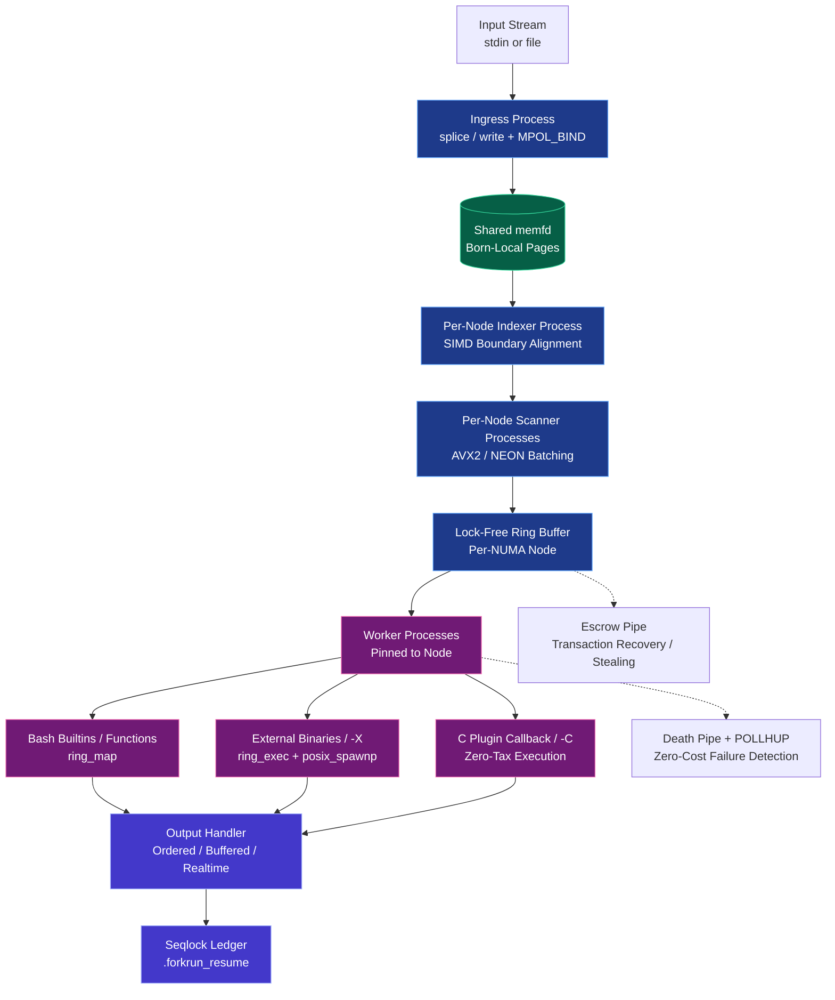

-----------------------------------------
# ARCHITECTURE.md

# forkrun Architecture

**High-performance, NUMA-aware, resilient stream parallelization for Linux.**

forkrun is a specialized dataflow engine designed from the ground up for **maximum single-node throughput** on massive streaming workloads, while maintaining strong correctness and resilience guarantees.

## Design Philosophy

> **"Make the fast path boring. Put complexity only where it is required."**

forkrun achieves extreme performance by:
- Eliminating unnecessary work on the happy path
- Treating data locality and monotonic progress as first-class invariants
- Using optimistic execution with cheap recovery instead of heavy coordination
- Leveraging physical hardware constraints (NUMA, cache hierarchy, memory bandwidth)

---

## Core Invariant: The Universal Linear Coordinate System

A cornerstone of `forkrun`'s performance and resilience is the **Universal Coordinate Plane**. All subsystems agree on a single, linear, 64-bit integer byte address space:

```
  0 ───────────────────────────────────────────────────────────────────► ∞
  [── Fallowed (Hole-Punched) ──][── Active Workers ──][── Ingest / Scanner ──]
  0                     Fallow Horizon            Write Head           EOF
```

1. **Zero-Copy Invariance:** Raw data bytes are written into the shared `memfd` once at ingest. No data is ever copied between intermediate queues.
2. **Metadata-Only Routing:** Ingress, Indexers, Scanners, Rings, Workers, and Escrow communicate exclusively by passing lightweight integer slices `[start_offset, end_offset)`.
3. **Entropy Export without Coordinate Collapse:** As workers finish batches, the background fallow thread punches physical holes via `fallocate(FALLOC_FL_PUNCH_HOLE)` behind the consumption horizon. Physical RAM is returned to the OS, but the absolute coordinate scale remains intact.
4. **Deterministic Checkpointing:** The Seqlock crash ledger (`.forkrun_resume`) simply records the completed coordinate frontier (`resume_horizon` + `resume_jagged`). Resuming a pipeline is as simple as skipping previously committed byte intervals on the invariant coordinate plane.

---

## Core Architecture Diagram


```mermaid
flowchart TD
    Input[Input Stream\nstdin or file] 
    --> Ingest[Ingress Process\nsplice / write + MPOL_BIND]

    Ingest --> Memfd[(Shared memfd\nBorn-Local Pages)]

    Memfd --> Indexer[Per-Node Indexer Process\nSIMD Boundary Alignment]
    Indexer --> Scanner[Per-Node Scanner Processes\nAVX2 / NEON Batching]

    Scanner --> Ring[Lock-Free Ring Buffer\nPer-NUMA Node]
    Ring --> Workers[Worker Processes\nPinned to Node]

    Workers --> Backend1[Bash Builtins / Functions\nring_map]
    Workers --> Backend2[External Binaries / -X\nring_exec + posix_spawnp]
    Workers --> Backend3[C Plugin Callback / -C\nZero-Tax Execution]

    Backend1 & Backend2 & Backend3 --> Output[Output Handler\nOrdered / Buffered / Realtime]
    Output --> Checkpoint[Seqlock Ledger\n.forkrun_resume]

    Ring -.-> Escrow[Escrow Pipe\nTransaction Recovery / Stealing]
    Workers -.-> DeathPipe[Death Pipe + POLLHUP\nZero-Cost Failure Detection]

    classDef core fill:#1e3a8a,stroke:#60a5fa,color:white
    classDef memory fill:#065f46,stroke:#34d399,color:white
    classDef path fill:#701a75,stroke:#f472b6,color:white
    classDef output fill:#4338ca,stroke:#a5b4fc,color:white

    class Ingest,Indexer,Scanner,Ring core
    class Memfd memory
    class Workers,Backend1,Backend2,Backend3 path
    class Output,Checkpoint output
```

---

## Major Subsystems

### 1. Born-Local NUMA Pipeline
Proactive data placement ensures that data is physically allocated on the NUMA node that will consume it. This eliminates the vast majority of cross-socket memory traffic that plagues traditional tools.

→ [`BORN_LOCAL_NUMA.md`](BORN_LOCAL_NUMA.md)

### 2. Lock-Free Ring Buffer Core
A carefully designed single-producer, multi-consumer ring per NUMA node with monotonic indices and minimal synchronization.

→ [`DESIGN.md`](DESIGN.md) and [`INVARIANTS.md`](INVARIANTS.md)

### 3. Adaptive Intelligent Batching
An intelligent controller that uses a Pre-Flight SIMD Popcount to compute the globally optimal batch size during orchestrator fork latency, then enters PID steady-state immediately. A geometric fallback engages if a worker spawns before the scan completes. Workers always claim exactly one slot regardless of phase.

→ [`PHYSICS.md`](PHYSICS.md)

### 4. Resilience & Exactly-Once Protocol
Optimistic execution with near-zero happy-path overhead, instant failure detection via Death Pipe, per-worker recovery, and hardened multi-layer resume capability.

- **Crash Escrow:** Lock-free transaction rollback channel for worker transient failures.
- **Seqlock Ledger:** Monotonic `resume_horizon` and jagged-edge interval tracking.
- **3-Layer Resume Security (v3.5.0+):** Parent-shell UID/permission provenance gate (with interactive command preview for shared scratch directories) → `PATH=''` restricted sandbox subprocess → Setup authorization gate.

→ [`RESILIENCE_PROTOCOL.md`](RESILIENCE_PROTOCOL.md) and [`EOF_PROTOCOL.md`](EOF_PROTOCOL.md)

### 5. Execution Backends

| Backend                  | Speed                  | Use Case                          |
|--------------------------|------------------------|-----------------------------------|
| Bash builtins/functions  | Very Fast              | General shell usage               |
| `posix_spawnp` / vfork (`-X`) | Significantly Faster   | External binaries (glibc `posix_spawnp` uses `CLONE_VFORK`) |
| C Plugin (`-C`)          | **Fastest**            | Maximum performance callbacks     |

## Documentation Map

- [`FORKRUN_OVERVIEW.md`](FORKRUN_OVERVIEW.md) — High-level introduction and benchmarks
- [`ECONOMIC_IMPACT.md`](ECONOMIC_IMPACT.md) — Value proposition for HPC centers
- [`DESIGN.md`](DESIGN.md) — Engineering blueprint
- [`PHYSICS.md`](PHYSICS.md) — Intuitive mental model
- [`BORN_LOCAL_NUMA.md`](BORN_LOCAL_NUMA.md) — NUMA architecture
- [`RESILIENCE_PROTOCOL.md`](RESILIENCE_PROTOCOL.md) — Failure handling & guarantees
- [`INVARIANTS.md`](INVARIANTS.md) — Formal rules that must never be broken
- [`FLAGS.md`](FLAGS.md) — Command-line reference
- [`EOF_PROTOCOL.md`](EOF_PROTOCOL.md) — End-of-file and stream termination

---


## Cross-file Contracts (maintainer note)

- **H1:** C writes `RING_NUM_KILLS`/`RING_POISONED`/`RING_BATCH_IDX` only when `num_kills > 0`; wrapper must reset after every ack.
- **M1:** Zero-length sentinel batches must be acked but not executed (`[[ "$REPLY" != "0" ]]` guard).
- **FRUN_CLAIM_BYTES:** EXIT trap escrow deposit gated by claim-active flag to avoid double-deposit.
- **ACTUAL_END OWNERSHIP:** In normal/byte mode, Indexer publishes `actual_end`; in `-L` mode, Indexer skips publication and Scanner publishes in the handoff chain.
- **GATE-RESOLVING WAKEUPS:** Any process publishing `actual_end` or `cum_lines` must execute a SEQ_CST memory barrier and write to `evfd_meta` if `meta_waiters > 0`.
- **CROSS-PROCESS WAIT ESCAPE:** Every cross-process wait must re-check terminal flags (`limit_cutoff_major`, `emergency_abort`) on every loop and use bounded polling (`poll(..., 100)`).
- **RESUME-SNAPSHOT:** scanners consult resume jagged intervals only via a frozen, sorted, seqlock-consistent snapshot taken once at scanner entry; the live `g_state` copies are orderer-owned and heap-ordered.

-----------------------------------------
# BORN_LOCAL_NUMA.md

### `BORN_LOCAL_NUMA.md`

# FORKRUN BORN-LOCAL NUMA ARCHITECTURE

This document defines the physical memory-routing architecture of `forkrun`. 

On modern multi-socket HPC systems (e.g., AMD EPYC, Intel Xeon), cross-socket memory access over the Infinity Fabric or QPI link is a primary performance bottleneck. Traditional parallelizers use reactive work-stealing, causing severe cross-socket memory migration. `forkrun` eliminates this via **Born-Local NUMA Placement**, ensuring that data is physically instantiated on the RAM banks of the socket that will process it, and structurally guaranteeing that workers never read across NUMA boundaries.

---

## §1. The Ingress Chunker (Proactive Placement)

The NUMA pipeline begins with a single Ingest process that divides the input stream into chunks (up to 2 MB) and routes them to specific NUMA nodes *before* they are scanned or processed.

### 1.1 The "First-Touch" Allocation
In NUMA mode, the Ingress process bypasses zero-copy `splice()` and explicitly uses standard `read()` and `write()` syscalls. 
Before writing a chunk to the shared `memfd`, the thread calls `set_mempolicy(MPOL_BIND)` to bind itself to a specific physical NUMA node. In Linux, the "First-Touch" memory policy dictates that physical RAM pages are instantiated on the node of the thread that first writes to them. By pinning itself, writing the chunk, and then re-pinning itself to the next node, the Ingress process effectively stripes the `memfd` across the physical topography of the motherboard.

### 1.2 Backpressure & The Geometric Accumulation Ramp
Chunks are not distributed blindly. 
1. **The 1MB Pipe Resize:** If `stdin` is a kernel pipe, `forkrun` expands the kernel pipe buffer to 1 MB to allow massive reads and reduce syscall overhead.
2. **Geometric Accumulation:** To prevent kernel memory-policy thrashing on small pipe reads, the Ingest process buffers data to the current NUMA node before switching. It starts at a 64 KB floor and geometrically doubles (up to 2 MB). This ensures tiny files are perfectly distributed across all sockets, while massive streams pool into deep 2 MB reservoirs.
3. **Starvation Backpressure:** If any other NUMA node completely empties its local queue, the Ingest process cuts the accumulation phase short to immediately feed the starving node.
4. **Dynamic Buffer Scaling:** The Ingest process maintains a "read-ahead" buffer limit. Using a bounded Infinite Impulse Response (IIR) filter, it scales this limit dynamically between 4 and 128 chunks.

---

## §2. The Per-Node Indexer Processes (Boundary Alignment)

Because the Ingress chunker splits data arbitrarily at physical 2 MB byte boundaries, a chunk will almost always split a record (e.g., a line of text) in half. 

To resolve this, each NUMA node has a dedicated Indexer process pinned to its socket. 
1. The Indexer uses SIMD-accelerated `memrchr` to scan backwards from the end of its assigned 2 MB chunk to find the final delimiter.
2. This delimiter becomes the *real* logical end of the chunk. 
3. The *real* logical start of the chunk is simply the real end of the previous chunk.

**The Physics Trade-off:** By doing this, a node's Indexer process must read a few dozen bytes belonging to the adjacent chunk (which physically resides on a different NUMA socket). `forkrun` intentionally trades this microscopic penalty (~100 bytes of cross-socket traffic per 2 MB chunk) for the absolute guarantee that chunk boundaries perfectly align with record delimiters. 

---

## §3. The Per-Node Scanners

Once the Indexers establish the exact logical boundaries, the per-node Scanners (also pinned to their respective sockets) find the internal record boundaries and publish work batches.

Scanners in NUMA mode differ from standard UMA scanners in three ways:
1. **No Tail Cooldown:** NUMA scanners do not artificially ramp down batch sizes at the end of a chunk. They operate at maximum throughput until the chunk boundary is hit, at which point the final partial batch is published as a normal single-slot entry with `FLAG_MAJOR_EOF` set in `minor_ring`. Workers claim it identically to any other slot.
2. **The Scanner Shield:** Scanners are strictly limited in how far they can read ahead of the worker pool. This prevents a fast scanner from blowing out the L2/L3 cache with metadata while workers are still processing older batches.
3. **Topology-Aware Stealing:** If a Scanner runs out of local chunks, it is allowed to steal an unprocessed chunk from another NUMA node. However, to prevent thrashing, it will only steal if the victim node has a backlog exceeding a topological threshold: `1 + (NUMA_distance / 10)`. Under extreme starvation (e.g., EOF is reached and no new data will ever arrive), this threshold collapses to `1`, allowing full cluster drain.

**Distance-charged stealing.** The threshold formula `1 + (distance / 10)` makes the minimum backlog required to steal *directly proportional to the cost of stealing* (farther = more expensive = higher threshold). Steal *propensity* is inversely proportional to cost. On `numa=fake=4` every inter-node distance is 10, so the threshold bottoms out at 2 chunks — fake-NUMA measurements are therefore a worst case. On real 2-socket EPYC, cross-socket distances of 32–40 raise the floor to 4–5 chunks before the dynamic scaling multiplier applies. Stealing permission is priced by the topology itself. (Exception: under global-EOF drain the threshold collapses to 1 so the stream can finish; bounded to end-of-stream.)

---

## §4. The Worker Pools & The Structural Guarantee

Workers are pinned to specific NUMA nodes and consume work exclusively from their local Scanner's ring buffer (or Escrow pipe). 

### 4.1 The `FLAG_MAJOR_EOF` Chunk-End Marker

To ensure workers and the ordering subsystem can detect the end of each NUMA chunk, the Scanner sets bit 31 (`FLAG_MAJOR_EOF = 1U << 31`) in the `minor_ring` entry of the **last batch in every chunk**. The `minor_ring` field otherwise holds the batch's within-chunk sequence number (bits 30–0), used by `ring_order` for global merge ordering.

The old `stride_ring` / `FLAG_CHUNK_BOUNDARY` mechanism (which embedded line counts and a boundary flag in a 16-bit field) has been replaced by the `offset_ring` + `end_ring` pair (explicit start/end byte offsets) and `FLAG_MAJOR_EOF` in `minor_ring`. The Scanner now fully determines all batch boundaries before publishing to the ring, so workers never need to detect a boundary mid-claim.

When a worker executes its lock-free claim (`atomic_fetch_add` of exactly 1), it receives a single ring slot covering a byte range `[offset_ring[slot], end_ring[slot])`. A slot marked with `FLAG_MAJOR_EOF` is processed identically to any other slot — the flag is only consumed by the `ring_order` output-ordering thread to advance its major sequence counter.

### 4.2 The Ultimate Structural Guarantee
Because:
1. Indexers perfectly align chunk boundaries with record delimiters.
2. Scanners bound every batch within a single chunk and mark the final batch with `FLAG_MAJOR_EOF` in `minor_ring`.
3. Workers claim exactly one slot at a time; a single-slot claim by definition cannot span two chunks.

...`forkrun` provides a **mathematical, structural guarantee that no worker will ever receive a batch that spans two non-contiguous chunks.**

Because chunks are guaranteed to be isolated to a single physical NUMA socket via the Ingress process's `MPOL_BIND` First-Touch allocation, **a worker will never execute a memory read that physically crosses a NUMA boundary** (unless explicitly stealing due to starvation). 

---

## §5. Architectural Trade-offs: Exact Batch Sizing (`-L`) (v3.5.0+)

In versions prior to v3.5.0, `-L` demoted the pipeline to UMA to maintain exact record boundaries. In v3.5.0+, **`forkrun` provides native NUMA execution for exact-line batches (`-L`) via the Scanner-Handoff Chain.**

Because the Ingress chunker carves the stream based on physical byte sizes (2 MB) rather than logical line counts, a chunk contains an arbitrary number of lines. Guaranteeing exactly *N* lines per batch across NUMA sockets requires serialization of the scanning phase across node scanners via cumulative line count tracking (`cum_lines`).

**The Physics Trade-off:** 
When a batch of $N$ lines straddles a 2 MB NUMA chunk boundary, the worker executing that boundary batch must read the initial $N - M$ lines from the predecessor chunk across the socket boundary ($1 \dots N-1$ lines of cross-socket traffic per chunk boundary). Delimiter counting remains strictly local (zero duplicate scans), while worker execution remains 100% parallelized and pinned across all cores. Throughput during the scan phase is single-scanner bound ($\approx$ UMA scan speeds), but exactness and NUMA worker distribution are structurally preserved.


**Run-length dependence of steal rate.** The 0.0–0.2% file-input cross-socket figure holds for meaningful run lengths (≥ a few hundred chunks). Micro-runs of ~50 chunks can show a single-steal 2.0% startup transient from initial load-balancing; this is expected and amortizes to <0.2% on longer streams.

-----------------------------------------
# CHANGELOG.md

# forkrun Changelog

## v3.6.0 (unreleased)

### C worker loop for spawn mode (W-PY33)

- New `fr_py_worker_spawn_loop` (claim→spawn→signal→ack in C, built
  only on tested primitives; capture-then-frame, never
  direct-to-memfd). Part A verified with strace (zero worker
  preads — no change needed).
- Opt-in `c_spawn_loop=True` on `map()` (mode="spawn", UMA,
  materialized). Parity with Python loop (±4%); 2-3x premise
  falsified (`tr` execution dominates both). 13 new tests; suite
  460 green.

### Single-pass extraction + exact fast formatter (W-PY32)

- One foreach pass (~15 comparisons) + snprintf-free `fmt_r4`
  (3.6M-value sweep: zero mismatches) in `ml_plugin_yyjson.c`.
- Measured +7-11% over obj-get (5M: 2077k vs 1875k at 28w);
  ~2M/s plateau is framework per-batch cost — 2.6x projection
  falsified. 3-test lock-in; Python 447 green.

### yyjson-accelerated C plugin, medium workload (W-PY31)

- Vendored yyjson (as-is) + new `ml_plugin_yyjson.c` (frozen ABI,
  no-INSITU, byte-identical output locked in by 7 tests).
- Measured: +13-32% medium (5M: 1875k vs 1664k at 28w); plateau at
  ~2M/s is framework per-batch cost, not parsing — the 3,500k goal
  is falsified as stated (needs framework work, future). Keep as
  the medium default: free +20%, zero risk. Python 444 green.

### Final-attempt coredump policy (W-PY30)

- **Coredumps off by default** (soft `RLIMIT_CORE` 0 at worker
  startup, hard preserved); **armed only for the final allowed
  escrow attempt** (`num_kills + 1 == retry_limit`, both claim
  wrappers); disarm at ack entries + worker-side escrow deposit.
  `coredump_filter` pinned to `0x31` (drops multi-GB shared
  arenas). 7 new tests; Python 437 + bash 89/262 green.

### WorkerTxn hardening: 4-state machine + output cursor (W-PY29)

- **4-state transaction machine** (`IDLE → CLAIMING → CLAIMED →
  COMMITTING → IDLE`, `WorkerTxn.state` 0/1/2/3): `TXN_CLAIMING`
  brackets `do_lockfree_claim` (claim-window death → RACE/abort);
  `TXN_COMMITTING` brackets ack side effects (ack-window death →
  RACE/abort, never a re-execution double-emit). Both hooks on BOTH
  entry paths; `do_lockfree_claim` untouched, no CAS (release stores
  + defensive check in `begin_commit`). Only backward edge:
  `CLAIMING → IDLE` on failed/EOF claim.
- **Per-batch `lseek` removed**: TLS `worker_output_end` cursor
  (init once per worker, snapshot at claim, advance only after
  COMPLETE emits via `fr_py_emit`, spawn/plugin sites, splice loop,
  ordered-ack sync, `fr_py_output_advanced` for the v0 path). Four
  stores (~2ns) replace a ~250ns syscall.
- **Python FD ordering fixed** (init → set_output_fd → ack_init);
  both reactors recover ALL deaths incl. exit 0 (C classifies).
- **12 adversarial tests** (`test_recovery_adversarial.py`); full
  suite 430 green. Recovery keeps `S_ISREG` + `size >= start`
  guards (first-batch rollback to 0 intact).

### Universal WorkerTxn recovery: engine-wide, all failure types (W-PY28)

- **First engine unfreeze since v3.5.2** (additive + 2 one-line
  hooks): per-worker transaction records (`WorkerTxn`, 128B each,
  1024 slots in MAP_SHARED `GlobalState`) published at claim
  (release) and cleared at ack (release). Happy-path cost is two
  cache-local stores (~1ns, invisible).
- **New `ring_recover_worker` core + loadable** (bash) and
  `fr_py_recover_worker` (Python shim, typed, no argv): one
  parent-side path for Python exceptions, graceful exits, SIGSEGV,
  SIGKILL, and OOM — revert partial output (regular files only),
  escrow with kills+1, respawn. Returns 0..5
  (RECOVERED/NO_BATCH/NORMAL_EXIT/ALREADY_DONE/RACE/FATAL).
- **Bash:** EXIT trap is cleanup-only (no more double-escrow);
  WORKER_DEATH recovers via the record (no trap-ACK wait, no 3s
  grace); trap-ACK pipe kept for poison notices only. SIGKILLed
  workers now recover (poison cascade) instead of aborting.
- **Python:** reactor deaths recover via the record (grace
  machinery retained as fallback for pre-W-PY28 substrates);
  worker-side escrow kept for live-worker errors (a death per
  retry would trip the respawn cap on deterministic failures —
  indistinguishable from crash loops parent-side). Crash-once
  SIGKILL now completes byte-exact (new regression test).
- **Honest result — hypothesis falsified as stated:** the work
  order's "3-second timeout followed by abort and checkpoint" is
  gone for worker deaths, so crash-manufactured checkpoints no
  longer exist: 17 bash resume tests now manufacture checkpoints
  via operator HUP (size-gated, self-synchronizing) instead of
  `kill -9`, and 1 Python test was rewritten (SIGKILL →
  respawn-cap, no grace wait). New M1a/M1b prove operator signals
  still abort + checkpoint (SIGINT → exit 130 foreground-only:
  bash ignores SIGINT in backgrounded pipelines without job
  control; SIGUSR1 → exit 138 under FORKRUN_PREEMPT_MODE=1), and
  M2/M3 analyze M1a's file instead of skipping. Documented
  residuals: ~ns claim-without-publish race, ACK-clear race
  double-emit window, pipe outputs at-least-once, first-batch bash
  revert hole.
- **Latent bugs fixed as drive-bys:** respawned ordered workers
  re-emit the whole file (missing ack-offset sync — new
  `fr_py_ack_init`, called on all worker entries); `UINT64_MAX`
  disarms output rollback (0 is a legitimate position).
- Full suites: Python 418 green, bash test_frun.sh 89/89,
  comprehensive 260 green + 0 skips (M2/M3/M16 consume M1a's
  checkpoint), C plugins green.

### Python frontend: C plugin worker loop, opt-in (W-PY26)

- **New `fr_py_worker_plugin_loop`** (`_shim.c` additions only,
  engine frozen): the plugin analogue of the W-PY18 splice loop —
  claim → plugin → signal → ack entirely in C, zero Python per
  batch. Built only on tested primitives (`fr_py_claim`,
  `fr_py_plugin_invoke` extracted byte-identical from
  `fr_py_plugin_call`, `fr_py_complete`, escrow/abort); poison,
  zero-length sentinel, retry/skip/fail-fast, trap-ACK, and order
  targets all mirror `_worker.py`.
- **Opt-in `c_worker_loop=True`** on `map()` (default False):
  mode="plugin", dialect-1/2 frozen ABI, UMA, materialized input.
  Anything else (splice/stream/NUMA/run/streaming/v0-72B) raises
  loudly — never silently falls back. 13 new tests in
  `python/tests/test_scaling.py`; full suite 409 green.
- **Diagnostics first** (`python/benchmarks/bench_scaling.py`,
  new): exp1 (no-output), exp2 (none-vs-index), exp3 (existing C
  orderer), exp4 (Python loop vs C loop), exp5 (perf-stat
  commands).
- **Honest result — hypothesis falsified as stated:** on this box
  (14c/28t) with ML-light, Python-loop and C-loop curves are
  equivalent at every worker count. Short runs (100k records,
  ~24ms) showed a 14w→28w dip in BOTH loops — a startup artifact
  (fork/spawn dominating wall time), not a scaling cliff. Long
  runs (1M records, ~106MB) scale monotonically to 28w in both
  loops (py: 870→1596→2850→4520→5719→6085k/s; c-loop within
  noise at every count). The C loop wins ~4-7% at high batch
  rates (lines=100) but does not change the scaling shape. The
  worker lifecycle is not the bottleneck.

### Python frontend: PyPI release prep (W-PY23)

- **Reproducible substrate builds**: same source + same compiler
  is now byte-identical (`make -f Makefile.substrate
  reproducibility-check`). The frozen engine embeds `__DATE__` /
  `__TIME__` (version output) and `__FILE__` paths, so the build
  pins them via flags only — `-ffile-prefix-map`, predefined
  `__DATE__`/`__TIME__` overrides, `--build-id=none` — with zero
  source changes. Verified: consecutive builds share a sha256.
- **Correct platform wheel**: `py3-none-linux_x86_64` (or
  `linux_aarch64`) instead of `py3-none-any` — the wheel carries
  a compiled `.so`, and pip now refuses it off-platform instead
  of installing something that cannot load. Non-Linux and
  unknown-arch builds fail fast with a clear error.
- **Complete PyPI metadata**: long_description from
  `python/README.md`, Beta status, full classifier set, project
  URLs, keywords, `Requires-Python >= 3.8`, zero runtime deps.
- **sdist support** (`MANIFEST.in`): engine TU, shim, stubs,
  plugin ABI header, and makefile ship in the tarball; `pip
  install forkrun-0.16.0.tar.gz` rebuilds the substrate from
  source and runs byte-identical.
- **Release gate**: `python/release_check.py` verifies version
  coherence, the full suite, canary, IDL schemas, reproducibility,
  wheel tag + metadata, sdist contents, doc twins, a clean tree,
  and the frozen engine — all-pass is required before tagging.
- Python `0.15.0` → `0.16.0`. Engine frozen (zero
  `forkrun_ring.c` changes).

### Benchmarks: real-world ML pipeline vs best-of-the-best (W-PY24)

- **New `python/benchmarks/` files** (benchmarks only — no
  library changes): `ml_data_gen.py` (seeded synthetic
  recommendation-event JSONL, light/medium/heavy),
  `ml_payload.py` (identical transformation for every UDF
  system), `ml_native.py` (Polars/DuckDB native expressions),
  `bench_ml_pipeline.py` (worker sweep 1–28, validation,
  crash-once fault injection, graceful degradation).
- **Measured (50k records/variant, best of sweep, honest)**:
  native-expressible work goes to Polars (2.4M/s, 4.4× best
  UDF) — but DuckDB (189k) loses to forkrun-UDF (293k), so
  native ≠ automatically faster. Arbitrary-Python UDFs go to
  ProcessPoolExecutor (1037k/577k/85k), Pool second, forkrun at
  60–75% (590k/308k/67k); heavy/compute-bound compresses the
  field as predicted. Ray (22–43k) and HF Datasets (30–75k)
  trail at this scale.
- **forkrun C plugin tier (new):** the same medium/heavy/light
  workloads as hand-rolled C callbacks through the frozen ABI
  (dialect-2 + FLAG_RAW borrowed window, stdout capture):
  light 1124k (beats Executor outright), medium 493k (85% of
  Executor, beats Pool), heavy 216k (2.6× the best Python
  system — the C tokenizer demolishes the Python one). Polars
  still leads expressible work ~4.6× (the "faster than Polars"
  hope is falsified). Plugin outputs validated by JSON-value
  equality vs the Python path on clean AND 5%-malformed data
  (light byte-identical; floats epsilon-compared; heavy `fh`
  excluded — SipHash-vs-FNV by design; `round-half-even`
  reproduced exactly, including a double-rounding fix).
- **Fault injection, corrected:** crash-once SIGSEGV at idx 5 +
  transients, every fault proven fired (an earlier revision used
  random indices that sometimes never executed — a vacuous
  pass). forkrun survives with output truncated at the lost
  batch (4887 records; signal death skips escrow and the C
  orderer stalls at the head hole — exit 0, clean prefix, no
  hang); the C plugin shows identical hole semantics; Ray
  survives complete (task retry); Pool hangs and dies
  (TimeoutError). Parent-side replay of death-hole batches is
  flagged follow-up work, not implemented here.
- Full tables, methodology, and caveats:
  `python/benchmarks/results/ml_pipeline_study.md` (+ CSV).
  No version bump (benchmarks only).

### Benchmarks: LLM tokenization, the niche measured (W-PY25)

- **New `python/benchmarks/` files** (benchmarks only — no
  library changes): `tokenize_data_gen.py` (seeded corpus +
  shared 30k vocabulary sidecar), `tokenize_payload.py`
  (identical tokenizer in Python), `plugins/tokenize_plugin.c`
  (same algorithm in C through the frozen ABI: dialect-2 +
  FLAG_RAW window, vocab hash table, stdout capture),
  `bench_tokenize.py` (8-system matrix: serial/Pool/Executor/
  HF/Ray/forkrun-Python/forkrun-C/Polars-map_batches).
- **Measured (20k docs, best of sweep, honest)**: forkrun C
  127k docs/s edges Executor 118k (1.1×); Pool 110k,
  forkrun-Python 78k, HF 32k, Polars-UDF 15k ≈ serial 12k, Ray
  13k. Big docs (662 tok/doc): C 58k vs Executor 39k (1.5×),
  forkrun-Python passes Pool on zero-copy transport. The
  predicted 10× did NOT materialize — per-document fixed costs
  (JSON parse, framing, transport) dilute the ~10× per-token
  compute edge (Amdahl's floor); the C advantage grows with the
  compute fraction. Polars cannot express tokenization natively
  (map_batches runs serially — verified against
  POLARS_MAX_THREADS=1).
- **Validation**: plugin outputs exactly equal Python outputs
  (parsed-JSON equality, clean + malformed corpora; diversity
  round-half-even reproduced including a double-rounding fix;
  suffix-continue semantics matched).
- Full tables, methodology, caveats:
  `python/benchmarks/results/tokenize_study.md` (+ CSV).
  No version bump (benchmarks only).

## v3.5.14 (unreleased)

### Python frontend: C drain process, opt-in (W-PY21-A)

- **New `fr_py_drain_loop`** (shim only): a forked child moves
  signal consume + output-memfd pread into a results destination
  (memfd for map/run, 1MB pipe for stream with hydraulic
  backpressure preserved). Framing untouched — the parent parses
  exactly as before.
- **New opt-in `c_drain=False` default** on run/map/stream (all 10
  collect/stream executors: UMA materialized + ingest ×
  simple/reactor, NUMA blocking + streaming). Single-threaded
  pumps throughout (no threads — fork-before-threads intact);
  the reactor is unchanged (drain_gen abstraction already
  separates data from control).
- **Measured verdict (honest): 0.7-1.0x — the speedup premise is
  falsified, so the default stays legacy.** Medium scale,
  alternating medians: map 35.7M vs 53.2M legacy (0.7x), stream
  59.6M vs 67.8M (0.9x), NUMA @2 same ratio. Structural reason:
  the parent must parse every record either way, Python signal
  reads are already batched (4096/64KB), and the drain adds a
  full extra transit of the output bytes. The ≥1.5x checklist
  item FAILS by measurement; kept as byte-identical opt-in
  substrate for a future design that also moves consumption.
- **Drive-by fixes**: spare-signal-close now fires only after a
  worker has EVER forked (pre-first-fork close poisoned ctx with
  signal_w=-1 and starved all consumers — the legacy ingest
  paths only survived via their end-of-stream safety sweep);
  missing `signal_w=None` in the NUMA stream drop closed a
  recycled fd number (the results read end) and hung with data
  ready but unread; empty-input drain parse guarded.
- Python `0.12.0` → `0.13.0`. 324 tests green (295 + 29
  `test_c_drain.py`); engine frozen (zero `forkrun_ring.c`
  changes).

### Python frontend: datapath consolidation (W-PY21-B)

- **New `fr_py_ack_direct`** (shim only): verbatim port of
  `ring_ack_main` minus the snprintf/argv/atoi round-trip
  (measured ~150ns/batch saved). All ack sites prefer it, else
  the legacy `fr_py_ack`.
- **New `fr_py_complete`** (shim only): thin composition
  `fr_py_emit` + `fr_py_ack_direct` — no duplicated writev, no
  order-fd parameter (the ack target derives from
  `fd_order_pipe` exactly like the worker's old `order_tgt`).
  One C call per batch replaces emit + thread-check + flush +
  flush + argv-ack, preserving output → signal → fallow →
  order → ack. Return codes 0/-1/-2/-3 (ok/output/signal/ack).
- **Worker hot path**: `threading.active_count()` DELETED
  (addendum Option A — documented contract, not policed; a
  startup check would observe nothing). `_flush()` kept before
  complete (flush-before-ack stays load-bearing for payload
  `print()`). bytes/None fast path (no extra coerce call);
  the commit FuncPtr binds once per worker.
- **New `fr_py_spill_sequential`** (shim only): C read/write
  loop for pipes/sockets (where `copy_file_range` cannot go),
  wired as the `_spill_to_memfd` fallback after the existing
  kernel path (unchanged). Measured 123MB file: 27.7ms vs
  30.5ms for the Python pread/pwrite loop (1.10x).
- **New `fr_py_parse_descriptors`** (shim only): C parses the
  `[idx][len][bytes]` framing into a descriptor table
  (batch_idx, offset, length); Python still slices result
  objects. Measured 0.65x via ctypes (per-element struct
  attribute access costs more than `struct.unpack_from`) — so
  it is OPT-IN only (`FORKRUN_C_PARSE=1`), kept as tested
  substrate for a future C-extension module that builds the
  result list in C.
- **Measured verdict (honest): the ≥10% checklist item PASSES
  against the true baseline, with two falsified premises.**
  Batch-bound no-op (1M lines, `lines=20`, 8 workers, medians):
  42ms vs 49ms true-original (argv-ack + thread check) =
  +14-17%. Realistic adaptive workloads: neutral (±2%, inside
  run variance). The "~4µs per-batch Python overhead" premise
  was overstated — the measured addressable total is ~1µs
  (flush ~250ns + argv ~150ns + crossing ~300ns + wrappers).
  Per-phase (same box): spill ~28ms/123MB, parse ~33ms/48MB
  framed blob (Python loop), worker commit ~2.5µs of ~4.6µs
  per batch. Known residual, documented: vs the `FORKRUN_NO_V1`
  hybrid split path (which already banks `ack_direct` + the
  deleted thread check), `fr_py_complete` measures ~80ns/batch
  slower in batch-bound micro-runs — 10 experiments (strace
  identical counts, perf inconclusive, order-bias excluded)
  could not isolate it below the noise floor; realistic impact
  nil; flagged for follow-up. Ordered mode already shows +4.5%.
- Python `0.13.0` → `0.14.0`. 344 tests green (324 + 20
  `test_complete.py`); engine frozen (zero `forkrun_ring.c`
  changes).

### Python frontend: resume/checkpoint on C-orderer paths (W-PY22)

- **New shim entry points** (shim only, engine frozen):
  `fr_py_resume_snapshot` (the exact seqlock reader from
  `ring_dump_resume_main` — ACQUIRE seq1, RELAXED data,
  load-bearing ACQUIRE fence, ACQUIRE seq2 — via out-params, no
  stdout redirection, plus the fallow-horizon fallback for
  bash-checkpoint interchange), `fr_py_set_resume_state`
  (typed params, plain stores + `qsort(cmp_interval)` — identical
  to `ring_set_resume_main` minus argv), `fr_py_is_resume_mode`.
- **New `_checkpoint.py` codec**: strict fail-closed parser
  (exactly 3 keys in order, decimal uint64, ≤1024 intervals,
  start < end, no extra content), bash-canonical serializer
  (sort + collapse), atomic publication (tmp → fsync → chmod
  600 → rename, previous preserved on failure).
- **New `_resume.py` orchestration**: path gating (resume ONLY
  where a live C orderer exists — map()/stream() with
  `orchestrator=True, order="index"`, UMA, non-splice; `run()`,
  unordered, non-reactor, splice, multi-node NUMA all raise
  `RuntimeError` instead of writing useless checkpoints),
  post-init `resume_begin` (parse + safety + engine state,
  pre-fork), abort choreography (abort → bounded worker reap →
  order_w close → bounded orderer reap → seqlock snapshot →
  atomic sidecar + checkpoint publish → teardown destroys),
  and the `<ckpt>.coll` output sidecar (aborted runs' committed
  output preserved cumulatively; a successful resumed map()
  prepends it — concatenation, never index re-sort, because
  batch indices restart every run — and consumes it).
- **Semantic contract** (documented in README + tests): ENGINE
  COMMIT is exactly-once (quiesced ledger, cumulative across
  multi-resume via the orderer's bootstrap); PYTHON CONSUMPTION
  is not (crash between commit and observation skips bytes the
  caller never saw — stream consumers persist yields
  themselves). All coordinates are bytes, never batch numbers.
- **Measured**: abort→checkpoint→resume is byte-identical to an
  uninterrupted 20k-line run; committed byte ranges are never
  re-executed (output-derived coverage proof); multi-resume
  frontiers mount (39424 → 101376 in testing); SIGINT and
  fail-fast aborts both checkpoint; no checkpoint on success,
  on zero progress, or on unsupported paths.
- Python `0.14.0` → `0.15.0`. 383 tests green (344 + 39
  `test_resume.py`); engine frozen (zero `forkrun_ring.c`
  changes).

## v3.5.13 (unreleased)

### Python frontend: NUMA multi-node (W-PY21)

- **New `nodes=` topologies** (`_numa.py`): `None`/`"auto"`
  (detect — single-socket stays UMA, unchanged), `1` (force UMA),
  `N` (first N physicals), `"0,1"` (explicit physicals), `"@N"`
  (N forced logical nodes cycling physicals — fake multi-node for
  testing, like bash). Unknown specs raise `ValueError` eagerly.
- **New NUMA pipeline executors** (blocking + streaming): the
  born-local ingest owns the source fd (files and pipes uniformly
  — no pre-spill), per-node indexers/scanners run with death
  pipes, the physical fallow reclaims via `PhysPackets`, and
  workers fork per-node on that node's first DATA publish (the
  W-PY19 pre-flight rule per ring) with a global stall fallback.
  Scanner spawn pipes stay disarmed — auto-forking on the startup
  burst would trip the CASE-B pre-flight bail (silent loss).
- **New shim entry points** (shim only, engine frozen):
  `fr_py_init_numa` (`--numa-map`), `fr_py_numa_ingest`,
  `fr_py_indexer_numa`, `fr_py_numa_scanner`, `fr_py_fallow_phys`,
  `fr_py_data_ready_node`. Workers self-pin via the engine map in
  `fr_py_worker_init` (mirrors `ring_worker inc`); Python
  pre-pinning in the reactor spawn path is best-effort backup.
  `order="index"` reuses `fr_py_orderer` with `numa=1` (no new
  orderer needed — the packed major/minor key was already there).
- **Hardened publish accounting**: the DATA high-water marks reset
  at init (new epoch) instead of only on the `w<hwm` heuristic —
  a fast pipeline finishing before the parent's first poll used to
  hide every publish in the stale mark's shadow (zero observed →
  spurious publish anomaly on in-process re-runs). Same latent
  race closed on the UMA mark.
- **Semantics**: per-node rings batch independently, so parity is
  over byte content (ordered mode reconstructs the input
  byte-exact via the C orderer), never batch counts. Fault
  tolerance, trap-ACK, respawn cap, and poison reporting ride the
  W-PY19 reactor unchanged (now NUMA-aware per slot lineage).
- Python `0.11.0` → `0.12.0`. 295 tests green (263 + 32
  `test_numa.py`); engine frozen (zero `forkrun_ring.c`
  changes).

## v3.5.12 (unreleased)

### Python frontend: parameter sweeps (W-PY20)

- **New `forkrun.sweep()`** (bash `:::` / `::::` / `--link`
  equivalent): `args=[[...], ...]` dimensions generate Cartesian
  products, `link=True` zips pairwise (shortest-truncation with
  `UserWarning`), `args_from=[files]` loads one dimension per file
  (one value per line, blanks skipped). Each combination becomes
  ordinary batches whose `.metadata` carries the sweep tuple;
  results return in combination order.
- **New `Batch.metadata`** (additive, default `None`): sweep tuple
  set by the wrapper before the user payload runs, retained across
  `invalidate()` like the other coordinates. No existing API
  changes; the claim/ack loop is untouched.
- **Execution**: standalone sweeps run one synthetic-input pipeline
  with forced `lines=1` (exactly one batch per combination —
  adaptive batching would merge combos) and `order="index"`
  (combination order — completion order would scramble it);
  conflicting `lines=`/`bytes=`/`order=`/`sink=` raise instead of
  silently violating the mapping. With-source sweeps run one
  `map()` per combination (path sources reused; fd/pipe sources
  materialized once — a repeated drain would see EOF). Payload
  errors ride escrow/retry/poison per combination; `mode="splice"`
  rejected (no payload exists to receive metadata).
- Python `0.10.0` → `0.11.0`. 263 tests green (241 + 22
  `test_sweep.py`); engine frozen (zero `forkrun_ring.c`
  changes).

## v3.5.11 (unreleased)

### Python frontend: reactor orchestration (W-PY19)

- **New opt-in `orchestrator=True`** on `run`/`map`/`stream`
  (default `None` = current fork-and-wait behavior, unchanged):
  workers are supervised by a Python reactor (`_reactor.py`) with
  per-worker death pipes (kernel-observable exit, SIGKILL-safe),
  bounded respawn (default cap 3 per slot — crash loops terminate),
  trap-ACK confirmation over a dedicated pipe (3s protocol grace —
  graceful-failure ACKs pair over a signed deaths-minus-ACKs
  balance, so pipelined death/ACK orderings never orphan a grace
  into a false catastrophic), poison `P:idx:kills` notifications,
  and the C orderer for `order="index"`.
- **New shim entry points** (shim only, engine frozen):
  `fr_py_set_order_pipe` (worker-local order-pipe fd for ordered
  acks), `fr_py_scan_with_spawn` (scanner spawn-request pipe),
  `fr_py_orderer` (runs the engine's `ring_order_main` in a forked
  child over the workers' own output memfds — the keyed-record
  framing is unchanged, only the ordering moves from Python
  reassembly into C).
- **Semantics**: healthy-path results are byte-identical to
  `orchestrator=False` (map/run/stream × none/index, splice,
  streaming ingest). A segfaulted worker is respawned and the
  pipeline completes minus the crashed batch (best-effort: a death
  that runs no code leaves no escrow deposit — documented, never
  silent; a stderr recovery note names the wid). Unconfirmed death
  raises `RuntimeError` after the grace; cap-reached deaths raise
  `RuntimeError` immediately. Ingest fork timing stays
  publish-gated (pre-flight bail avoidance); scanner spawn requests
  are mechanism-tested while auto-fork stays disarmed.
- Python `0.9.0` → `0.10.0`. 241 tests green (215 + 26
  `test_reactor.py`); engine frozen (zero `forkrun_ring.c`
  changes).

## v3.5.10 (unreleased)

### Python frontend: zero-copy ingest + raw window (W-PY18 addendum)

- **`fr_py_copy_range`** (shim only): single-shot kernel copy with
  explicit offsets (copy_file_range → sendfile → -1). Drives
  `_spill_to_memfd`; exotic pairs fall back to the original
  sequential loop byte-exact (pipes verified). Measured 130MB spill:
  29ms kernel (4.5 GB/s) vs 33ms userspace — ~20% faster spill, ~3%
  end to end. Never touches fd positions (W-PY16 SEEK_CUR lesson).
- **`fr_py_get_raw_window`**: borrowed MAP_SHARED pointer into the
  ingress memfd (the engine's TLS-cached mapping — the FLAG_RAW
  mechanism v1 plugins already use internally). Readback-exact,
  NULL on bad input; documented lifetime (until remap/exit).
- Splice-loop Part 3 (`fr_py_splice_batch` standalone): not added —
  the loop covers it via sendfile + emit_record fallback (no orphan
  API without a caller).
- Python `0.8.0` → `0.9.0`. 215 tests green (206 + 9
  `test_zero_copy.py`); engine frozen (zero `forkrun_ring.c`
  changes).

## v3.5.9 (unreleased)

### Python frontend: splice passthrough mode (W-PY18)

- **New `mode="splice"`** (payload None, `bytes=N` default 512KB):
  workers run `fr_py_worker_splice_loop` (shim only — claim →
  sendfile → signal → ack, zero Python per batch; framing identical
  so the parent parses untouched). Works over map/stream ×
  materialized/streaming-ingest (bash -s shape: pipe in, live out).
  Strict validation (non-None payload, `lines=`, `run()`, `sink`
  all rejected — an ignored payload would drop user code).
- **Measured, not 2B**: byte+Python 214M vs lines 161M at 10M lines
  (+33%); splice ≈ Python passthrough (56–61M medium, 84M stream —
  both parent-bound: spill/scan/Python-parse). Ceiling analysis:
  sendfile ~4GB/s + parent parse ~3GB/s cap this box at ~230M for
  map(); 2B needs ~26GB/s end to end. Full numbers + model:
  `python/benchmarks/results/splice_study.md`.
- Deviations from sketches: reused `fr_py_claim/ack/escrow/emit`
  (the sketched do_ack_* don't exist); `sendfile` not `splice(2)`
  (no staging pipe; emit_record fallback); payload-accept-anything
  rejected as a footgun.
- Python `0.7.0` → `0.8.0`. 206 tests green (192 + 14
  `test_splice_mode.py`); engine frozen (zero `forkrun_ring.c`
  changes).

## v3.5.8 (unreleased)

### Python frontend: batch-size amortization study (W-PY17)

- **The amortization hypothesis is mostly wrong** (measured, not
  hoped): per-batch cost is ~10ns/line at EVERY size (it scales with
  bytes — no fixed overhead exists to amortize). Forced large batches
  peak at ~96M lines/s (8 workers) / 116M (1 worker) for no-op, not
  the hypothesized 1-2B. New `bench_batch_size.py` (8 sweep entries
  in run_all.py + standalone) with exact batch counts (b'' probes,
  never n/lines estimates).
- **Sweet spot lines=1k–10k** (adaptive already chooses inside it):
  lines=100 loses ~40%, lines=50k+ loses ~35% (starvation: 20 batches
  ÷ 8 workers). Upper/sum gain +4–9% at 10k; JSONL regresses −26%
  at 10k (payload-bound — tune the payload). Streaming +13% at 10k.
  Single worker beats eight for no-op (116M vs 96M — claim contention
  binds, not dispatch). Engine byte-clamps 100k-line requests (21
  batches, not 10). Memory flat 76–80MB across the 100× range.
- Full tables + guidance:
  `python/benchmarks/results/batch_size_study.md`; README documents
  the `lines=` knob and the new `streaming=` parameter.
- Benchmarks + docs only (zero library/engine changes).
  Python `0.6.0` → `0.7.0`. 192 tests green; engine frozen.

## v3.5.7 (unreleased)

### Python frontend: streaming ingest + fd scrubbing (W-PY16 + addendum)

- **Streaming ingest** (`streaming=None/True/False`; fifo/socket
  auto-stream): parent spills in 1MB chunks while a forked scanner
  publishes concurrently and a forked reaper (`fr_py_fallow_loop` →
  the engine's own `ring_fallow_main`, zero engine changes) punches
  holes behind the contiguous acked prefix. Workers fork on first
  DATA publish (new `fr_py_data_ready` query) — never during
  pre-flight — and grow their MAP_SHARED view geometrically
  (zero-copy kept); acks carry the fallow write end. Stall timeout
  (2s) forks workers for slow-source pipelining; empty input skips
  workers; scanner/reaper deaths abort loudly (never silent loss).
- **Measured: 1GB via pipe with 0.2MB parent RSS growth**
  (requirement was <200MB); byte-exact vs materialized across
  python/spawn/plugin modes × map/run/stream; bytes-mode wide lines
  exact. Medium-scale throughput is ~2-3× more CPU than materialized
  (bimodal; under investigation as perf follow-up — capability, not
  speed, is this order's deliverable).
- **FD scrubbing** (`_fd_scrub.py`, all forks): children keep engine
  fds (escrow/eventfds — closing them breaks retry and spins claims)
  + job fds + 0/1/2. forkrun now runs inside event-loop hosts
  (opencode/Jupyter/asyncio): covered by subprocess event-loop tests.
- **Two engine findings documented in code**: (1) the scanner seeds
  its base with `lseek(SEEK_CUR)` on a fork-shared offset — the spill
  uses `pwrite` so the base stays 0; (2) pre-flight bails on waiting
  workers into a phase-1 that publishes nothing for completed input.
- Deliberate non-additions: no `fr_py_ingest_begin/chunk/end` (per-
  chunk scan calls would reset publish state); no signal-carried
  length; GIL already released by CDLL.
- Python `0.5.1` → `0.6.0`. 192 tests green (175 + 10
  `test_streaming_ingest.py` + 7 `test_fd_scrub.py`); engine frozen
  (zero `forkrun_ring.c` changes).

## v3.5.6 (unreleased)

### Python frontend: pipe capacity optimization (W-PY15)

- **Signal pipe 64KB → 1MB** (`forkrun/_pipes.py`, used by
  `_execute_streaming`): 65536 outstanding 16B batch signals vs 4096 —
  workers run further ahead of a moderately slow consumer before
  backpressure stalls them. Best-effort `F_SETPIPE_SZ` with silent
  fallback; fds stay non-inheritable (spawn hygiene preserved).
- **Spawn stdin/stdout already 1MB** (set in `fr_py_exec_spawn` since
  W-PY13) — verified by inspection, covered by a 3MB single-batch
  pump test; no C change in this order.
- **Untouched by design:** engine ack pipe (H3 4KB backpressure
  invariant), escrow/death pipes, `forkrun_ring.c` (frozen).
- Python `0.5.0` → `0.5.1`. 175 tests green (166 + 9 new
  `test_pipes.py`); new `stream_slow_consumer` benchmark row.

## v3.5.5 (unreleased)

### Python frontend: C-level output emit (W-PY14)

- **New `fr_py_emit`** (shim only): one C call per batch writes the
  16-byte header + payload via `writev` (zero-copy for `bytes` returns)
  plus the 16-byte signal; `signal_fd=-1` skips the signal (map/run),
  `out_fd=-1` skips output (discard). Exact v0 semantics preserved
  (`None` = no record, `b""` = empty record; output failure rides
  escrow like a Python write error, signal failure stays fatal).
- **Measured ≈ v0 (±noise), NOT the 63M→100M target — documented, not
  claimed.** Upper map: 26.1M (emit) vs 23.7M (v0) adaptive; 18.6M vs
  18.4M at lines=100 (i9-7940X). Cause: the remaining cost is
  payload-side copies (`bytes(data).upper()`), not output syscalls, and
  map/run already skipped signals since W-PY7 — the real saving is one
  syscall per batch. Kept as permanent infra (fewer syscalls, exact
  semantics); the 100M+ transform goal needs payload-side copies gone
  (write-in-place `OutputBatch`, Stage 6+). New `emit_upper` benchmark
  records the A/B permanently.
- Python `0.4.0` → `0.5.0`. 166 tests green (150 + 16 new
  `test_v1_emit.py`); engine frozen (zero `forkrun_ring.c` changes).

## v3.5.4 (unreleased)

### Python frontend: v1 spawn & plugin fast paths (W-PY13)

- **Spawn v1** (`fr_py_exec_spawn`): C-level `posix_spawnp` + concurrent
  poll pump — zero-copy splice ingress memfd → stdin, stdout staged to a
  reused capture memfd then framed once. 2.1× at small batches (1.05M vs
  0.49M lines/s, lines=100); parity at adaptive batching (~24M both —
  command-bound). Missing command exits 127 (shell convention, retryable).
- **Plugin v1** (`fr_py_plugin_call`): C-level dispatch through the FROZEN
  128B `forkrun_ctx` (dialect from the plugin's `forkrun_use_ctx`, filled
  exactly like `ring_call`) — **bash `-C` plugins run from Python
  unchanged**. Throughput ≈ v0 on transform micro-benchmarks (0.8–1×);
  wins are unification + zero-copy input + no per-batch input copy.
- **Selection is automatic with v0 fallback** (symbol probe +
  parent-side `forkrun_use_ctx` probe — the 72B v0 convention is never
  misdispatched; `FORKRUN_NO_V1=1` forces v0). Caught in development: an
  in-place header backfill that the concurrent streaming reader could
  observe mid-write (whole-batch loss) — fixed by append-once framing;
  every byte visible in an output memfd is final.
- Python `0.3.0` → `0.4.0`. 150 tests green (129 existing + 21 new
  `test_v1_fast.py`); engine frozen (zero `forkrun_ring.c` changes).

## v3.5.3 — 2026-09-20

### Python frontend: benchmark publication (W-PY11, W-PY12, measurement-only)

- **182M lines/s** no-op at 10M lines (bring-up amortized; 102M at 1M).
  Claim/ack via ctypes bypasses bash variable binding.
- **6.4× faster than serial Python** on transforms (63M vs 9.8M);
  **21.5× over multiprocessing.Pool** at large scale (zero-copy fork
  inheritance vs pickle/IPC).
- **3.6M JSONL records/s**, 31M filter, 50M aggregation — production
  data-prep rates, stable across scales.
- **1.8× faster streaming than collection** at 10M (pipelining
  discovered benefit; 1.4× at 1M); ordered-vs-unordered 1.34x.
- **Flat RSS** across 8× stream growth (no output); 39–175MB observed
  on fixed 50MB slow-consumer output (variance disclosed in
  `python/benchmarks/results/large.md`, under investigation).
- **14–15M lines/s spawn mode** (adaptive batching amortizes
  subprocess); 43–54M plugin ctypes callbacks.
- Attributable CPU% per headline row (children-CPU method — system-wide
  /proc/stat rejected as noise on shared boxes); v0.5 reads
  overhead-bound at 10M (parent collect serial), documented honestly.
- New: `python/benchmarks/run_all.py` (table + CSV, --scale/--trials/
  --filter/--list), `make bench[-small|-large|-csv]` targets, CPU%
  column, `python/benchmarks/results/large.{md,csv}`, README
  side-by-side tables + "What These Benchmarks Do NOT Measure".
- Python `0.2.0` → `0.3.0`. 121 tests green; engine frozen (zero C
  changes since v3.5.2). Tag message ready (owner creates the tag).

## v3.5.2 (unreleased)

- **W-RAW: C-plugin raw window delivery (`FORKRUN_CTX_FLAG_RAW` live):**
  `ENGINE_KNOWN_FLAGS` is now `FORKRUN_CTX_FLAG_RAW` (was `0u`); the
  `fr_ctx_engine_known_flags_matches_v2_grant_semantics` tripwire asserts
  the new known set. `ring_call` dispatches raw-first: when the plugin's
  `forkrun_use_ctx` grants `FLAG_RAW` (v2 only), the engine skips
  `do_tokenize` entirely, passes only fixed args in `argv`
  (`argc = fixed_argc`), and publishes the borrowed zero-copy window in
  `ctx->reserved[0]` (`const void *data` over
  `[batch_offset, batch_offset + batch_byte_length)`). The engine holds a
  persistent per-worker `MAP_SHARED`/`PROT_READ` mmap of the ingress memfd
  (lazy-map on first raw batch, `mremap` growth to
  `max(need*2, file size)`, never unmapped per batch). Precedence is
  binding: raw overrides argv tokenization, stdin delivery, and the user's
  `-s`/`-b` flags (W-STDIN's stdin-feed arm is marked and falls through to
  argv). Raw requires v2 — a v1 plugin requesting the flag gets the grant
  masked to zero, argv delivery, and a dlopen-time warning. Pre-v3.5.2
  engines grant nothing, so plugins must check
  `ctx->flags_granted & FORKRUN_CTX_FLAG_RAW` and fall back to argv.
  Window contract: borrowed (callback duration only), stable-during-callback
  (append-only ingest, private `pread` tokenize buffers, fallow punches only
  behind the acked prefix), address-not-stable across calls, `fd_in` escape
  hatch retained. Docs: `C_PLUGIN.md` §4 (contract, negotiation pattern,
  complete example, stability note); lock-in tests T-RAW-1..7
  (`UNIT_TESTS/test_c_plugins_raw.sh`). No changes to `try_simd_scan`, the
  fences, or the scanner macros.

- **W-STDIN: C-plugin stdin delivery (`-s`/`-b` with `-C`):** the bash JIT
  exports `FORKRUN_C_STDIN=1` for `-C` + (`-s` | `-b`) — the entire
  bash-side change, riding the existing `FORKRUN_EXTRA_VARS` cleanroom
  transport — and `ring_call` fills the dispatch arm W-RAW established:
  `FLAG_RAW` > stdin mode > argv tokenize. In stdin mode tokenization is
  skipped (`argv` = fixed args only) and the batch is spliced onto the
  plugin's fd 0 as an EOF-terminated byte stream. Tier split mirrors
  external `-s`: fitting batches are fed synchronously (no fork); larger
  batches fork a SIGCHLD-shielded feeder child (the `ring_exec` pattern
  verbatim: block around fork, own `waitpid`, restore after) that splices
  concurrently while the parent runs the callback. The child `_exit`s
  (never returns into bash), ignores SIGPIPE, and scrubs the fork-order
  mask-hazard fds (death-pipe write end via the `fd_worker_w` array walk,
  `FD_TRAP_ACK_W`, `fd_fallow_w`) — targeted close, no new bash protocol,
  no `/proc` opens. Failure semantics from process lifecycle: feeder death
  reads as EOF (length-checking plugins fail into escrow/retry; a 0-return
  with a dead feeder is failed by the parent rather than risk short output
  with rc 0; partial-consumption EPIPE `_exit(0)` is never flagged);
  worker death orphaning the child EPIPE-exits it while the death pipe
  fires unmasked. The ctx is unchanged (offset/length/lines/delimiter/fd_in
  populated; v2 length-bounded reads, v1 read-to-EOF); `-b` composes as a
  byte-transparent pipe (no NUL truncation). The old "`-s`/`-b` ignored in
  `-C` mode" warning is removed; `--help` `-C` line documents the new
  semantics. Docs: `C_PLUGIN.md` §5 (contract, v2/v1 patterns,
  implementation note); lock-in tests T-STDIN-1..9
  (`UNIT_TESTS/test_c_plugins_stdin.sh`). No new loadables, no persistent
  processes; the `/proc`-based persistent feeder stays deferred in
  `docs_port/`.

- **W-STAGE1: the substrate's config boundary goes load-bearing:**
  `fr_config_t` (declared in v3.5.1) is now consumed: `ring_worker inc`
  snapshots the bash-surface transport (`RING_WID`, `RING_NODE_ID`,
  `RING_WINCARN`, `FORKRUN_RETRY_LIMIT`, `FD_ORDER_PIPE`, `FORKRUN_DEBUG`)
  into a worker-local struct once per worker — no config-sync verb; the
  Python frontend will fill the same struct via ctypes and fork-inherit it
  as plain memory. Consumers: claim node init + poison threshold (the
  per-claim env read leaves the hot retry path), ack order-pipe, call ctx
  identity; `FORKRUN_C_STDIN` and the feeder-scrub reads stay env (mode
  signaling, not config — taxonomy comments). `WorkerBatchState` fields
  renamed to the `fr_state_t` identity
  (`batch_idx`/`slots`/`num_kills`/`poisoned`, decided at the poison
  branch) with per-field width tripwires beside the substrate asserts
  (whole-struct sizeof is wrong by design: the claim struct also carries
  the payload window). One bash comment (config-injection point, both
  twins). Lock-in T-CONFIG-1..4
  (`UNIT_TESTS/test_c_plugins_config.sh`); basic 91/91, all C-plugin
  suites, T-RAW, T-STDIN green with zero behavior change.

- **P1 residual #5 (docs only):** pre-consent process termination named in
  `SECURITY.md` (+ twin): sandbox extraction precedes the ownership gate
  (F29-B ordering — prompts preview extracted values), so a hostile
  checkpoint can terminate the calling shell before the consent prompt
  fires. Within the documented same-UID tampering boundary (residual #1);
  the sandbox contains the code's effects, not process-signal effects.
  Accepted; no code change (the ordering is load-bearing).

- **Stage 3.0 IDL scaffolding (annotation-only, zero runtime code):**
  `tools/idl_schema.py` (single source: 41/41 loadables, all `ARGC_ARGV`;
  field lists with direction/optionality/PTR+LEN for the migration-order
  four: claim, ack, call, poll), `tools/gen_idl.py` emitting
  `forkrun_callschema.h` (convention companion table + field hooks) plus a
  generated ctypes mirror and usage table; `tools/test_idl.py` (10 tests:
  standalone/order-independent compile, name coverage, byte-exact
  usage/doc equality against the frozen engine table, `--check`
  freshness, ctypes self-consistency); `.github/workflows/idl-check.yml`
  runs both. No `fr_call_t`, no thunk flips (Stage 3 per-function
  commits in v3.5.3+), no usage-string changes.

- **Stage 2 ctypes spike (measurement, zero engine code):**
  `benchmarks/python/ffi_spike.py` against a probe micro-library (not the
  engine): null-call floor 0.179us, claim-shaped 1.717us, claim-ptr
  0.483us, 1MiB MAP_SHARED memoryview 0.207us, Python 8-arg fixed cost
  0.050us (i9-7940X, best-of-7). New `ffi-boundary` row in the Stage 0
  table (+ `results/ffi_spike.json`, report narrative): call overhead is
  four orders of magnitude under the ~10-100ms per-batch budget — Stage 3
  thunk motivation must come from argv parse costs, not call overhead.

- **W-PY1: first working Python frontend (Stage 4 Phase 1 v0, no engine
  changes):** `forkrun.run/map/stream` execute over the C substrate via
  ctypes with no bash in the path. New files only:
  `python/forkrun/_shim.c` (textually includes `forkrun_ring.c` — same TU,
  so statics/TLS are visible — adding non-static `fr_py_*` entry points:
  version/init/destroy/ingest-done/scan/worker-init/claim/ack/escrow/
  abort/poisoned-count; the claim wrapper republishes TLS and decides
  poison exactly like `ring_claim_main`, minus bash binding),
  `python/forkrun/_bindings.py` (loader + `FrPyBatch`), `run.py` (parent:
  init/spill-source-to-memfd/ingest-done/scan/fork/wait),
  `_worker.py` (forked claim/Batch/payload/invalidate/ack loop, `os._exit`
  only, escrow retry / skip / fail-fast), `batch.py` lifetime + lazy
  absolute offsets, `tests/test_v0.py` (15 engine tests). Parent scans
  synchronously before forking (ingest_complete is the scanner's EOF gate —
  set it before scan, not after); workers mmap the memfd whole for
  zero-copy `Batch.data`; `ack(-1,-1)` is a no-op disarm; zero-length EOF
  sentinel slots are skipped like bash (`REPLY != 0`); same-process escrow
  retry preserves bash `-E` counting without a respawn manager. v0 is
  single-node UMA with materialized (bounded) input; spawn/plugin modes,
  multi-node, ordered emitter, resume are staged `NotImplementedError`s.
  Build: `make -f Makefile.substrate python-substrate`
  (`python/forkrun/libforkrun_python.so`, gitignored); CI:
  `.github/workflows/python-check.yml` (fedora + bash-devel, like the
  canary). `Makefile.substrate check` still runs canary + `python/tests`.

- **W-PY2: Python v0 refinements (Python-only, C frozen):** four supervisor
  findings closed. F-PY1 (flush-before-ack): every worker ack funnels
  through `_ack()` (thread-guard + stdout/stderr flush + ack), so
  payload `print()` output survives `os._exit()`; lock-in
  `test_flush_before_ack` (fd-redirected capture). F-PY3 (offset scan):
  `_scan_offsets` uses `find()`-based C-speed search instead of the
  per-byte loop — 24x on a 1MB batch (84ms → 4ms, i9-7940X); lock-in
  `test_offset_scan_performance` (<100ms + absolute-coordinate checks).
  F-PY2 (single-threaded contract): documented in the worker docstring +
  `threading.active_count()` warning at ack (checked, not prevented);
  lock-in `test_thread_warning_and_quiet`. API polish:
  `forkrun.__version__ = "0.2.0"`, `forkrun.__engine_version__`
  (ring_version at import, `"unknown"` when unbuilt), README upgrade path
  (emitter/ordered/NUMA/resume). 6 new tests (flush, perf, thread
  warn+quiet, single-line, lines=500 granularity regression, version):
  36 green. F-PY4 (harness error-class overlap) accepted as-is.

- **W-PY3: result-crossing emitter (§3.9b v0.5, Python-only, C frozen):**
  per-worker output memfds carrying keyed records
  (`batch_idx`/`length` u64 LE + payload bytes) via copy-on-return; the
  parent preads them after waitpid and reassembles over `batch_index`
  (`map(order="index")` sorts; the C orderer is skipped by design). Two
  work-order corrections: output memfds are parent-created PRE-FORK (a
  post-fork child fd is invisible to the parent — the order's worker-side
  creation is unimplementable), and `map()` keeps memfd collection (the
  order's sink-append sketch reintroduces the fork-closure bug: worker-side
  appends never reach the parent list). No new C functions were needed —
  Python writes inherited memfds natively, so the order's `fr_py_output_*`
  API dissolved into ~40 lines of Python. Files are gone (tmpfs memfds,
  tmp-file fallback where unavailable); no Python pipe/queue carries
  payload bytes (purity test extended). 7 new tests (basic, ordered keys,
  None-return, RSS-output-sized boundedness, emitter-vs-sink parity,
  record framing, 4x large output): 43 green. v0.5 drains post-completion
  (bounded by OUTPUT size); true PIPE streaming is v1.

- **W-PY4: fault suites + robustness characterization (Python-only, C
  frozen):** L-series (`tests/test_fault.py`): segfault kills the worker
  without a deposit — survivors drain the rest, parent raises
  `RuntimeError`, no zombies; mixed-fault survivor output is an exact
  input prefix; `MemoryError`/`ValueError` ride the escrow path (poison
  summary on stderr); in-payload `KeyboardInterrupt` retries (once-flag,
  byte-exact). G/Q-series (`tests/test_concurrent.py`): sequential and
  thread-concurrent runs correct via a process-wide `_RUN_LOCK` (engine
  globals are process-wide; parent threads serialize, worker payloads stay
  single-threaded); fd counts stable over 10 runs. Numpy Layer 3
  (`tests/test_numpy_ub.py`): Layer 1 raises; cross-batch live export
  reads intact in v0 (mmap held, no fallow) — recorded as measurement,
  warning text updated, never a contract. RSS (`tests/test_rss.py`,
  subprocess-per-size peaks): parent flat across 4x stream with no output,
  output-sized under `map`. Daemon (`tests/test_daemon.py`):
  double-forked self-terminating daemon survives without blocking
  `waitpid`; inherits the full fd set in v0 (recorded baseline, no
  scrubbing yet). Harness self-test (`tests/test_harness.py`): framing
  codec incl. truncated-tail drops, fd-count helper. 21 new tests:
  64 green.

- **W-PY6: true streaming emitter v1 (Stage 5 Phase 1, Python-only, C
  frozen):** `stream()` yields WHILE workers run. After each memfd record
  the worker emits a 16-byte `(wid, batch_idx)` signal (indices only —
  pipe never carries payload bytes); the parent `select()`s, `pread()`s
  new bytes incrementally (never `read`/`lseek`: the fd description is
  shared with the writing child), and yields in completion order. Slow
  consumer fills the pipe → workers block in the signal write holding
  unacked batches → claims stop (backpressure); abandoning the generator
  EPIPEs blocked writers and reaps everything (verified ECHILD, no
  leaks). `map()` stays on the v0.5 post-completion drain, `run()`
  needs no drain; no `streaming=` param was added (`run`'s
  discard/worker-sink semantics have nothing to stream). 6 tests
  (incremental first-yield, line-multiset exactness, empty, None-return,
   50MB-output slow-consumer parent peak <60MB, streaming within 2.5x of
   collect): 77 green.

- **W-PY7: ordered streaming (Stage 5 Phase 2, Python-only, C frozen):**
  `stream(order="index")` reassembles parent-side over the records'
  batch_idx keys (`_reassembly.py`: add/drain/final_drain + max_size
  diagnostic; drain loop gains order/stats, still yielding blobs).
  Two deviations: no `advance_past_gap` — the parent has no
  poisoned-index channel (only a scalar count), and EOF-anchored final
  flush sorted already skips holes with zero stall risk, subsuming it;
  and no hard `(workers×2)+1` cap — a poisoned head-of-line legitimately
  buffers everything after it, so any cap risks data loss (max_size is
  diagnostic, not a limit). 10 tests: buffer mechanics (ordered add,
  hole-skip final drain, diagnostics), in-sequence/unique indices,
  unordered regression, ordered==map byte equality, idx-gated-sleep
  bound (max ≥3, < total), deterministic poison hole (lines=500 fixed →
  exactly batch 50 of 100; yields all-but-50, max ≥49), empty,
  single-batch: 87 green.

- **W-PY8: Mode 2 spawn — external binaries (Stage 5 Phase 3,
  Python-only, C frozen):** `mode="spawn"` executes a command per batch
  (str split on whitespace, or list argv) via Python `subprocess`
  (`_spawn.py`: batch bytes on stdin, stdout captured, 30s timeout;
  non-zero/timeout/not-found → `SpawnError` → escrow/retry/poison).
  Dispatch coerces eagerly in `run`/`map`/`stream` (spawn+callable raises
  `ValueError` on call, preserving eager validation) and normalizes to
  the engine path — claim/ack/emitter/reassembly never branch on mode.
  Stdin-pipe input transport is inherent to exec and explicitly
  sanctioned; the §3.9 rule governs results (unchanged memfd path).
  v0 overhead ~1-5ms/batch documented (C `posix_spawnp` fast path is v1;
  `frun -X` for peak). 12 tests (validation incl. `_spawn` hygiene,
  cat/gzip/sed-list, mixed grep continuation, not-found poison,
  stdout-only, empty, stream, ordered==map): 99 green.

- **W-PY9: Mode 3 plugin — C callbacks (Stage 5 Phase 4, Python-only, C
  frozen):** `mode="plugin"` takes `"path:function"`, dlopens pre-fork
  and calls per batch through ctypes (`_plugin.py`: explicit in/out
  buffers, lazily allocated 1MB output buffer reused per worker,
  non-zero → `PluginError` → escrow/retry/poison). ABI honesty: the v0
  struct is a deliberately separate Python-side convention
  (`fr_py_plugin_ctx`, 72B, explicit pad) — NOT the frozen 128-byte
  engine ABI, whose argv/stdout mechanism belongs to `ring_call`;
  reimplementing it in Python would duplicate C-owned mechanism. Pinned
  two-sided (C `_Static_assert`s + exact ctypes offsets, incl. the
  `n > out_len` strictness edge). Two findings while implementing: the
  order's sketch mismatches the frozen header field-for-field, and its
  oversize test is unreachable — engine byte batches clamp to
  min(L2, 1MB), so the -2 arm is defense-in-depth (boundary test locks
  1MB-exact success instead). 14 tests (loading ×4, layout pin, basic,
  batch_idx identity, poison, validation ×2, empty, stream, ordered==map,
  1MB boundary): 113 green. v1 unifies via `ring_call`; zero-copy input
  and dialect negotiation ride along.

- **W-PY10: Python packaging (Python-only, no engine/library changes):**
  `pyproject.toml` + `setup.py` (`pip install .` / `pip wheel .`), no
  `src/` restructure (`package_dir={"": "python"}`, tests never ship),
  version single-sourced from `__version__` (0.2.0), build_py compiles
  the substrate via `Makefile.substrate` (single flag source; gcc
  fallback), Linux-only fail-fast import (plan §4), no PyPI upload.
  Two corrections: the order's `src/` move is churn without function,
  and its `0.1.0` contradicts the shipped `0.2.0`. 5 tests (Linux
  import, faked-platform guard refusal, setup.py--version parity,
   in-place .so, full wheel→isolated-target→subprocess-run cycle):
   118 green.

- **W-PY11: Python benchmark suite (measurement-only, no lib/engine
  changes):** `python/benchmarks/` (harness + throughput/memory/fault/
  baselines/niches + `run_all.py` CLI with --scale/--trials/--filter/
  --list/--csv) plus `make bench[-small|-large|-csv]` targets. Corrects
  five sketch bugs (missing imports incl. a `run_all` NameError, empty
  table crash, deprecated `mktemp`, `memoryview.split`, loop-closure
  batch-size leak) and right-sizes the mp baseline to small scale.
  Harness unit-tested (`tests/test_bench.py`, engine-free). First
  numbers, medium/1M (i9-7940X 28c, median of 5): no-op 102M/s all
  paths, upper 52M, sum 45M, plugin 43M, spawn cat/tr ~14.6M (batches
  amortize subprocess — 100x over the sketch's guess), stream 0.70x
  of map (faster, no collect), ordered 1.01x, 4.6x vs serial / 12.6x
  vs Pool, JSONL 3.4M, RSS flat +0MB (1→8MB), slow-consumer 61MB peak
  on 50MB output. Fault inversion documented: faulty runs score higher
  lines/s because poisoned batches skip payload work. 8 harness tests:
  126 green.

- **W-PY5: spawn-time CUDA hazard guard (Stage 4 final item, Python-only,
  C frozen):** `python/forkrun/_cuda_guard.py` (tri-state detection:
  `dlopen(RTLD_NOLOAD)` + `cuCtxGetCurrent` primary — refuses only on a
  live context so torch-importing-but-virgin scripts pass untaxed;
  `/proc/self/maps` fallback consulted ONLY when the primary is
  inconclusive, never overriding a definitive answer), enforced in
  `_execute()` before engine contact or fork with an actionable refusal
  (names the fix: spawn before CUDA init; early-spawn is Stage 6+, not
  advertised as available). Two corrections while implementing: the
  order's `ctypes.RTLD_NOLOAD` does not exist (it lives on `os`), and its
  fallback reading would over-refuse virgin scripts. 7 contract tests
  (clean import, actionable message, tri-state precedence lock-in via
  mock, virgin-torch and live-CUDA subprocess drivers, simulated-hazard
  run refusal, real-run integration): Stage 4 complete.

## v3.5.1 — 2026-09-17

Porting-plan preconditions (v1.3 §2.0) that ship unconditionally as bugfixes,
independent of the Python-frontend work:

- **Resume-ledger seqlock fence PAIR:** `TRACK_COMPLETED_BATCH` keeps
  `__atomic_thread_fence(__ATOMIC_RELEASE)` before the second `resume_seq`
  bump. Both readers — the scanner resume snapshot and `ring_dump_resume` —
  now issue `__atomic_thread_fence(__ATOMIC_ACQUIRE)` immediately before
  their closing `resume_seq` loads. The reader fence is the load-bearing
  half: an acquire load cannot prevent itself from being satisfied before
  the RELAXED data loads. The writer RELEASE fence is explicitly
  belt-and-suspenders under C11, because the closing RELEASE RMW already
  orders the preceding RELAXED stores; it remains as toolchain defense and
  to preserve the kernel-analogous publish shape.

- **Kernel-observable indexer death (NUMA):** one liveness pipe per NUMA
  node, created by the orchestrator (not the engine): the indexer child
  inherits the write end, the parent closes its copy at spawn, and the
  reactor polls the read end via `ring_poll`'s new optional 6th argument
  (Bash array name; omitted/empty = old behavior). Indexer SIGKILL/OOM —
  which runs no exit code, so `|| ring_abort` and traps structurally
  cannot catch it — now produces POLLHUP → `INDEXER_DEATH` →
  wait-for-status: clean EOF drain continues; a non-zero status aborts
  ONLY when no abort is already in flight — the classification is
  abort-aware (`ring_abort_reason`). An indexer's non-zero exit is its
  EXPECTED emergency path on any pipeline abort (`ring_indexer_numa`
  returns EXECUTION_FAILURE once it observes the alarm), so re-aborting
  there would print a spurious FATAL on every clean early exit and
  clobber trapped-signal exit codes (SLURM 143/138 → 1). Only an
  alarm-unset non-zero status — a genuine violent death (e.g. SIGKILL),
  which loses chunk-boundary alignment — aborts with reason 2
  (checkpoint + non-zero exit, never a silent clean exit). Test-only
  chaos hook `FORKRUN_TEST_INDEXER_PIDFILE` (same pattern as the fallow
  pidfile) targets one indexer by PID; lock-in tests LA3 (violent death
  → FATAL + checkpoint + non-zero exit) and LA4 (clean `| head` abort →
  exit 0, no spurious FATAL).
  The fork-order constraint at the spawn site is documented: scanner and
  worker forks must come after every indexer write-end is closed in the
  parent, or a later-forked child masks that indexer's death.

- **W-B: cleanroom test determinism (pidfile + R2/R10):** the chaos pidfile
  (`FORKRUN_TEST_INDEXER_PIDFILE`, same pattern as the fallow pidfile) is
  written after trap install so signal tests target the right process;
  R2/R10 rewritten with bounded pidfile waits on `--nodes=@2`; D6
  exit-code preservation locked (trapped-signal codes survive, no spurious
  FATAL on clean early exit). Lock-in: LA3 (violent indexer death) / LA4
  (clean `| head` abort) plus the R2/R10 signal tests.

- **Single-source packing constants:** `MINOR_BITS`/`MINOR_MASK`/
  `MAJOR_MASK`/`PACK_KEY` now come from `forkrun_substrate.h` (`FR_*`),
  whose static asserts tie `fr_state_t` widths to the frozen plugin-ABI
  packing; the strong tie is enforced by including the frozen
  `ring_loadables/forkrun_plugin.h` before the engine's ctx struct.

- **F30: topology validation & `--nodes=@N` ceiling:** `ring_init` now
  returns `EXECUTION_FAILURE` on invalid topology (e.g. `--nodes=@N`
  exceeding the 512 `meta_ring` capacity). Previously, running on with
  unchecked `ring_init` failure left ring pointers NULL, producing a
  cleanroom SIGSEGV mid-pipeline on `--nodes=@513`. Both `ring_init` and
  `_forkrun_build_numa_map` now enforce early-fatal handling
  (`NORMAL_EXIT_FLAG=true; return 1`) with clean `[ERROR]` messages on
  stderr and no spurious checkpoint emission. Input parsing in
  `_forkrun_build_numa_map`'s `@*` branch is hardened with a bounded digit
  regex (`^[0-9]{1,9}$`), preventing non-numeric or overflow-length
  literals from triggering bash arithmetic errors or causing silent UMA
  degradation. Lock-in test T14 validates `@513`, `@abc`, and
  `@999999999999999999999` rejections in an isolated temporary directory.

- **F15: NUMA steal over-claim orphaned the thief's own chunks at EOF:**
  in `core_scanner_loop`'s NUMA claim section, a scanner that over-claimed
  the victim's published chunks exited outright
  (`goto unified_scanner_eof`) — safe only when over-claiming one's OWN
  queue. A thief entered the steal branch because its own queue was empty;
  chunks published/indexed to the thief's own queue since (indexer lag;
  ingest's min-backlog routing feeds empty nodes) were then orphaned — no
  process would ever scan them. Manifestations: successor-chunk waiters
  hung (`WAIT_FOR_META_READY` has no EOF escape), ordered mode silently
  truncated, `-L` hung at the handoff gate. One-word fix (`goto` →
  `continue` plus a rewritten comment): re-check the own queue instead;
  termination routes through the Instant NUMA Tear-down path
  (`global_eof` && own publish-head exhausted), which converges at global
  EOF. The own-scanner over-claim case reaches the identical clean exit, so
  the change is strictly safe. Lock-in tests F15a (permanent
  chunk-conservation assertion: Σ`assigned` == Σ`processed` and
  Σ`I stole` == Σ`stolen from me` from the per-node `--stats` telemetry,
  across {file, pipe} × {@2, @4} × {default, `-s`}) and F15b (EOF-herd
  stress: 10× ≥1M-line fast-draining pipe runs, byte-exact + conservation
  each iteration). Post-reactor stderr is required to carry Node frames in
  every combo/iteration (D8 below closed the fd-2 poisoning that used to
  swallow it) — rc==0 + byte-exact stay unconditional, and every F15
  manifestation breaks one of those two deterministically.

- **D8: INDEXER_DEATH handler permanently redirected fd 2 to /dev/null:**
  the handler ran `exec {fd_indexer_death_r[$sID]}<&- 2>/dev/null` as a
  bare `exec` (no command words), so the `2>/dev/null` persisted in the
  main shell for the rest of the run — the `wait`, `ring_numa_stats`
  telemetry, verbose output, and EXIT-trap checkpoint hints all vanished
  while stdout stayed byte-exact and rc stayed 0. Mode-correlated (~90%
  default vs ~0% `-s`) because the poisoning requires the reactor loop to
  still be polling when the indexer POLLHUP arrives — a drain-timing race
  (indexer fds are deliberately not in `core_cnt`). Introduced by the D6
  indexer work this cycle (v3.5.0's 396-run benchmark suite showed
  default-mode telemetry fine), so the earlier "pre-existing flake"
  attribution was wrong. One-line fix matching SCAN_DEATH's close form
  (`exec {fd_indexer_death_r[$sID]}<&-`); F15a/F15b tightened to require
  Node frames in every combo/iteration. User-facing impact: on NUMA aborts
  in default mode the checkpoint-hint messages could be silently lost.

- **F29: resume consent-gate integrity (informed consent):** forkrun is an
  engine for running arbitrary code by design; what F29 closed was code
  executing without ever appearing in a preview, and forged data executing
  while the preview showed the file's benign text. Three components: (A)
  positional token close + EXIT-trap emission — frame tokens arrive
  positionally, are bound to readonly names and shifted away on entry, and
  emission goes only through a trap installed after wipe/verification, so
  early-exit forgeries emit token-less output the parent rejects (T1g); the
  quoteless-`_emit_all` invariant keeps the `-c` script's positionals
  unscrambled. (B) Ownership gate relocated after extraction + preview helper
  at all three consent sites — prompts preview extracted values (what will
  RUN), never raw file text. (C) Parent-side re-render — declare-only shape
  filter (double-dash-permitting) + round-trip `declare -p` re-render in a
  PATH-dead restricted shell + denylist (`FORKRUN_TRUST_RESUME` et al):
  unescaped substitutions execute only in-sandbox and the parent evals just
  the neutralized form (T1b/T1h/T1a-ext); plain setup declares pass through
  to the layer-3 gate (T1i). Token secrecy is not a security property. M20 /
  M21 / T7 re-verified byte-exact after the `PATH=''` revert (D9). Lock-in:
  T1a-ext/T1g/T1h/T1i (+T1a/T1b/T1d/T1f); F6 characterize-only probe
  (CWD-planted `touch` executes in-sandbox on bash 5.3 — contained, see
  SECURITY.md). `PATH=''` retained per owner determination at the time —
  superseded by D10 below, which closes F6 by construction.

- **D10: dead-PATH construction for both restricted shells:** POSIX PATH search
  treats an empty component as the current working directory, so `PATH=''`
  is NOT a dead PATH (F6 probe: a CWD-planted binary executed under `PATH=''`;
  no default-PATH fallback). Both restricted shells (the extraction sandbox
  and the re-render shell) now run with `PATH` at a freshly-created,
  immediately-deleted mktemp directory: it cannot contain an executable and
  its random name cannot be pre-created or guessed (mktemp creates it 0700;
  only mktemp failure is fatal — an empty name would silently restore CWD
  semantics — and aborts before either shell runs). F6 is upgraded from a
  characterize-only probe to a hard assertion (marker absent = PASS); the
  sandbox's remaining pre-consent execution surface is pure builtins
  (DoS-only). See SECURITY.md Layer 2.

- **F31: emit fallback resumes after a partial sendfile (v3.5.0 review
  finding, still present):** `forkrun_emit_with_fallback` fell through to
  a full-range `ring_copy_chunk(off, len)` after ANY non-EPIPE sendfile
  outcome — including a positive-short partial, which re-emitted the
  already-written `[off, off+s)` prefix (duplicated bytes in that batch's
  output). Pre-existing since the v3.4.3 O_APPEND fallback with an exotic
  trigger (short-positive followed by a hard error in the same batch);
  ordering and the resume ledger are untouched (duplication is
  content-within-one-batch; `TRACK_COMPLETED_BATCH` tracks declared
  length). Fix: on `s > 0` resume the copy at `(off+s, len-s)`; on `s < 0`
  non-EPIPE keep the full-range copy (`robust_sendfile` returns -1 only
  with zero progress, so it is exact — this differs from the review
  sketch, whose resume arithmetic is only valid for `s > 0`). Verified by
  an LD_PRELOAD sendfile-interposition harness against the exact TU
  (old: +64 duplicated bytes; fixed: byte-exact; hard-fail-first: exact
  in both) plus the basic suite 89/89 on a locally built v4 blob.
  Engine change — blobs rebuilt via CI; the owner matrix must be re-run
  before tag.

- **W-LA3: LA3 violent-death test redesign (sleep-operand root cause):**
  LA3 wedged on every budget — not an engine hang but 84-minute payloads:
  line-args mode runs `sleep 0.01 ${lines}`, and GNU sleep SUMS operands
  (batch 1 ≈ 5050 s; ≈ 3,970 CPU-years total). The same root cause explains
  the emulated abort-hang (teardown waits on in-flight payloads — benign,
  pre-existing, now documented) and why R2/R10/LA4 always passed (`-s` /
  `printf` payloads). No engine defect found anywhere in the chain.
  Redesign, test-side only, both twins: `printf` payload, endless
  SIGPIPE-clean feeder (indexers exit status-0 at ingest EOF, so finite
  input lets them die before the kill), liveness-gated kill (kill -0
  before, death-verified after), five-fact failure capture
  (rc/live/sent/dead/fatal/gen/cp/tmp). Verified 3× standalone plus full
  Section L 57/57 on x86_64. Also fixed in this round: NEW-D1 (F8 now
  `--nodes=@2`, forced-count NUMA arms, still green).

- **F28: `-L` scan loop off memchr-per-line (SIMD skip-ahead, perf-neutral):**
  the `-L` Scanner-Handoff Chain loop walked one `memchr` per line on the
  serialized scanner. New `-L`-only helper `scan_nth_delim()` jumps straight
  to the need-th delimiter (`try_simd_scan` skip-ahead on SIMD arches, exact
  memchr-per-line fallback elsewhere); the loop claims `need = L -
  lines_in_batch` clamped by the `-n` budget, tail-counts stragglers once
  with `fast_count_delim`, and flushes via the unchanged
  `UNIFIED_SCANNER_FLUSH` sites (`counted` still counts every delimiter in
  `[raw_start, raw_end)` exactly once; `is_last` still `bnd >= raw_end`; no
  `BytesMax` capping — exact lines cannot be byte-capped). `try_simd_scan`
  is byte-identical (its NULL-means-unsupported-or-not-found contract is
  load-bearing for the normal scanner). Measured before/after on 100M-line
  `seq` input (889MB, `--nodes=@2` to hit the handoff path, x86_64_v4,
  single runs): -L 1000 file/pipe x default/-k 9.78–9.99s before vs
  10.00–10.15s after; -L 10000 9.46–9.55s before vs 9.67–9.78s after;
  interleaved A/B re-runs (L1000 file default x3 each) 10.02–10.15s vs
  10.09–10.18s — noise, no systematic gap. Verdict: scan is not the binding
  constraint here (no-op-payload isolation: `-L 1000 :` 5.82s vs `-l 1000 :`
  5.78s; ingest/payload dominate), so the change is a structural
  call-amortization win that does not move end-to-end on this box.
  BORN_LOCAL_NUMA §5's "≈ UMA scan speeds" claim re-confirmed, no update.
  Acceptance: F7 carry-math exact, T9/T10 `-n`-clamp unchanged, new F8
  (`-L`+`-n` clamp L=4/7/100 x n=37) green on both blobs, `-L`+`-n` probes
  bit-identical across 4 shapes. Notes: initial UMA befores measured the
  wrong path (handoff requires `is_numa`) and are superseded; `-L 100000`
  is pre-existing-unstable on BOTH blobs (intermittent worker-139/trap-grace
  aborts with clean-prefix truncation, rare count anomalies) — out of scope;
  one unreproduced `-L 100` short-count transient (99 lines, 1 of 8 runs,
  rc=0) on the pre-W-E tree; system `sort` segfaults on 889MB here, so
  content checks used awk count+sum+min+max instead.

- **New/changed tests this release:** T14 (F30 ceiling; invocation fixed by
  W-D4), F15a/F15b (conservation + herd; Node-frame presence tightened by
  D8), T1g/T1h/T1i(i/ii)/T1a-ext (token-knowledge forgeries, F29), F6
  (characterize-only CWD probe), F8 (`-L`+`-n` clamp, F28). Deduplicated:
  simple M17/M20/M21 removed (diagnostic variants kept), both T10b_diag
  blocks removed (diagnostics folded into T10b's failure path).

## v3.5.0 — 2026-09-03

The headline of this release is a fully-rearchitected resume subsystem: NUMA-native
exact-line batching, a hardened multi-layer resume sandbox that has now been validated
under adversarial attack, atomic checkpoint publication, and coordinated signal-driven
shutdown. It also fixes a serious pre-existing bug where ordered/buffered output could
be silently lost when appending.

### Highlights

- **Plugin context ABI v2 frozen at 128 bytes (append-only):** new `batch_lines`,
  `struct_size`, `worker_incarn`, `flags_granted`; `forkrun_use_ctx` now encodes
  a dialect byte plus optional behavior-flag bits with engine-side grant negotiation
  (no flags granted in 3.5.0 — the machinery is frozen; first flag,
  `FORKRUN_CTX_FLAG_RAW`, planned for 3.5.1). UMA `numa_batch_id` is derived from
  the 64-bit claim index and is globally unique (equals `batch_index`).
- **`-L` (exact lines) is now NUMA-native.** The Scanner-Handoff Chain serializes
  scanning across nodes via the cumulative line-count chain, preserving exact batch
  boundaries without demoting the pipeline to UMA. A batch may straddle a NUMA chunk
  boundary (1..L−1 lines of cross-socket read per boundary — the price of exactness).
  Deterministic `-n` is likewise now exact on NUMA via the same chain.
- **Resume files are now defended in depth** — see SECURITY.md for the full model:
  ownership/permission gate → restricted, PATH-dead sandbox with function wipe and
  split-frame emission → interactive authorization for functions/setup/custom vars.
  Every adversarial test in the suite (hostile substitutions, function shadows, output
  injection, frame forgery) executes against a live sandbox and is rejected.
- **`>>` append redirect no longer silently discards output.** A pre-existing bug:
  `sendfile()` returns EINVAL on O_APPEND output files, and the orderer classified
  the failure as "downstream closed" — clean exit 0, zero output, no error. All
  orderer emit paths now fall back from sendfile to read/write on any failure
  (O_APPEND, partial sends, environment-specific EINVAL), with EPIPE properly
  distinguished as the only clean-exit condition.
- **Checkpoints are published atomically** (temp + rename): a crash mid-write or a
  racing reader sees either the old complete checkpoint or the new one, never a torn
  fragment. Failed checkpoint generation leaves the previous checkpoint untouched.
- **External signals now coordinate shutdown.** SIGTERM/SIGUSR1 (SLURM preemption)
  and friends route through the reactor's abort path — fd choreography, worker
  reaping, frozen ledger — *before* the checkpoint is written, instead of exiting
  from the signal handler mid-flight. A trapped signal can never be downgraded to a
  silent clean exit by a concurrent SIGPIPE.

### Bug Fixes

- **C engine:**
  - NUMA ingest probe-transfer data loss: when `set_mempolicy` is unavailable
    (containers, non-NUMA kernels) with forced multi-node, the transfer-method probe
    moved data without accounting it — files ≥ chunk size lost their tail; files
    smaller than a chunk produced zero output. Both exited success. (A1)
  - Fallow-death silent truncation: a killed fallow process caused every worker's
    next ack to fail with exit 0 — no escrow, no respawn, no checkpoint, silently
    truncated output. Ack pipe failures now fire the global alarm (reason 2), and
    the fallow subprocess aborts the pipeline on abnormal exit. (A2)
  - `ring_numa_ingest` double-free of `nodemask` on the OOM path. (A4.8)
  - v2 plugin ABI: `numa_batch_id` is now globally unique on UMA as documented;
    derived from the authoritative 64-bit claim index, guaranteeing strict
    monotonicity past the 2^22 threshold (previously every UMA batch reported
    the same key 0:0). (D2)
  - Plugin context `cfg_state[4]` byte order aligned: fixed an inverted extraction
    where bytes and workers were transposed. Now strictly `[0]=cfg_w`, `[1]=cfg_l`,
    `[2]=cfg_b`, `[3]=flags`. (D3)
  - Scanner-side resume snapshot: Seqlock-consistent frozen copy of resume intervals
    prevents tearing and shared-cache read contention. (A4.9)
  - Topology ceiling: `--nodes=@N` capped at 512 (previously accepted up to 1024)
    to preserve `meta_ring` bounds. (A4.10)
  - Orderer: `FD_ORDER_PIPE` missing during an ordered ack now fails loudly with
    the alarm instead of hanging the pipeline. (A4.4)
  - Non-EPIPE orderer write failures are now internal faults (checkpoint + non-zero
    exit) rather than silent clean exits.
- **Bash wrapper:**
  - `-L` validation: ranges (`-L 5:10`), zero (incl. `0k`), and negatives are
    rejected as errors instead of silently breaking the exact-lines contract.
    `-L` combined with `-b` emits an override warning (line mode wins, stdin
    delivery preserved). (W3)
  - `-E` appendage hardening: the error-check flag is now explicitly initialized;
    previously the appendage relied on unset-variable semantics that a future
    quoting change could silently invert. (W1)
  - `+s -b -X` no longer runs the command on empty input: the mis-generated
    zero-argument spawn path is removed; byte data is delivered as arguments. (W5)
  - Checkpoint filename quoting: `--checkpoint-file` with spaces/specials now
    writes the correct file (dynamic trap-time reference instead of an embedded
    %-quoted literal). (W4)
  - Permission gate: the group/world-writable check used `0o022` (invalid bash
    octal) — the soft reject silently never fired. Now `8#022`, verified.
  - Early fatal errors (bad `-C` invocation, etc.) no longer write spurious
    "Pipeline aborted" checkpoints.
- **Resume sandbox:**
  - The sandbox never executed under `--restricted` (output redirection in its
    first line was prohibited; `source` with a slash path was prohibited). Rewritten:
    content passed by value, builtins only, environment *constructed* via
    `env -i` (an empty PATH is not a dead PATH — bash re-seeds defaults; the
    environment must be built, not cleared).
  - Function definitions cross in a separate token frame and are eval'd only after
    the interactive authorization gate passes. The gate's own preview commands run
    with no resume-supplied functions in scope.
  - Resume of an already-complete stream is a clean no-op; a stale horizon
    (beyond EOF) fails loudly.

### Performance

- Order-pipe backpressure: the worker→orderer ack pipe is sized to one page (4 KiB),
  closing the hydraulic loop (slow stdout → orderer blocks → acks block → workers
  stop claiming → scanner/ingest yield) with bounded in-flight output state.
- A forced-path regression test (`FORKRUN_DISABLE_MEMPOLY=1`) now covers the NUMA
  ingest fallback; per-mover fallback coverage is a standing suite category.

### Known Issues

- `-C` + `-s`/`-b`: stdin/stdin-chunk delivery to C plugins is not yet implemented;
  the flags are ignored with a warning. Access batch data via `forkrun_ctx`
  (`batch_offset`/`batch_byte_length`/`fd_in`) in the meantime; full support is
  planned for v3.5.1. `-i`/`-I` with `-C` DO work (substitutions arrive as fixed
  plugin arguments).
- Interactive resume prompts wait 60 s for input when a TTY is present but
  unattended (test runs from a terminal). This is the documented fail-closed
  default; tests should run with detached stdin.
- Sanitizer note (unchanged): TSan observes intra-process races only; forkrun's
  coordination is cross-process on MAP_SHARED memory and is validated by the
  invariant set + full matrix, not TSan.

### Invariants (new in this release — see INVARIANTS.md §11, §13–15)

- Gate publication & producer wakeup invariant.
- No sole-path data movement: every zero-copy syscall has an exercised fallback.
- Gates inspect text, never live state derived from executing that text.
- Sanitize by construction (`env -i` + explicit values), not by clearing.

-----------------------------------------
# C_PLUGIN.md

### `C_PLUGIN.md`

# NATIVE C PLUGINS: "Zero-Tax" Execution (v3.2.1+)

For workloads where absolute maximum throughput is required, `forkrun` can bypass both the Bash AST and external `vfork`/`exec` overhead entirely by loading a native C function and executing it directly inside the persistent worker threads.

We call this **"Zero-Tax" Execution**. It is the fastest possible way to process data in `forkrun`.

When you run an external binary (e.g., `frun -X /bin/my_tool`), the OS still has to `posix_spawnp` a new process for *every single batch*. While `forkrun` makes this incredibly fast, process creation still has a physical limit in the Linux kernel. With the `-C` flag, your C function is loaded via `dlopen`. When a batch is claimed, the worker simply invokes a function pointer. **Process creation overhead drops to literally zero.**

---

## §1. The Basic Interface: Drop-In Replacement

To make porting existing tools as simple as possible, `forkrun` expects your C callback to use the standard POSIX `main`-style signature.

### 1. Write the Plugin (`plugin.c`)
Here is a minimal example. You can literally rename `main` to `my_plugin` in existing C utilities, and they will immediately scale across 64+ cores with zero IPC overhead.

```c
#include <stdio.h>

// Standard signature - acts exactly like a normal CLI program
int my_plugin(int argc, char **argv) {
    // Process each item in the batch
    for (int i = 0; i < argc; i++) {
        // Your blazing-fast data transform here
    }
    
    // Return 0 on success. 
    // Returning 200 (or returning any non-zero code while the -E flag is active) automatically triggers forkrun's resilience machinery.
    // Return code 201 is RESERVED (planned v3.5.1): permanent skip — poison this batch immediately, no retry. Do not use yet.
    return 0; 
}
```

### Plugin Return Codes

| Return | Meaning |
|---|---|
| `0` | Success |
| `1`–`199` | Failure — retried while `-E` is active; poisoned after `FORKRUN_RETRY_LIMIT` |
| `200` | Explicit retry request (always retried regardless of `-E`) |
| `201` | *Reserved (planned v3.5.1)*: Permanent skip (poison immediately, never retry) |
| `137` / `139` | SIGKILL-class / SIGSEGV-class fatal failure (always retried) |
| `254` | Internal engine error |
| `≥ 256` | Truncated to low 8 bits (`256`→`1`, `257`→`1`) |

### 2. Compile as a Shared Library
Compile your C file into an optimized, position-independent shared object (`.so`):

```bash
gcc -O3 -shared -fPIC plugin.c -o plugin.so
```

### 3. Execute with forkrun
Use the `-C` flag and pass the path to your shared object. Append `:function_name` so `forkrun` knows which symbol to load.

```bash
# Syntax: frun -C /path/to/plugin.so:<function_name> < inputs

# Example:
frun -C ./plugin.so:my_plugin < massive_dataset.txt
```

---

## §2. Advanced Usage: The Execution Context

`forkrun` supports two context ABI versions:

* **Version 1 (`forkrun_use_ctx = 1`):** Standard context struct with separate 32-bit `numa_major` and `numa_minor` fields.
* **Version 2 (`forkrun_use_ctx = 2`, v3.5.0+):** High-precision packed context (128-byte frozen layout). Replaces major/minor with a 64-bit `numa_batch_id` union (`(major << 22) | minor`), preserving full 42-bit major chunk sequence numbers for billion-record runs. Globally unique on both UMA and NUMA; on UMA it equals `batch_index` exactly (derived from the 64-bit claim index).

```c
#include <stdint.h>
#include <stdio.h>

// Opt-in flag: 1 = legacy 32-bit fields, 2 = v3.5+ packed 64-bit batch ID
int forkrun_use_ctx = 2;

struct forkrun_ctx {
    uint64_t batch_index;       // Global batch sequence number
    uint64_t batch_offset;      // Byte offset in the shared memfd
    uint64_t batch_byte_length; // Length of the current batch in bytes
    uint32_t version;           // Struct version (1 or 2)
    uint32_t worker_id;         // Internal Worker ID (0 to N)
    uint32_t node_id;           // NUMA node ID
    uint32_t num_kills;         // Retry count (if batch previously failed)
    union {
        uint64_t numa_batch_id; // Version 2: packed (42-bit major << 22 | 22-bit minor)
        struct {
            uint32_t numa_major; // Version 1: truncated 32-bit major
            uint32_t numa_minor; // Version 1: 32-bit minor
        };
    };
    int32_t  fd_in;             // Read-only file descriptor to the memfd
    char     delimiter;         // The record delimiter character
    uint8_t  cfg_state[4];      // Global config state: [0]=cfg_w, [1]=cfg_l, [2]=cfg_b, [3]=flags (SH_STDIN, SH_BMODE)
    /* ---- v2 extension zone (append-only forever) ---- */
    uint32_t batch_lines;       // Records in batch; 0 = undefined (-b byte mode)
    uint32_t struct_size;       // sizeof(struct) as built by THIS engine
    uint32_t worker_incarn;     // Respawn generation of this worker
    uint32_t flags_granted;     // Behavior flags negotiated; dialect >= 2 only
    uint32_t reserved32;        // Alignment padding (zero)
    uint64_t reserved[6];       // Future extension fields (zero in v2)
};

int my_func(int argc, char **argv, const struct forkrun_ctx *ctx) {
    if (ctx->version >= 2) {
        uint64_t major = ctx->numa_batch_id >> 22;
        uint32_t minor = ctx->numa_batch_id & 0x3FFFFF;
        printf("Worker %u on Node %u (Major %lu, Minor %u)\n", 
               ctx->worker_id, ctx->node_id, major, minor);
    }
    return 0;
}
```

### Option B: Copy-Paste (For single-file scripts / restricted nodes)
You do not actually *need* the header file. Because C only cares about memory layout, you can simply paste the struct definition directly into the top of your `plugin.c` file. This allows you to write, compile, and run C-plugins on highly restricted HPC login nodes without managing include paths.

```c
#include <stdint.h>
#include <stdio.h>

// 1. Opt-in flag: 2 = v3.5.0+ packed 64-bit batch ID, 1 = legacy 32-bit fields
int forkrun_use_ctx = 2;

// 2. The Context Struct (Matches forkrun v3.5.0+ layout, 128 bytes aligned)
struct forkrun_ctx {
    uint64_t batch_index;       // Global batch sequence number
    uint64_t batch_offset;      // Byte offset in the shared memfd
    uint64_t batch_byte_length; // Length of the current batch in bytes
    uint32_t version;           // Struct version (1 or 2)
    uint32_t worker_id;         // Internal Worker ID (0 to N)
    uint32_t node_id;           // NUMA node ID
    uint32_t num_kills;         // Retry count (if batch previously failed)
    union {
        uint64_t numa_batch_id; // Version 2: packed (42-bit major << 22 | 22-bit minor)
        struct {
            uint32_t numa_major; // Version 1: truncated 32-bit major
            uint32_t numa_minor; // Version 1: 32-bit minor
        };
    };
    int32_t  fd_in;             // Read-only file descriptor to the memfd
    char     delimiter;         // The record delimiter character
    uint8_t  cfg_state[4];      // Global configuration state: [0]=cfg_w, [1]=cfg_l, [2]=cfg_b, [3]=flags
    uint32_t batch_lines;       // Records in batch; 0 = undefined (-b byte mode)
    uint32_t struct_size;       // sizeof(struct) as built by THIS engine
    uint32_t worker_incarn;     // Respawn generation of this worker
    uint32_t flags_granted;     // Behavior flags negotiated; dialect >= 2 only
    uint32_t reserved32;        // Alignment padding (zero)
    uint64_t reserved[6];       // Future extension fields (zero in v2)
};

// 3. Process the data
int my_func(int argc, char **argv, const struct forkrun_ctx *ctx) {
    if (ctx->version >= 2) {
        printf("Worker %u mapping %lu bytes at offset %lu (Batch ID: %lu)\n", 
               ctx->worker_id, ctx->batch_byte_length, ctx->batch_offset, ctx->numa_batch_id);
    }
    
    return 0;
}
```

---

## §3. How the ABI Trick Works (Under the Hood)

If you are a systems hacker, you might wonder how `forkrun` handles dynamically loading functions that might have 2 arguments OR 3 arguments without corrupting the stack.

`forkrun` uses `dlsym` to inspect the loaded `.so` for the `forkrun_use_ctx` variable. 
* If it finds the flag and its dialect byte equals `1` or `2`, `forkrun` executes the callback using the 3-argument signature, passing the context pointer. 
* If it does not find the flag (or the dialect is unknown), it falls back to the standard 2-argument signature.
* Plugins test `ctx->version >= 2`, never `== 2`.
* Unknown flags on a known dialect are simply ungranted (`(ctx->flags_granted & FLAG) == 0`); they never trigger legacy fallback.
* Slices into `cfg_state[4]` are: `[0]=cfg_w`, `[1]=cfg_l`, `[2]=cfg_b`, and `[3]=flags (SH_STDIN, SH_BMODE)`.
* `batch_lines` counts delimiter-terminated records (`wc -l` semantics). A final unterminated record may be delivered by the tokenizer as one additional record beyond this count. `0` = undefined (`-b` byte mode).
* Guard tail-field reads with `ctx->struct_size >= offsetof(struct forkrun_ctx, field) + sizeof(field)`; the engine's value is authoritative for what is populated—never compare it to your own `sizeof`.

Calling a 2-argument function through a 3-argument function pointer call site is technically Undefined Behavior by strict ISO C, but is reliable on all supported hardware ABIs (surplus register arguments like RDX or X2 are simply ignored by the callee) — relying on the exact same platform calling-convention invariant as `main(int, char **, char **[])`.

### Zero-Copy Memory Stability (`mmap`)
During the callback invocation, the byte window `[batch_offset, batch_offset + batch_byte_length)` in the shared `memfd` (`fd_in`) is immutable and guaranteed stable. Background fallow hole-punching operates strictly behind the acknowledged consumption horizon, and a worker's batch is acknowledged only *after* the callback returns. Native C plugins and Python/ctypes bindings may therefore safely `mmap` that page-aligned window from `fd_in` and zero-copy read directly (the Apache Arrow / NumPy `frombuffer` pattern).

Note that `mmap` offsets must be page-aligned (`sysconf(_SC_PAGESIZE)`), so consumers must map the *containing* page-aligned window of an unaligned `batch_offset` and adjust their internal pointer accordingly.

*Warning:* Only map within your batch's active byte window; regions behind the fallow horizon may already be hole-punched (reading them yields zeroes).

---

## §4. Raw Window Delivery (`FLAG_RAW`, v3.5.2+)

The third delivery mode for C plugins (`-C`). Instead of tokenized argv
strings, the plugin receives a borrowed, zero-copy pointer to the batch's
bytes in shared memory, plus the byte length — no tokenization, no copy.
It is the C-tier analogue of the Python frontend's `Batch.data` contract
(the same borrowed-window lifetime, the same stability guarantee, the same
absolute plane coordinates).

**Precedence (binding):** if the plugin declares `FLAG_RAW`, raw window
delivery overrides everything — argv tokenization, stdin delivery, the
user's `-s`/`-b` flags. The plugin's ABI opt-in is authoritative over the
user's CLI presentation choice.

### The contract

- `ctx->reserved[0]` is `data` when `FLAG_RAW` is granted: a borrowed
  `const void *` to `[batch_offset, batch_offset + batch_byte_length)`.
  Zero when the flag is not granted. `reserved[1..5]` remain zero.
- **Borrowed:** valid for the duration of the callback only. Do not store
  the pointer across batches.
- **Stable during the callback:** the window's bytes are immutable while
  your function runs (see the stability note below).
- **Address not stable across calls:** the engine may `mremap` its
  persistent view as the stream grows, so the pointer value for two
  batches may differ even for adjacent offsets. Only offset+length
  identity is stable — never compare pointers across batches.
- **`fd_in` escape hatch:** `fd_in` remains populated. Plugins that prefer
  `pread` (or their own `mmap` with page-aligned arithmetic) can ignore
  `data` and use `batch_offset`/`batch_byte_length`/`fd_in` directly.
- **argv still valid:** `argc`/`argv` contain ONLY the fixed arguments
  (`frun -C plug.so:fn --mode fast` → `argc=2`, `argv={"--mode","fast"}`).
  No batch data is tokenized into argv in raw mode.
- **Metadata still populated:** `batch_offset`, `batch_byte_length`,
  `batch_lines`, and `delimiter` are valid in raw mode. `batch_lines`
  counts delimiter-terminated records (`wc -l` semantics); `0` means
  undefined (`-b` byte mode). Scan for `ctx->delimiter` to split records.
- **Raw requires v2:** a v1 plugin (`forkrun_use_ctx = 1 | FLAG_RAW`) gets
  the flag masked to zero, argv delivery, and a dlopen-time warning on
  stderr. Use `forkrun_use_ctx = 2 | FLAG_RAW`.
- **Old-engine compatibility:** a v2 plugin requesting `FLAG_RAW` on a
  pre-v3.5.2 engine gets `flags_granted = 0` and argv delivery (the
  existing negotiation contract — unknown flags are simply ungranted).
  Always check the grant and implement the argv fallback.

### The negotiation pattern

```c
#include <stdint.h>
#include <stdio.h>
#include <string.h>
#include <unistd.h>  /* write */
#include "forkrun_plugin.h"

/* Request dialect 2 + raw window delivery. */
int forkrun_use_ctx = 2 | FORKRUN_CTX_FLAG_RAW;

static const void *raw_data(const struct forkrun_ctx *ctx) {
    return (const void *)(uintptr_t)ctx->reserved[0];
}

int my_raw_fn(int argc, char **argv, const struct forkrun_ctx *ctx) {
    if (ctx->version >= 2 && (ctx->flags_granted & FORKRUN_CTX_FLAG_RAW)) {
        /* Raw path: borrowed window, zero-copy. */
        const char *data = (const char *)raw_data(ctx);
        size_t len = (size_t)ctx->batch_byte_length;
        size_t off = 0;
        while (off < len) {
            ssize_t w = write(STDOUT_FILENO, data + off, len - off);
            if (w < 0) return 1;
            off += (size_t)w;
        }
        (void)argc; (void)argv;  /* fixed args available but unused here */
        return 0;
    }
    /* Fallback path: pre-v3.5.2 engine (or flag ungranted) — argv. */
    for (int i = 0; i < argc; i++) {
        size_t n = strlen(argv[i]);
        size_t off = 0;
        while (off < n) {
            ssize_t w = write(STDOUT_FILENO, argv[i] + off, n - off);
            if (w < 0) return 1;
            off += (size_t)w;
        }
        if (write(STDOUT_FILENO, "\n", 1) != 1) return 1;
    }
    return 0;
}
```

Compile and run as usual:

```bash
gcc -O3 -shared -fPIC plugin_raw.c -o plugin_raw.so
frun -k -C ./plugin_raw.so:my_raw_fn < massive_dataset.txt
```

(`-k` orders the per-batch windows back into input order for byte-exact
output. Without `-k`, windows are still individually exact but may
interleave.)

### Why the window is safe (mmap-stability note)

The engine holds a persistent `MAP_SHARED`/`PROT_READ` mmap of the ingress
memfd in each worker (lazily mapped on the first raw batch, grown with
`mremap` as the stream grows, never unmapped per batch). The borrowed
pointer is `base + batch_offset`. The window is stable during the callback
because (a) ingest is append-only past the window's end, (b) tokenization
never writes the shared memfd (all tokenize paths use private `pread`
buffers), and (c) fallow punches holes only *behind the acked contiguous
prefix* — this batch is unacked, therefore its pages are intact. This is
the same guarantee the Python frontend's `Batch.data` relies on; the C
tier proves it first.

---

## §5. Stdin Delivery (`-s`/`-b` with `-C`, v3.5.2+)

The second v3.5.2 delivery mode for C plugins. When the user passes `-s`
(or `-b`, which implies stdin) with `-C`, and the plugin has NOT declared
`FLAG_RAW`, the batch data is delivered on the plugin's stdin (fd 0) as a
byte stream terminated by EOF. This is the C-plugin analogue of external
`-s` mode — with the spawn amputated: no `posix_spawnp` per batch, just an
in-process callback whose fd 0 the engine feeds before/during the call.

**Precedence:** `FLAG_RAW` (checked first) > stdin mode > argv tokenize.
A raw plugin invoked with `-s` receives the window, never a stdin feed.

### The contract

- Read fd 0 until EOF (v1 style), or read exactly
  `ctx->batch_byte_length` bytes (v2 style). Both patterns below.
- **Partial consumption is tolerated:** a plugin may read a prefix and
  return (like `head` with external `-s`). The unconsumed remainder is
  discarded; the next batch starts clean — no drift, no corruption.
- **The ctx is unchanged:** `batch_offset`, `batch_byte_length`,
  `batch_lines`, `delimiter`, and `fd_in` are populated exactly as in argv
  mode. Stdin mode is purely a delivery convention.
- **`-b` composes:** byte-mode chunks travel through a byte-transparent
  pipe — no NUL truncation, no delimiter scanning. (This closes the gap
  that made `-C` + `-b` + argv broken: argv strings cannot hold NULs.)
- **argv still valid:** `argc`/`argv` contain ONLY the fixed arguments.
  No batch data is tokenized into argv in stdin mode.

### The v2 pattern (length-bounded read)

```c
#include <stdint.h>
#include <unistd.h>
#include "forkrun_plugin.h"

int forkrun_use_ctx = 2;

int my_stdin_fn(int argc, char **argv, const struct forkrun_ctx *ctx) {
    size_t want = (size_t)ctx->batch_byte_length;
    size_t got = 0;
    char buf[65536];
    while (got < want) {
        ssize_t n = read(STDIN_FILENO, buf, sizeof(buf));
        if (n < 0) return 1;
        if (n == 0) {
            /* EOF before expected length = infrastructure failure
             * (feeder died mid-batch). Return non-zero so the batch is
             * retried through the existing escrow machinery. */
            return 1;
        }
        /* ... process buf[0..n) ... */
        got += (size_t)n;
    }
    return 0;
}
```

### The v1 pattern (read-to-EOF loop)

```c
#include <unistd.h>

int my_stdin_v1_fn(int argc, char **argv) {
    char buf[65536];
    for (;;) {
        ssize_t n = read(STDIN_FILENO, buf, sizeof(buf));
        if (n < 0) return 1;
        if (n == 0) break;  /* EOF: end of this batch */
        /* ... process buf[0..n) ... */
    }
    return 0;
}
```

Run it:

```bash
frun -k -C ./plugin_stdin.so:my_stdin_fn -s < massive_dataset.txt
frun -k -C ./plugin_stdin.so:my_stdin_fn -b 4M < binary_blob
```

### How it works (implementation note)

One function, internal dispatch: the bash JIT exports `FORKRUN_C_STDIN=1`
for `-C` + (`-s` | `-b`) — the entire bash-side change — and `ring_call`
reads it as ambient state (`ring_call`'s CLI surface is frozen). Tier split
mirrors external `-s`: small batches (fitting the granted pipe capacity
minus margin) are spliced synchronously with no fork; large batches fork a
SIGCHLD-shielded feeder child (the `ring_exec` pattern verbatim) that
splices concurrently while the parent runs the callback, then `waitpid`.
The child `_exit`s (never returns into bash), ignores SIGPIPE (reader
death reads as EPIPE, not a signal), and scrubs the fork-order mask-hazard
fds (death-pipe write end, trap-ack, fallow). All failure semantics come
from process lifecycle: child death reads as EOF (short read → non-zero
return → escrow/retry), worker death orphaning the child EPIPE-exits it
while the death pipe fires unmasked.

-----------------------------------------
# DESIGN.md

### `DESIGN.md`

# forkrun Ring Architecture – Design Overview

## 1. Purpose

This document explains the internal architecture of **forkrun**’s ring-based execution engine. It focuses on *why* each mechanism exists, the invariants it maintains, and how the pieces interact under load. It is intended for readers who want to understand or extend the system.

The core goals are:

* Extremely high throughput on streaming workloads
* Minimal overhead on the fast path
* Correctness under bursty, skewed, or adversarial input
* Pure Bash compatibility with optional native accelerators

The guiding philosophy is:

> **Fast path is boring. Slow path is where complexity belongs.**

---

## 2. High-Level Model

**Process model:** although docs speak of ingest/scanner/orderer/fallow "threads" (and the C code uses TLS for per-worker state), each role is at runtime a *forked process* sharing one `MAP_SHARED` anonymous mapping. There are no user threads in the pipeline; the atomics on the shared mapping are inter-process operations, and all TLS state is per-process.

forkrun consists of four cooperating roles (three in legacy flat mode, four when NUMA is active):

1. **NUMA Ingest** – Zero-copy splice from stdin into the shared memfd, routing data to the correct socket via `set_mempolicy`.
2. **Indexers / Scanners** – Identify line boundaries and publish availability into per-node rings.
3. **Workers** – Claim batches and execute user commands.
4. **Coordinator State** – Per-node shared-memory rings + global coordination primitives.

All coordination is done through shared memory, atomic operations, and kernel primitives (eventfd + pipes). No locks are taken on the fast path.

When `--nodes=1` (or auto-detected as single node) the system falls back to the classic flat pipeline while preserving every invariant.

---


### No-load / bring-up time

Full NUMA pipeline bring-up — including `memfd` creation, per-node ring setup, `madvise(MADV_HUGEPAGE)`, pinning, and clean-room exec environment extraction — completes in ~30 ms on the reference 14-core machine. This is not just overhead; it is the basis of trickle-friendliness: sub-second jobs (<100 ms) correctly show lower core utilization because the engine declines to over-spawn for work that will finish during fork latency. For ≥1B-line sustained workloads the fixed cost is negligible.

## 3. The Ring Buffer

### 3.1 What the Ring Represents

The ring does *not* contain data. It contains **offset markers** into an append-only backing file (typically on tmpfs).

Each ring entry represents:

* A boundary where new data becomes visible
* Optionally, a marker that the batch is partial

This allows:

* Zero-copy data sharing
* Arbitrarily large inputs
* Workers to operate independently

### 3.2 Ring Entry Encoding

Each ring slot is described by up to four parallel arrays:

* `offset_ring` (64-bit): Start byte offset of the batch in the backing memfd.
* `end_ring` (64-bit): End byte offset of the batch. The worker's data range is `[offset_ring[slot], end_ring[slot])`. No line count is stored; the byte range is sufficient.
* `major_ring` (32-bit, NUMA only): The NUMA chunk sequence number this batch belongs to, used by `ring_order` to merge per-node streams into global output order.
* `minor_ring` (32-bit, NUMA only): The batch's sequence number within its chunk.
  * **Bit 31 (`FLAG_MAJOR_EOF = 1U << 31`)**: Set on the *last* batch of a NUMA chunk, signaling the ordering subsystem to advance to the next major sequence. Clear on all other batches.
  * **Bits 30–0**: The minor (within-chunk) batch index.

### 3.3 Atomic Invariants

* `write_idx` monotonically increases
* `read_idx` monotonically increases
* Each ring slot is written once, read once
* Readers never observe an uninitialized slot

Memory ordering:

* Scanner publishes ring entries with **release** semantics
* Workers consume them with **acquire** semantics

In NUMA mode each socket has its own independent `SharedState` ring; the invariants hold per node.

## 3.4 Ring-full semantics (never-wraps design)

The ring is sized to *never wrap* in normal operation, which eliminates ABA and overwrite hazards.

- **UMA mode:** the ring is shielded by `W_max * 64` slots with a floor of 1024 slots. The scanner is throttled by `active_workers` and the fallow horizon — it never publishes beyond `read_idx + shield`.
- **NUMA mode:** per-node ring size is `RING_SIZE/2` usable, with the same fallow-horizon shield.
- **Fallow-horizon shield:** the scanner may not advance `write_idx` beyond the minimum active worker offset plus shield; `fallocate(PUNCH_HOLE)` reclaims physical pages behind the horizon without moving the logical offsets.

If a ring were to fill (pathological oversubscription or stalled orderer), workers block on `evfd_data` rather than overwriting — correctness is preserved, throughput degrades gracefully. This invariant is structural: no slot is ever reused before all workers have passed it.


---

## 4. Claiming Work

### 4.1 Fast Path Claim

The fast path is intentionally simple (two amortized RMWs per batch):

1. Load `write_idx`
2. Atomically increment `read_idx` by exactly **1** (claim)
3. Atomically add to `total_lines_consumed` (accounting — same cache line, sharded per NUMA node)
4. Compute offsets from the single claimed ring slot
5. Execute batch

No locks, no CAS retry loops. Amortized contention is still negligible — both RMWs are per-NUMA sharded and the second is often on a hot cache line.

No polling, no blocking, no branching beyond bounds checks. The scanner has already pre-calculated the byte/line boundaries for this slot. If sufficient data exists, the worker never sleeps.

### 4.2 Waiting (Case 1)

If `read_idx >= write_idx`, the worker:

* Increments a waiter counter
* Polls an eventfd
* Sleeps until the scanner publishes more data

Wakeups are advisory; spurious wakeups are harmless.

---

## 5. Transaction Recovery and Fault Tolerance

### 5.1 The Single-Slot Claim Invariant

*Note: In versions prior to v3.3.0, workers could speculatively over-claim multiple batches and divide them. This complex overshoot mechanism was permanently excised in favor of the Single-Slot Claim Invariant (see INVARIANTS.md).*

A worker always claims exactly 1 slot (1 batch) per atomic operation. Because the scanner completely pre-calculates boundaries, there is no longer a concept of partial remainders or subdivision.

### 5.2 The Escrow Recovery Queue

To handle fault-resilience, forkrun repurposes the **escrow** pipe:

* A non-blocking anonymous pipe (per-node in NUMA mode)
* Entries contain: the ring slot index of the aborted batch, its slot count (always 1 under the single-slot invariant), and the batch's `num_kills` counter (24-byte packet).

If a worker process crashes, is killed by OOM, or explicitly fails, its active transaction is rolled back:

1. It is caught by the parent or trap handler
2. The exact single-slot bounds are published to escrow
3. Availability is signaled via `evfd_data`

### 5.3 Escrow Stealing

Idle workers:

* Check escrow before touching the ring
* If work exists, steal it
* Consume the recovered batch exactly as normal

This ensures fault tolerance without requiring complex rollback tracking in the core scanner logic.

---

## 6. Eventfd Usage

Eventfds are used strictly as **wake signals**, never as state.

There are multiple eventfds:

* Data availability (per-node)
* Worker spawning
* Escrow recovery notifications
* EOF signaling

Properties:

* Semaphore mode makes each wakeup a consumable unit (a read decrements by 1), so one blast wakes exactly N waiters.
* Spurious wakeups are allowed
* Missed wakeups are impossible due to monotonic indices

This keeps the design robust and simple.

---

## 7. Scanner Control Logic (Two-Phase Model with Geometric Fallback)

The scanner operates in two primary phases, with a geometric fallback if the preferred pre-flight path is interrupted.

### Phase 0: Pre-Flight Popcount (Latency Hiding)

During the Bash orchestrator's fork latency window — while workers are being spawned — the scanner uses a SIMD `fast_count_delim` (AVX2/NEON) pass to count the total lines already present in the backing file. If it reaches `Wmax * Lmax` lines (or EOF arrives first), it computes the globally optimal initial batch size `L = total_lines / W` and jumps directly to Phase 2 (PID steady-state).

This converts orchestrator latency from dead time into useful calibration work. When workers begin claiming, the batch size is already at its optimal value.

### Phase 1: Geometric Fallback (Interrupted Pre-Flight)

If a worker spawns before the pre-flight scan reaches `Wmax * Lmax` lines, the scanner hot-swaps its simulated batch size `sim_L` into the live state and resumes doubling (`L *= 2`) to quickly converge on the optimal size. This achieves O(log L) convergence and halts immediately on input stall.

**Workers are completely oblivious to this phase.** The scanner changes the contents of ring slots (larger batches per slot); workers always claim exactly 1 slot regardless.

### Phase 2: PID-like Steady State (Adaptive Equilibrium)

Scanner periodically measures:
* Input publish rate
* Consumption rate
* Backlog depth
* Active worker count

Batch size is adjusted conservatively toward a target. Adjustments are slow to avoid oscillation.

**Tail handling**: once EOF is imminent, the scanner stops changing batch size and publishes final partial batches as normal single-slot entries bounded by chunk/EOF boundaries. Workers drain the tail identically to normal operation — no special-case logic required.

### Phase 2b: Early Partial Flush (Low-Latency Trickle Mode)

Under normal load the scanner accumulates a full batch of `L` lines before publishing. However, when stdin is arriving slowly *and* workers are sitting idle, holding a partial batch in the scanner adds latency without benefit. The scanner detects this condition and flushes early.

**The two signals:**

* `stall_meter` — exponential moving average of input-stall events. It grows each time a read attempt on the backing file returns no new data (stdin is not delivering), and decays each time a read succeeds. It reflects the *sustained* rate of input stalls.
* `starve_meter` — exponential moving average of worker-starvation events. It grows each time `active_waiters > 0` is observed at the natural meter-update point, and decays otherwise. It reflects whether workers have been *sustainedly* idle.

**Why both are required:**

* Stall only (no starve): workers are keeping up with or ahead of stdin — there is no idle worker waiting for the partial batch. No benefit to flushing early.
* Starve only (no stall): data is available in the backing file but workers are consuming faster than the scanner can scan. Flushing smaller partial batches increases the scanner's per-line overhead and makes this situation worse, not better.
* Both saturated: stdin is arriving slowly AND workers are idle. Flushing the partial batch reduces latency at no throughput cost.

**Implementation detail:**

Both meters use the same EWMA kernel (`meter = (meter + xLim) >> 1` to grow, `meter >>= 1` to decay) with threshold `xLim - 3 = W + DAMPING_OFFSET - 3`. Meters update at their natural observation points on every loop iteration — not at flush time — so they track ongoing system state independently of flush frequency. The stall signal is captured into an `experienced_stall` flag at detection time and passed to the control macro at flush time, ensuring the signal is correctly scoped to the interval between flushes.

---

## 8. NUMA Topology Pipeline

When multiple NUMA nodes are present:

```
stdin
  ↓ ring_numa_ingest (splice + set_mempolicy)
shared memfd
  ↓ index_pipe
ring_indexer_numa (boundary alignment + node routing)
  ↓ per-node pipes
ring_numa_scanner[N] (pinned to node)
  ↓ publish to per-node ring
Workers (claim from local ring or escrow)
```

Data is **born-local** at ingest time. Scanners are pinned. Workers inherit locality via `RING_NODE_ID`. Cross-socket traffic is minimized to the claim-pipe back-pressure and occasional escrow steals.

---

## 9. Memory Reclamation (Fallowing)

The backing file grows monotonically.

A background GC process:

* Observes the minimum active offset
* Punches holes behind it using `fallocate(PUNCH_HOLE)`

This:

* Preserves offsets
* Avoids fragmentation
* Requires no coordination with workers

---

## 10. Output Ordering

* `--realtime` / `--unbuffered`: direct to stdout
* `--ordered` / `--buffered`: per-worker memfd + `ring_order` (NUMA-aware major/minor merging using the ordering keys published by scanners)

The reorder path is the only place that may block.

---

## 11. Cross-File Contracts (Seams Most at Risk from Refactor)

These invariants span C and the Bash wrapper; both sides must maintain them:

1. **(H1) Poison Flag Lifecycle:** C writes `RING_NUM_KILLS`, `RING_POISONED`, `RING_BATCH_IDX` *only* when `num_kills > 0`. The Bash wrapper must reset these after every `ring_ack`.
2. **(M1) Zero-Length Sentinel Batches:** Zero-length sentinel batches (EOF markers, `FLAG_MAJOR_EOF` with 0 bytes) must be **acked but not executed** (`[[ "$REPLY" != "0" ]]`).
3. **(FRUN_CLAIM_BYTES) Escrow Gating:** The EXIT trap's escrow deposit is gated by `FRUN_CLAIM_BYTES > 0` (or `worker_last_cnt > 0`) to prevent duplicate deposits.
4. **(H2) `actual_end` Publisher Truth Table:**
   - Normal mode: Indexer searches and publishes.
   - Byte mode (`-b`): Indexer skips search, publishes raw chunk end.
   - Exact lines (`-L`): Indexer skips both; Scanner owns and publishes in the handoff chain.
5. **(H3) Closed Hydraulic Loop:** The worker→orderer ack pipe is sized to 4 KiB (1 page) to enforce direct output backpressure through the ring buffer.
6. **(Producer Wakeup Invariant):** Scanners and indexers must unconditionally issue `sys_write(evfd_meta)` upon publishing gate-resolving state (`actual_end`, `cum_lines`) whenever waiters are present.

## 12. Design Summary & Mental Model
Key properties of the architecture:

* Lock-free fast path
* Explicit slow paths
* Monotonic indices instead of condition variables
* Advisory wakeups
* Opportunistic load balancing
* Born-local NUMA data flow

**Mental model** (from PHYSICS.md):

> A speculative, cooperative work-stealing engine where correctness is enforced by monotonic progress, not locks — where the optimal batch size is computed during fork latency by a SIMD pre-flight scan — and where data is physically born on the correct socket.

Once that model clicks, the rest of the design follows naturally.

**See also:** `INVARIANTS.md` (the formal never-break list) and `PHYSICS.md` (the geophysics perspective).

-----------------------------------------
# ECONOMIC_IMPACT.md

# Reclaiming Exascale Capacity: The Economic Case for forkrun on Frontier

**Executive Summary**  
As exascale systems like Frontier push GPU solvers to extreme speeds, CPU-based data preparation and post-processing pipelines remain bottlenecked by tools designed for a pre-NUMA era. On Frontier, GNU Parallel’s single-threaded dispatcher leaves entire nodes operating at ~6% CPU utilization during data-prep phases while the GPUs sit idle waiting for input. This inefficiency wastes not only CPU cycles but also the far more expensive GPU resources and prevents other science teams from using the oversubscribed system.

**forkrun** is a NUMA-aware, contention-free parallelizer that replaces GNU Parallel and `xargs -P`. On Frontier it is expected to accelerate data-prep pipelines by **10×–1000×** while raising CPU utilization from ~6% to >95%. This directly reclaims massive amounts of wasted node-hours, increasing total scientific throughput without additional hardware. 

---

### The Hidden Cost of Data Prep on Exascale

Frontier is heavily oversubscribed. Every node-hour is a strictly constrained resource.  
Scientific campaigns routinely spend a significant fraction of their allocation simply preparing data (unzipping, filtering, reformatting, routing inputs to GPUs). Most users parallelize this work with GNU Parallel, whose single-threaded Perl dispatcher is oblivious to Frontier’s deep NUMA topology (4 NUMA domains per 64-core Trento CPU).

**The result is severe economic inefficiency:**  
When dispatching microsecond-scale tasks, GNU Parallel saturates one core while the remaining 63 CPUs — **and the expensive GPUs that depend on them** — sit largely idle. The node continues to consume full baseline power and facility resources while delivering only ~6% useful work. Meanwhile, other science teams are denied or delayed because Frontier’s node hours are being wasted on inefficient data preparation.

---

### Estimated Economic Impact

Frontier’s fully-loaded operational cost (power, staff, facility, hardware amortization) is approximately **$1M per day**. Even modest reductions in wasted data-prep time yield large returns:

| Scenario   | Data-prep share of allocation | Expected speedup on Frontier | Recovered capacity for actual science | Estimated annual value |
|------------|-------------------------------|------------------------------|---------------------------------------|------------------------|
| Floor      | 5%                            | 10×                          | ~4.5%                                 | $15–18M/year           |
| Moderate   | 15%                           | 20×                          | ~14.2%                                | $45–55M/year           |
| High       | 30%                           | 30×                          | ~29.0%                                | $100-110M/year         |

These figures assume conservative speedup ranges based on Frontier’s 64-core Trento CPUs and 4× NUMA domains. A short Director’s Discretionary validation run would quantify the exact numbers for Frontier workloads.

---

### The forkrun ROI: Efficiency, Throughput, and Accessibility

forkrun treats data flow as a physical system. Using born-local NUMA placement, lock-free claiming, and SIMD scanning, it eliminates dispatcher overhead and scales cleanly across all four NUMA domains on Frontier’s Trento CPUs — achieving >200,000 batch dispatches per second versus ~500 for GNU Parallel.

This directly improves four key metrics:

1. **Cost per Unit Science** — Compresses multi-hour data-prep jobs into minutes, amortizing fixed node costs over far more useful output.  
2. **Total Scientific Output** — Reclaims oversubscribed node-hours and returns them to the allocation pool for actual simulation.  
3. **Expanding the Parallelizable Surface Area** — Users can parallelize arbitrary multi-step shell functions with zero `fork`/`exec` overhead (`frun my_func < inputs`).  
4. **Zero Refactoring Cost** — Drop-in replacement. Existing workflows require only changing the command name.

---

### Proposed Next Steps

forkrun is currently an open-source (MIT) tool proven on both UMA and NUMA hardware. To bring it to production readiness on Frontier, I propose a targeted collaboration:

1. **Validation** — Use a Director’s Discretionary allocation to run synthetic benchmarks on Frontier’s Trento nodes and capture real NUMA telemetry (expected: near-zero cross-socket traffic).  
2. **Case Studies** — Partner with 2–3 existing OLCF user groups currently bottlenecked by `parallel` or `xargs` in their data-prep pipelines.  
3. **Rollout** — Quantify recovered node-hours from these studies to justify facility-level integration of forkrun into the OLCF software stack.

---

### Contact / Source

**Anthony Barone**  
BSc Geophysics (UC Berkeley) • MSc Geophysics (UT Austin — advised by Mrinal Sen)
Dandridge, TN (1 hour from ORNL) | anthonywbarone@gmail.com | (858) 735-2342
https://github.com/jkool702/forkrun
Background: Computational Geophysics & Inverse Theory

-----------------------------------------
# EOF_PROTOCOL.md

### `EOF_PROTOCOL.md`

# FORKRUN EOF PROTOCOL

This document defines the formal protocol by which forkrun detects end-of-input and guarantees clean termination without lost wakeups, premature exits, or deadlocks. This protocol is a first-principles design, not derived from existing systems.

> **Scope:** This protocol governs the Scanner→Worker boundary (`ring_claim`, `core_scanner_loop`). The Ingest→Scanner boundary uses a simplified 2-condition variant of the same rules.

---

## §1. The Three Conditions for EOF

EOF is determined by **three conditions simultaneously being true**, checked in the following **strict order**:

| # | Condition | Meaning |
|---|---|---|
| **C1** | Parent/supplier has declared EOF | The local work supplier has permanently finished. There will **never** be more local work arriving. |
| **C2** | No local work remains | The local ring is fully drained (`read_idx >= write_idx`). |
| **C3** | No non-local work remains | When applicable: no work available in the escrow pipe, and no chunks available to steal from other nodes. |

### Ordering Rules

- **C1 must be true before C2 matters.** If the supplier hasn't declared EOF, an empty ring simply means "wait for more data."
- **C1 and C2 must both be true before C3 matters.** If local work exists, the worker must consume it before checking non-local sources.
- **All three conditions must be re-verified in order.** If any condition fails during the sequential check, the worker must loop back and re-check from C1.

### Implementation

In the code, this manifests as:

```c
// C1: Has the supplier declared EOF permanently?
if (atomic_load_acquire(&local_state->scanner_finished)) {

    // C2: Re-verify local work is empty AFTER observing Supplier EOF
    if (atomic_load_acquire(&local_state->read_idx) <
        atomic_load_acquire(&local_state->write_idx)) {
        continue;  // Local work exists → loop back to C1
    }

    // C3: Re-verify non-local work (Escrow) is empty AFTER C1 & C2
    if (fd_escrow_r && fd_escrow_r[my_numa_node] >= 0) {
        struct pollfd pfd = {.fd = fd_escrow_r[my_numa_node], .events = POLLIN};
        if (poll(&pfd, 1, 0) > 0 && (pfd.revents & POLLIN)) {
            continue;  // Escrow work exists → loop back to C1
        }
    }

    // All 3 conditions met in order. Terminate.
    return 2;
}
```

**Reference:** `ring_claim_main()` in `forkrun_ring.c`.

> **Note on §1 C3 implementation:** the snippet above shows the *logical* condition for escrow emptiness (is escrow empty?). Since v3.4 the hot-path implementation does not poll the escrow pipe here; it uses a per-node `escrow_pending` flag with TATAS re-arm and continuous drain (see §4). The poll-based check remains the correct logical definition of C3, but the fast-path check is the flag load described in §4.

---

## §2. The EOF eventfd

Each NUMA node (or the single UMA node) has a dedicated EOF eventfd (`evfd_eof_arr[node]`). This eventfd has special semantics that differ from the data eventfds.

### Rules

1. **Write-once.** The EOF evfd is written exactly once per node, immediately before the scanner exits. Once non-zero, it stays non-zero forever.

2. **Never consumed.** The EOF evfd is **polled but never read** (`sys_read` is never called on it). This ensures that once it becomes non-zero, every subsequent `poll()` call that includes it will return immediately with `POLLIN`.

3. **Written only after finalization.** The EOF evfd is written **only after** the scanner has:
   - Published all final work to the ring (`write_idx` updated with release semantics)
   - Set `scanner_finished = 1` (with release semantics)

   This guarantees that any worker woken by the EOF evfd will observe the fully published final state.

### Purpose

The EOF evfd exists solely to **break blocking polls**. Without it, a worker blocked in `poll(-1)` waiting for data would never wake up after the scanner finishes, because the data evfd might not fire again. The EOF evfd guarantees that all polls return instantly once there will never be more data.

### Implementation

**NUMA path:**
```c
atomic_store_release(&local_state->write_idx, local_scan_idx);   // 1. publish final work
atomic_store_release(&local_state->scanner_finished, 1);          // 2. declare EOF
uint64_t blast = 999999;
sys_write(evfd_eof_arr[my_node_id], &blast, 8);                   // 3. wake all polls
```

**UMA path:**
```c
atomic_store_release(&local_state->write_idx, local_scan_idx);   // 1. publish final work
atomic_store_release(&local_state->scanner_finished, 1);          // 2. declare EOF
uint64_t blast = 999999;
sys_write(evfd_eof_arr[0], &blast, 8);                            // 3. wake all polls
```

**Reference:** `core_scanner_loop()` finalization in `forkrun_ring.c`.

---

## §3. Simultaneous Polling Rules

When a worker or scanner blocks in `poll()` waiting for events, it must follow strict rules about **which eventfds are polled simultaneously** and **in what order events are processed**.

### Rule 3.1: Co-polling Requirements

Any poll that waits for a **lower-priority** event **must simultaneously poll all higher-priority events** until those higher-priority conditions are confirmed met.

| Poll waiting for... | Must also poll... | Rationale |
|---|---|---|
| Local data | EOF evfd | Must detect EOF to avoid infinite wait when no more data will arrive. |
| Non-local data (escrow) | Local data evfd **and** EOF evfd | Must detect local work (higher priority) and EOF. Local work must be consumed before non-local work. |

Once a higher-priority condition is confirmed (e.g., `scanner_finished` is true), the lower-priority poll no longer needs to actively wait for it — the EOF evfd ensures any subsequent poll returns instantly.

### Rule 3.2: Event Processing Priority

When a simultaneous poll returns with multiple events ready, they **must be processed in the following strict order**:

| Priority | Event | Action |
|---|---|---|
| **1 (highest)** | Local work evfd is non-zero | Consume (read) the evfd and loop back to claim local work. |
| **2** | Non-local work evfd is non-zero (when applicable) | Consume it and loop back to claim non-local work. |
| **3 (lowest)** | EOF evfd is non-zero | Exit **only** when the EOF evfd is non-zero **and** all work evfds are zero. |

This priority ordering prevents a race where a worker sees EOF and exits while there is still unconsumed work signaled by a data evfd that fired simultaneously.

### Rule 3.3: Optional Co-polling

When polling for **local** data, it is acceptable (but not required) to **also** poll for non-local data. If both return non-zero simultaneously, the standard priority rules from §3.2 apply: **local data is consumed first**.

This is in contrast to polling for **non-local** data, where simultaneously polling for local data is **mandatory** (Rule 3.1).

---

## §4. Escrow Priority Inversion (v3.4+)

### Mechanism (v3.4+): Continuous Drain + Re-arm Flag

1. **Deposit signal.** `ring_escrow_put` writes the packet to the per-node escrow pipe and sets the per-node `escrow_pending` flag (release store).
2. **Re-arm (test-and-test-and-set).** On every claim iteration each worker performs one acquire load of `escrow_pending` (cache-resident; reads 0 for the whole run in the no-failure case). The first worker to see it non-zero atomically exchanges it to 0 and sets its thread-local `tl_drain_escrow` flag. The TATAS form prevents RMW cache-line ping-pong when several workers observe the flag simultaneously.
3. **Continuous drain.** While `tl_drain_escrow` is set, the worker checks escrow *before* the ring on every claim, draining until EAGAIN, then snaps back to ring-first priority. Inversion is continuous for the recovery episode, not one-shot.

Crash validation is unchanged: reclaimed packets route through `evaluate_claim`, never bypassing `write_idx` validation.

**Reference:** `ring_claim_main()` in `forkrun_ring.c`.

---

## §5. Scanner-Side EOF (Ingest → Scanner)

The Scanner uses a simplified 2-condition variant of this protocol to detect when the Ingest stage has finished writing data to the memfd.

| # | Condition | Mechanism |
|---|---|---|
| **C1** | Ingest has declared EOF | `ingest_complete` flag set via `atomic_store_release`, or `evfd_ingest_eof` fires |
| **C2** | No unscanned data remains | `pread()` returns 0 bytes (or ≤ previously available bytes) with `ingest_complete` true |

The scanner's wait poll simultaneously polls both the data evfd and the EOF evfd (2-way), with the data evfd taking priority:

```c
struct pollfd pfds[2] = {{.fd = evfd_ingest_data, .events = POLLIN},
                         {.fd = evfd_ingest_eof, .events = POLLIN}};
poll(pfds, 2, poll_timeout);

bool data_fired = (pfds[0].revents & POLLIN) != 0;
bool eof_fired = (pfds[1].revents & POLLIN) != 0;

if (data_fired) {
    uint64_t v;
    sys_read(evfd_ingest_data, &v, 8);     // Priority 1: consume data signal
}
else if (eof_fired) {
    atomic_store_release(&local_state->ingest_complete, 1);  // Priority 2: note EOF
}
```

When `ingest_complete` is observed, the scanner forces one final `pread()` to drain any data written between the last read and the EOF signal (`force_refill = true; continue;`). This prevents the last-byte-lost race.

**Reference:** `core_scanner_loop()` in `forkrun_ring.c`.

---

## §6. Audit Checklist

Use this checklist when modifying any code in `ring_claim_main()`, `core_scanner_loop()`, or the eventfd infrastructure.

- [ ] **Every blocking `poll()` that waits for data also polls the EOF evfd.** A poll that only waits for data without also watching for EOF will deadlock if the scanner finishes while the worker is blocked.

- [ ] **Every blocking `poll()` that waits for non-local work also polls the local data evfd.** Local work takes priority over non-local work. Failing to co-poll means the worker could process escrow while local ring data goes stale.

- [ ] **Event processing follows the strict priority cascade: local → non-local → EOF.** Reordering this cascade can cause premature exit (if EOF is checked before data) or head-of-line blocking (if escrow is checked before local).

- [ ] **The EOF evfd is never `sys_read()`.** Reading an eventfd resets its counter to zero. If any code reads the EOF evfd, subsequent polls on it will no longer return POLLIN, causing other workers to hang.

- [ ] **The EOF evfd is written only after `scanner_finished` is set with release semantics.** If the evfd fires before `scanner_finished` is visible, workers could observe the evfd, check `scanner_finished`, see it as false, and re-enter a blocking poll that never wakes.

- [ ] **The 3-condition EOF check re-verifies from C1 on any failure.** If a modification adds a `break` instead of `continue` when C2 or C3 fails, the worker could miss work that arrived between checks.

- [ ] **Escrow drain must terminate on EAGAIN (never spin on an empty pipe); the per-node re-arm flag must be consumed by exactly one atomic exchange per deposit episode.** Continuous drain inversion is thread-local and must not affect global priority when idle; the `tl_drain_escrow` flag must be cleared only after EAGAIN, and `escrow_pending` must be TATAS-consumed.

---

## §7. Relationship to Other Documents

| Document | Relationship |
|---|---|
| [INVARIANTS.md](INVARIANTS.md) | This protocol relies on Invariants §1 (monotonic indices), §2 (publish-before-claim), and §5 (escrow never required for progress). |
| [DESIGN.md](DESIGN.md) | The 4-stage pipeline (Ingest → Index → Scan → Claim) provides the architectural context for where these EOF conditions are checked. |
| [PHYSICS.md](PHYSICS.md) | The adaptive flow controller interacts with EOF via the stall/starve meters, but does not affect the correctness of EOF detection. |

-----------------------------------------
# FLAGS.md

# # # # # FORKRUN V3 FLAGS # # # # #

### DATA PASSING & DELIMITERS

- `<default>`                 : Pass arguments fully quoted via cmdline (`"${A[@]}"`). (no flag needed)
- `-U`, `--unsafe`            : Pass arguments unquoted via cmdline (`${A[*]}`). *(WARNING: This flag forces Bash AST array expansion. Do NOT use this flag to speed up external binaries, as it disables the ultra-fast C-level vfork engine!)*
- `-s`, `--stdin`             : Pass data to the worker via its `stdin` (instead of via cmdline arguments).
- `-b`, `--bytes <N>`         : Byte mode. Split the stream into `<N>`-byte chunks instead of using delimiters (implies `-s`). Supports standard prefixes (e.g., `-b 1M`).
- `-z`, `--null`              : Use NULL (`\0`) as the record delimiter instead of newline.
- `-d`, `--delim <char>`      : Use a custom single-character record delimiter.

### EXECUTION BACKENDS

- `-X`, `--external`          : Force external binary execution to enable the ultra-fast C-level vfork engine, which is FASTER than parallelizing the equivalent builtin command. If a command exists as both a builtin and a disk binary, this prefers the disk binary. Implemented via `posix_spawnp` — on glibc this uses `CLONE_VFORK` internally, so 'vfork engine' and 'posix_spawnp' describe the same fast path. *(NOTE: If -U or -i or -I are used, the ultra-fast-path is disabled, and this flag has no effect).*
- `-C`, `--plugin <so:fn>`    : Load a native C plugin for zero-tax execution. Format: `-C path/to/plugin.so:function_name`. If a .c file exists alongside the .so, it will be auto-compiled with `gcc -O3 -shared -fPIC`. See [`C_PLUGIN.md`](C_PLUGIN.md) for additional info.

### OUTPUT MODES

- `--buffered`                : (DEFAULT) Buffered / "atomic fan-in" mode. Output is stored in a memfd and printed once the whole batch finishes. 
- `-k`, `--ordered`           : Ordered mode. Same as buffered, but output is printed strictly in input-batch order.
- `-u`, `--realtime`          : Unbuffered/realtime mode. **WARNING: AVOID UNLESS ABSOLUTELY NECESSARY.** Workers write directly to `STDOUT` yields ~0 performance gain over `--buffered`, but risks severe I/O slowdowns, hopelessly scrambled output (byte-level interleaving), and duplicate lines on crash recovery. Use *only* for commands with guaranteed atomic writes where immediate terminal feedback is mandatory.
- `-o`, `--order <mode>`      : Explicitly set the mode (`buffered`, `ordered`, `realtime`).

### WORKER & BATCH SCALING (Dynamic Ranges)

*Syntax note: Options accepting `<init>:<max>` allow you to define the starting value and the upper bound for the dynamic PID controller. Setting `<init>` and `<max>` to `0` or `-1` has special meaning. Examples: `1:0` (DEFAULT) (start at 1, scale to default max) | `0:-1` (start at default max, scale to maximum allowed) | `4:16` (start at 4, scale to max of 16).*

- `-j`, `-P`, `--workers <W>` : Set the number of concurrent workers. Supports `<init>:<max>` (e.g., `-j 4:32`). Default max is the number of logical cores.
- `-l`, `--lines <L>`         : Set the batch size (lines per worker). Supports `<init>:<max>` (e.g., `-l 10:10000`). Default max is 4096.
- `-L`, `--exact-lines <N>`   : Force exactly `N` lines per batch. NUMA-native since v3.5.0 (scanning is serialized across nodes via the cumulative line-count chain, and a batch may straddle a NUMA chunk boundary — prefer `-l` unless exact counts are required). Rejects ranges (`M:N`), 0, or negative values. If combined with `-b`, `-L` takes precedence and emits an override warning (lines mode wins, stdin delivery preserved).

| Flag | Batch Semantics |
|---|---|
| `-l M:N` | **Adaptive range:** batches may be smaller when forced by EOF, limits, or trickle inputs. |
| `-L N` | **Exact:** every non-sentinel batch contains exactly `N` records. |
- `-t, --timeout <us>`: maximum time (µs) a partial batch may sit in the scanner before early flush. This bounds the wait feeding the stall/starve early-flush invariant (DESIGN.md §7, Phase 2b): when input is trickling *and* workers are idle, the scanner flushes the partial batch at this deadline instead of waiting for a full one. `--greedy` is equivalent to `-t 0`.
- `--greedy`                  : Aggressive low-latency mode, equivalent to `-t 0`. Flushes partial batches immediately when workers are idle, minimizing latency at the cost of smaller batches during trickle input. (Alias for `--timeout 0`.)

### STRING SUBSTITUTION

- `-i`, `--insert`            : Replace `{}` in the command string with the inputs passed on stdin.
- `-I`, `--insert-id`         : Replace `{ID}` in the command string with `[{NODE_NUM}.]{WORKER_NUM}.{BATCH_NUM}`. `{ID}` is unique per batch, and can be used to redirect output per batch.

### LIMITS & TOPOLOGY

- `-n`, `--limit <N>`         : Stop processing after exactly `N` records have been claimed. (In byte mode `-b`, `-n` specifies the exact byte limit).
- `--nodes`, `--numa <map>`   : Control NUMA topology mapping. Nodes that do not exist will be skipped (excluding for `@N`).
  - `auto` (default): Autodetect all physical online nodes.
  - `@N` : Oversubscribe / force `N` logical nodes (N ≤ 512; larger values are rejected to preserve internal ring bounds).
  - `0,1`: Explicitly bind to physical NUMA nodes 0 and 1.
  - `0:3`: Explicitly bind to physical NUMA nodes 0 and 1 and 2 and 3.
- `-N`, `--dry-run`           : Dry run. Print the generated command strings instead of executing them.
- `-v`, `--verbose`           : Increase verbosity (prints timing and flag summaries to `stderr`). Implies --stats.
- `+v`, `--no-verbose`        : Decrease verbosity. Disables --stats.
- `-V`, `--version`           : Prints forkrun version number
-  `--stats`                  : Prints NUMA statistics to stderr (currently ignored for UMA)
- `--tui`, `--progress`      : Opens a live telemetry dashboard (TUI) visualizing throughput, memory footprint, and per-node CPU/queue saturation. `--no-tui`/`--no-progress` disables it.

### MULTI-INPUT PARAMETER SWEEPS

- `::: <args>`                : Treat subsequent arguments as inputs. Generates a Cartesian cross-product if multiple `:::` are used.
- `:::: <files>`              : Treat subsequent arguments as files and read inputs from them (use `-` for stdin).
- `--link`                    : Zip parameter lists together instead of generating a full cross-product.
  *Note: When using sweeps, parameters are automatically unpacked and passed as positional arguments (`$1`, `$2`, etc.) to your function, or you can use `{1}`, `{2}`, etc. to insert them explicitly into your command string.*
  
### ERROR HANDLING & RETRIES

- `-E`, `--retry-nonzero-exit`    : Activate auto-retry machinery for commands returning non-zero exit codes. When active, `|| exit $?` is appended to the parallelized command, meaning any non-zero return triggers a worker kill and batch retry.
- `+E`, `--no-retry-nonzero-exit` : (DEFAULT) Deactivate auto-retry for non-zero exit codes.
  - *Note on subshells*: When parallelizing functions that spawn subshells without `-E` active, failures must be manually guarded to return `200` to trigger the retry machinery (along with `137` SIGKILL and `139` SIGSEGV). To protect the entire subshell, use the following pattern:
    ```bash
    ff() {
      # ...
      (
        # all subshell cmds
        true   # <--- ADD THIS AT THE VERY END OF THE SUBSHELL
      ) || return 200
      # ...
    }
    ```

### CHECKPOINT & RESUME

- `--resume <file>`           : Resume a previously aborted pipeline using the specified checkpoint file.
  - **Buffered/Ordered modes**: Provides "Exactly-Once" semantics. Ensure you truncate your output file to the byte count specified in the crash message before resuming.
  - **Realtime (-u) mode**: Provides "At-Least-Once" semantics. Resuming may result in a few duplicate lines at the failure boundary.
  - SECURITY: full-auto resume re-extracts the execution environment inside a PATH-less restricted shell, re-renders it via `declare -p/-f`, and round-trip-verifies the serialization (bounded by unguessable start/end tokens) before importing anything. Resume files containing setup commands, functions, or custom variables require interactive confirmation or `FORKRUN_TRUST_RESUME=1`. Environment state whose serialization is not round-trip-stable (e.g., setups embedding command substitution) is rejected rather than imported.
- `--checkpoint-file <file>`  : Specify a custom filename for the checkpoint file written in case of failure. (Default: .forkrun_resume)

### UNSETTING FLAGS

- +U, +s, +N, +i, +I, +E, +X, +v, --no-stats : disables the corresponding flag listed above, restoring default behavior. If both +flag and -flag are used, the last one passed wins.

### PERFORMANCE TIP: TRANSPARENT HUGE PAGES

- forkrun's internal shared ring-state mapping is `madvise(MADV_HUGEPAGE)`-hinted automatically, so it can use Shmem Transparent Huge Pages whenever `/sys/kernel/mm/transparent_hugepage/shmem_enabled` is 'advise' or 'always'.
- A much larger effect (50-60% higher top-end throughput in `-s`/`-b`/`-C` modes, plus a large reduction in system time, especially in `-C` mode) comes from THP being used for the memfd-backed input/output data itself. That data is only ever accessed via read/write/copy_file_range/sendfile, never mmap, so it is NOT covered by 'advise' mode (which requires an actual madvise-hinted mapping over the data to take effect) -- 'always' is currently required to get this gain, since it is a pure inode/size-based policy that applies regardless of how the file is accessed:
  - `echo always | sudo tee /sys/kernel/mm/transparent_hugepage/shmem_enabled`
- If you'd rather not change this system-wide, 'advise' is a safe, more conservative default that still helps the ring-state mapping:
  - `echo advise | sudo tee /sys/kernel/mm/transparent_hugepage/shmem_enabled`
- If shmem_enabled is set to 'never', forkrun will print a one-time recommendation to stderr on startup. (Note: hugetlbfs-backed hugepages are NOT supported and are not the same thing as this setting -- forkrun relies solely on THP, not HUGETLB.)

### ENVIRONMENT VARS

- `FORKRUN_RETRY_LIMIT`: poison threshold. A batch is declared poisoned once it has failed **N total times** (the original attempt plus N−1 retries — i.e., up to N executions of the batch). Default 3 = up to 3 executions. N=0 and N=1 both mean "poison after the first failure" (a single execution). Negative = never poisoned. Exactly-once execution (no retries): set to 0.
- `FORKRUN_EXTRA_FUNCS` : Use this to specify required sub-functions to pass into frun's environment.
  - EXAMPLE: `hh() { echo "$@"; }; gg() { hh "$@"; }; ff() { gg "$@"; };`. If you call `frun ff <inputs` the definition for `ff` will automatically be available to `frun` but the definitions for `gg` and `hh` will not be. Instead, call `FORKRUN_EXTRA_FUNCS='gg hh' frun ff <inputs`.
- `FORKRUN_EXTRA_VARS`  : Use this to specify (environment) variables to pass into frun's environment.  NOTE: `FORKRUN_EXTRA_VARS='PATH [...]'` is required to propagate a custom PATH into frun's environment.
  - EXAMPLE: If your code depends on variable X and X is only defined in your current shell session (and not in the code you are running) then you need to call `frun` via `FORKRUN_EXTRA_VARS='X' frun ...`
- `FORKRUN_EXTRA_SETUP` : Use this to specify raw commands that need to be run in frun's environment during setup.
  - EXAMPLE: If you are running frun with a custom loadable builtin, then you would enable it via `FORKRUN_EXTRA_SETUP='enable -f "/path/to/custom_loadable.so" custom_loadable'`
- `FORKRUN_PREEMPT_MODE`: Controls SLURM preemption detection and handling.
  - `auto` (default): Automatically detects SLURM environment via `SLURM_JOB_ID`.
  - `0` / `false`: Disable preemption handling entirely.
  - `1` / `true`: Force-enable preemption handling. When enabled, forkrun catches `SIGTERM` (scancel/preemption) and `SIGUSR1` (SLURM `--signal=B:USR1@<time>`) to instantly freeze the pipeline and generate a checkpoint for perfect resume capability.

-----------------------------------------
# FORKRUN_OVERVIEW.md

# forkrun — NUMA-Aware Contention-Free Streaming Parallelization for HPC Data Prep

**forkrun is a self-tuning, drop-in replacement for GNU Parallel that accelerates shell-based data preparation by 50×–400× for typical shell builtins (up to ~3300× for external-binary no-op microbenchmarks) on modern CPUs and scales linearly (or better) on NUMA systems like Frontier.**

**forkrun achieves:**

- **200,000+ batch dispatches/sec** (vs ~500 for GNU Parallel)
- **87–99% CPU utilization** across all cores depending on mode and input size (vs ~6% for GNU Parallel) — ~95–99% for sustained default/external modes, ~90% aggregate across mixed benchmarks
- **Born-local NUMA placement**: file ingest measures 0.0–0.2% cross-socket chunks. Under fast-draining *pipe* input, 2–13% of chunks may be stolen — by design (an idle node costs more than a remote chunk). Real multi-socket topologies raise the steal threshold with distance (`1 + distance/10`), so these figures — measured on `numa=fake=4`, where all distances are 10 — are a **worst case**. (The end-of-stream drain collapses the threshold to 1 regardless of distance; this is bounded to EOF.)
- **Automatic recovery and retry** when a worker unexpectedly dies processing a batch

forkrun is built for high-frequency, low-latency workloads on NUMA hardware - a regime where existing tools leave most cores idle.

## The Problem

Data preparation on multi-socket HPC systems like Frontier means running millions of fast shell operations — format conversions, field extractions, validation checks, and file transforms — across inputs ranging from a few records to billions of lines. GNU Parallel and `xargs -P` were designed for long-running jobs, not microsecond-scale operations on NUMA hardware. At scale, their per-item fork overhead, cross-socket data migration, and lock contention become the bottleneck — not the work itself. 

forkrun, in its fastest mode, can distribute **200 000+ batches/sec** on a single node — while **GNU Parallel struggles to break 500**. On Frontier, this potentially reduces the cost of data prep (measured in total node time) from over 50% down to under 10%.

## What forkrun Is

**forkrun** is an **intra-node** drop-in shell parallelizer that replaces `xargs -P` and GNU Parallel for streaming workloads on a single machine. It is easy to use — source the script, and it can immediately parallelize native bash functions or external commands:

```bash
. frun.bash                                # sourcing frun.bash sets up *everything*
frun my_bash_func < inputs.txt             # parallelize custom bash functions!
cat file_list | frun -k sed 's/old/new/'   # pipe-based input, ordered output
frun -k -s sort < records.tsv              # stdin-passthrough, ordered output
frun -s -I 'gzip -c >{ID}.gz' < raw_logs   # stdin-passthrough, unique output names
```

Under the hood, forkrun is a **contention-free *(no userspace locks or CAS retry loops on the fast path — two amortized atomic RMWs per batch (`read_idx` + `total_lines_consumed`), sharded per NUMA node)*, NUMA-aware, dynamically self-tuning parallelization engine** implemented as a set of C loadable bash builtins. It coordinates workers through shared memory and atomic operations — no locks on the fast path, no cross-socket data migration, no per-item fork overhead.

## How It Works

**The data pipeline** has four stages, each designed to preserve locality:
1. **Ingest**: Data is `splice()`'d from stdin into a shared memfd. This is **PFS-friendly**, multiplexing data entirely in kernel space without generating filesystem metadata storms (no `stat()`/`open()` cascades). On multi-socket systems, `set_mempolicy(MPOL_BIND)` places each chunk's pages on a target NUMA node *before any worker touches them*. This placement is driven by real-time backpressure from the per-node indexers, making NUMA distribution completely self-load-balancing. Data is always **born-local**.
2. **Index**: Per-node indexers (pinned to their socket) find record boundaries using AVX2/NEON SIMD scanning at memory bandwidth, dynamically batch based on runtime conditions, then publish offset markers into a per-node lock-free ring buffer.
3. **Claim**: Workers claim batches via a single `atomic_fetch_add` — no CAS retry loops, no locks, no contention. If a worker process crashes, its transaction is safely rolled back and deposited into an escrow pipe for idle workers to steal.
4. **Reclaim**: A background fallow thread punches holes behind completed work via `fallocate(PUNCH_HOLE)`, bounding memory usage without breaking the offset coordinate system.

**Adaptive tuning** is fully automatic. During the Bash fork-latency window a SIMD Pre-Flight Popcount (AVX2/NEON) measures total available lines and computes the globally optimal initial batch size, jumping the scanner directly into PID steady-state before the first worker claims a slot. If data arrives too quickly for the pre-flight scan to complete, the scanner falls back to a geometric ramp that converges in O(log L) steps. Either way the worker fast-path is identical -- a single `atomic_fetch_add` claiming exactly one slot -- with no user `-n` or `-j` configuration required. forkrun runs efficiently whether it has 20 inputs from `ping` running on your laptop, or a billion lines from a file on a ramdisk running on a Frontier node.

## Benchmarks (14-core/28-thread i9-7940x, 100 M lines)


> **Note on benchmark basis:** headline throughputs above are *conservative* 100M-line measurements. Top modes (`-s`, `-b`, external-binary) are limited by a ~30 ms fixed pipeline bring-up cost; ≥1B-line runs remove this fixed cost and show 30–50% higher peak rates. The 50×–400× range quoted in the intro is the typical shell-builtin range; microbenchmark extremes (`/bin/true`, `-l 1:-1`) reach ~1500–3300× due to GNU Parallel's per-item Perl fork overhead.

| Workload                                      | forkrun                 | GNU Parallel                 | Speedup    | Notes |
|-----------------------------------------------|-------------------------|------------------------------|------------|-------|
| Default (array + fully-quoted args, no-op)    | **25.0 M lines/s**      | 58 k lines/s                 | **~430×**  | forkrun default mode |
| Ordered output (`-k`, no-op)                  | **24.5 M lines/s**      | 57 k lines/s                 | **~430×**  | no measurable overhead |
| `echo` (line args)                            | **22.6 M lines/s**      | ~55 k lines/s                | **~410×**  | typical shell command |
| `printf '%s\n'` (I/O heavy)                   | **12.8 M lines/s**      | ~58 k lines/s                | **~220×**  | formatting + output |
| `-s` stdin passthrough (no-op)                | **1.04 B lines/s**      | 6.05 M lines/s (`--pipe`)    | **~172×**  | streaming / splice |
| `-b 512k` byte batches (no-op)                | **2.51 B lines/s**      | 6.02 M lines/s (`--pipe`)    | **~417×**  | kernel-limited |

<small>NOTE: All benchmarks run on single-socket UMA hardware with emulated NUMA (booted with `numa=fake=4` to emulate 4 nodes). On real multi-socket NUMA hardware, forkrun is expected to scale linearly (or better).</small>

**Test Coverage & Validation**
- forkrun has been rigorously validated with **4,272 successful test runs**: (354 avg unit tests + 396 benchmark runs) × (UMA + NUMA) × (baseline + TSan + ASan/UBSan) = 4,500 test runs

**Batch distribution rate**
- forkrun default mode: **~10 000 – 12 000 batches/sec**
- forkrun `-s` mode: **> 200 000 batches/sec (UMA) / > 100 000 batches/sec (NUMA)**
- GNU Parallel (current tool): **~470 batches/sec**

(Default-mode rate implies a settled average batch of roughly 2,000–2,500 lines; `-X` mode telemetry confirms the controller saturates at Lmax = 4096.)

**Average CPU utilization across 396 benchmarks (mix-dependent)**
- forkrun:      ~90% aggregate across 400 mixed runs (27.1 / 28 cores in steady-state default mode = 95%; 27.6/28 = 98.6% for sustained default tests at ≥1B-line scale (100M-scale measures 24.5–25.5/28 for default -X); `-U` unsafe mode hits 27.1+/28; `-b 512k` on 100 MB intentionally ~2.6/28)  (no centralized dispatcher - all cores doing work when work exists)
- GNU Parallel:  9.6% total  (2.68 / 28 cores; 6% useful work = 1.68 / 28)  (1 full core used strictly for dispatching work - 1.68 cores doing actual work)

Utilization also scales *down* correctly: `-b 512k` on a 100 MB input sustains ~2.6/28 cores because the engine declines to spawn a full worker pool for a sub-second job — the same auto-tuning that saturates 27/28 cores on billion-line streams.

**Comparison of forkrun Modes**
- **`-s` mode** is the headline: data flows memfd → kernel pipe → command stdin via `splice()`, entirely in kernel space. Bash never touches the data bytes — only the claim/dispatch coordination runs in userspace.
- **`-b` mode**: allows for distributing batches of constant byte size without needing to scan for delimiters. Performance approaching kernel limits on memory movement.
- **`-k` mode (Ordered output)**: has no measurable overhead in our benchmarks. Tests indicate that ordering adds under 2% to the runtime, whereas strict ordering brutally penalizes traditional tools.
- **`-u` mode (Realtime output)**: **WARNING: AVOID UNLESS ABSOLUTELY NECESSARY.** Yields ~0 performance gain over `--buffered` while risking severe I/O slowdowns, hopelessly scrambled output (byte-level interleaving), and duplicate lines on crash recovery. Use *only* for commands with guaranteed atomic writes where immediate terminal feedback is mandatory.
- **CPU utilization**: avg 27.1 / 28 cores (95.2%) sustained across all modes for 396 tests. "Default" mode tests saturate on avg 27.6 / 28 cores (98.6%).
- **Born-local NUMA placement**: file ingest measures 0.0–0.2% cross-socket chunks. Under fast-draining *pipe* input, 2–13% of chunks may be stolen — by design (an idle node costs more than a remote chunk). Real multi-socket topologies raise the steal threshold with distance (`1 + distance/10`), so these figures — measured on `numa=fake=4`, where all distances are 10 — are a **worst case**. (The end-of-stream drain collapses the threshold to 1 regardless of distance; this is bounded to EOF.)
- **File vs pipe input**: zero measurable difference — the ingest pipeline handles both identically.

- **`-L` mode (Exact batch sizing)**: Guarantees exactly $N$ lines per batch. In NUMA mode (v3.5.0+), this uses the **Scanner-Handoff Chain**: scanning is serialized across node scanners via cumulative line tracking, and batches that straddle a 2 MB chunk boundary pull their initial lines across the socket. Throughput is single-scanner bound ($\approx$ UMA scan speeds), but exactness is preserved without demoting the entire pipeline.

## Key Design Properties

- **Deterministic Stream Prefixes (`-n`)**: Setting `-n N` mathematically guarantees that strictly the first $N$ records of the input stream are processed in exact linear order across all NUMA nodes, with zero spatial races, zero overshoot, and clean skip propagation for remaining chunks.

- **Contention-free**: The fast path is intentionally boring and excessively fast (two amortized atomic RMWs (`read_idx` + `total_lines_consumed`) with no locks or CAS retry loops). All algorithmic complexity is shifted to the slow path to ensure graceful degradation, meaning contention is structurally eliminated rather than reactively avoided.
- **Born-local NUMA**: Data is placed on the correct socket at ingest time via `set_mempolicy` using real-time backpressure (self load-balancing). Scanners and workers are pinned. Cross-socket traffic is a measured 0.0–0.2%. Stealing is permitted only when local work is exhausted.
- **Zero-copy data path**: `splice()`, `copy_file_range()`, and `sendfile()` move data without userspace copies. Scanner publishes byte-offsets and line counts. Workers read directly from the backing memfd.
- **Self-tuning**: Automatic worker scaling, adaptive batch sizing, and early partial flush for low-latency trickle inputs. No manual `-n` or `-j` tuning required.
- **Fault-tolerant & Self-healing**: Built-in automatic recovery for unexpectedly killed workers (e.g., OOM kills, segfaults). `forkrun` automatically traps the failure, isolates and discards corrupted partial output, safely respawns the worker, and re-dispatches the poisoned batch without deadlocking the pipeline.
- **Single-file deployment**: Ships as one bash file with an embedded loadable `.so`. Zero external dependencies beyond a handful of standard Linux utilities (e.g., sed, base64, gzip, rm, cat) — no heavy runtimes like Perl (unlike GNU Parallel) or Python, making it perfect for lightweight containerized deployments. Requires only a Linux kernel ≥ 3.17 and Bash ≥ 4.0 (Bash ≥ 5.1 recommended for array performance). Kernels ≥ 4.5 additionally enable the `copy_file_range` fast path; older kernels automatically fall back to `sendfile`/read-write with no functional difference.
- **Auditable Builds**: the embedded C extension is compiled and injected by a public GitHub Actions workflow; the git history of the base64 blob traces every byte to a specific CI run of `forkrun_ring.c`. (Reproducible builds with published checksums are on the roadmap and would upgrade this to cryptographic attestation.)

## Why It Matters for Frontier: Data Prep

forkrun targets a known inefficiency in HPC workflows: underutilized CPUs during data preparation.

Frontier's compute nodes rely on customized 64-core AMD EPYC "Trento" CPUs configured with 4 NUMA domains (NPS4). Data prep workflows that run millions of fast shell transforms hit exactly the failure mode that forkrun was designed for: **high-frequency, low-latency operations on deep NUMA topologies**. 

GNU Parallel's per-item Perl initialization overhead and NUMA-oblivious scheduling leave most cores idle on this workload shape. forkrun keeps them saturated with node-local data. On systems like Frontier, where data prep can dominate runtime, this represents a **significant opportunity for reclaiming compute capacity**.

## Current Limitations & Roadmap for Resilience

While `forkrun` features robust intra-node fault tolerance (automatically recovering from individual worker crashes and preemptions without data loss), transitioning it into a hardened, facility-wide utility requires advancing its multi-node cluster capabilities. Priorities for the development roadmap include:

- **Enhanced checkpoint portability** and cluster-level resume support (e.g., seamless Slurm integration for preempted multi-node jobs).
- **Deeper integration** with facility workload managers to dynamically expand or contract resource usage.

Executing this roadmap, hardening the codebase for Exascale production environments, and providing dedicated facility support is the primary focus for proposed collaboration and funding with ORNL.

## Next steps / Contact / Source

forkrun is open source (MIT License). Drop `frun.bash` on a Frontier login node and run `. frun.bash && frun -s : < 1B_line_file` side-by-side with your current Parallel pipeline. I’m happy to assist remotely or on-site. I live in Dandridge, TN (~1 hour away from ORNL) and am available for an on-site demo with minimal notice.

Let's work together to get Frontier spending **more time doing science** and less time "waiting for data".

### **Anthony Barone**  
BSc Geophysics (UC Berkeley) • MSc Geophysics (UT Austin — advised by Mrinal Sen)
Dandridge, TN (1 hour from ORNL) • anthonywbarone@gmail.com • (858) 735-2342
https://github.com/jkool702/forkrun • Background: Computational Geophysics & Inverse Theory

-----------------------------------------
# INVARIANTS.md

### `INVARIANTS.md`

# FORKRUN INVARIANTS

These are the rules that **must never be broken**. If they hold, the system is correct regardless of batching heuristics, NUMA count, or workload shape.

---

## 1. Slot Ownership & Monotonic Indices

**Invariant**  
Each ring slot is claimed exactly once, by at most one worker.

**Enforced by**  
`read_idx` advanced **only** via atomic `fetch_add`. No CAS retry loops on the fast path. No decrement or rollback logic anywhere.

**NUMA note**  
Each `SharedState` (one per node) maintains its own `read_idx` / `write_idx`.

**Audit Rule**  
✅ Any change introducing CAS retries, conditional claim rollback, or speculative reads of ring slots violates this invariant.

---

## 2. Publish-Before-Claim

**Invariant**  
Workers must never observe uninitialized slots.

**Enforced by**  
Scanner writes ring slot data **before** advancing `write_idx`. `write_idx` publish uses **release** semantics. Workers load with **acquire** semantics.

**Audit Rule**  
✅ Any reordering of slot writes, batch metadata writes, or `write_idx` publication must preserve release ordering.

---

## 3. Batch Atomicity

**Invariant**  
A batch is claimed whole or not at all.

**Enforced by**  
Workers claim exactly 1 slot (1 batch) at a time. Atomicity is enforced upstream by the Scanner, which pre-calculates and bounds the line/byte offsets for the batch within that single slot before publishing.

**Audit Rule**  
❌ Never introduce logic that conditionally claims per-slot or splits batch claim across multiple atomics.

---

## 4. Single-Slot Claim Invariant

**Invariant**  
Workers always claim exactly 1 ring slot via a single `atomic_fetch_add`. The Scanner is solely responsible for determining the batch size (`L`) and publishing the byte/line boundaries for that batch into the slot before advancing `write_idx`.

**Enforced by**  
The worker fast path is unconditional:
```c
my_read_idx = __atomic_fetch_add(&local_state->read_idx, 1, __ATOMIC_SEQ_CST);
claim_count = 1;
```
No CAS retry loops. No sign-bit checks. No speculative multi-slot arithmetic. The Scanner changes the *contents* of slots (larger or smaller batches); workers never see the policy, only the slot.

**The Fallback Guarantee**  
Even when the Pre-Flight Popcount is interrupted by an early worker spawn — causing the Scanner to fall back to the Phase 1 Geometric Ramp-Up — the worker hot-path is identical. The Scanner publishes larger batches into single slots. Workers remain completely oblivious.

**Audit Rule**  
❌ Never introduce logic where a worker claims more than 1 slot in a single atomic operation.  
❌ Never introduce CAS retry loops on `read_idx`.  
❌ Never route workers through different code paths based on a sign bit or advisory batch-size value.

---

## 5. Tail-Aware Drain Rules

**Definition**  
The tail begins when the scanner approaches EOF. Remaining data may not cleanly fill the current batch size `L`.

**Scanner Responsibilities**  
When the tail is reached, the scanner publishes the final partial batch as a normal single-slot claim bounded by the EOF/chunk boundaries and sets `FLAG_MAJOR_EOF` in `minor_ring` (NUMA mode) or relies on `scanner_finished` / `write_idx` reaching EOF (UMA mode). The scanner stops changing batch-size policy once the tail begins.

**Worker Responsibilities at Tail**  
Workers do nothing differently. They claim exactly 1 slot. Because the scanner has already bounded the slot to the exact remaining bytes/lines, the worker processes it and moves on. There is no overshoot to correct at the tail boundary — a single-slot claim never reaches past what the scanner has published.

**Key Insight**  
Batch size is a *policy*, not a property of the tail. Once the tail begins, policy ends and structure takes over. The single-slot claim invariant (§4) eliminates the tail-overshoot problem entirely.

**Audit Rule**  
❌ Never introduce logic that forces workers to finalize or roll back a multi-slot claim at the tail.  
❌ Scanner must not publish batch-size changes after entering the tail.

---

## 6. Escrow Correctness

**Invariant**  
Escrow is advisory and never required for forward progress.

**Enforced by**  
Escrow is strictly a fault-tolerance channel for crashed workers. Because workers claim exactly 1 slot, there are no partial remainders to subdivide or reclaim. Escrow stealing is optional but critical for recovery.

**Audit Rule**  
✅ It must always be possible to ignore escrow entirely and still complete all work.

---

## 7. Waiter Accounting

**Invariant**  
Over-counting waiters is safe. Under-counting is forbidden.

**Enforced by**  
Increment before blocking + guaranteed decrement on *all* exits (including traps).

**Audit Rule**  
❌ Never add a wait path without paired increment and guaranteed decrement.

---

## 8. Eventfd Non-Reliance

**Invariant**  
Eventfds are advisory only.

**Enforced by**  
All correctness checks based on indices. Wakeups only gate sleeping, never claiming.

**Audit Rule**  
🚫 Never assume exact wake counts, wake ordering, or wake delivery.

---

## 9. Ordering & Emission

**Invariant**  
Logical indices define output order.

**Enforced by**  
Per-batch logical index + reorder buffer + emit only contiguous prefix.

**Audit Rule**  
❌ Never emit based on completion time.

---

## 10. NUMA-Specific Invariants

* Data is born-local to its target node (`set_mempolicy` at ingest).  
* Scanner pinned to its node.  
* Per-node escrow pipes.  
* Major/minor ordering keys for correct global reorder.  
* Claim-pipe back-pressure prevents unbounded growth.

---

## 11. Gate Publication & Producer Wakeup Invariant

**Invariant**
Any process publishing gate-resolving state (`actual_end`, `cum_lines`, `write_idx`) must execute a `SEQ_CST` memory barrier and issue `sys_write` to the corresponding metadata/data eventfd whenever waiters are present (`meta_waiters > 0` or `active_waiters > 0`).

**Enforced by**
All publication sites in `forkrun_ring.c` issue release stores followed by an explicit `__atomic_thread_fence(__ATOMIC_SEQ_CST)` before checking waiter counters and waking sleeping threads.

**Audit Rule**
❌ Never remove or conditionally optimize away eventfd wakeups on gate-resolving state publications.

---

## 12. Meter-Based Early Flush Protocol

**Purpose**
When stdin is arriving slowly and workers are idle, the scanner may flush a partial batch early to reduce latency. This must not trigger spuriously or degrade throughput under normal load.

**The Two Meters**

| Meter | Signal | Grows when | Decays when |
|---|---|---|---|
| `stall_meter` | Input stall | Read returns no new data | Read returns new data |
| `starve_meter` | Worker starvation | `active_waiters > 0` | No workers waiting |

Both use the same EWMA kernel and threshold (`W + DAMPING_OFFSET - 3`).

**Invariant: Both meters must be saturated to trigger early flush.**

Neither meter alone is sufficient:

* `stall_meter` saturated, `starve_meter` not → no idle workers; no point flushing early
* `starve_meter` saturated, `stall_meter` not → data is available; flushing smaller batches increases scanner overhead and makes starvation worse
* Both saturated → sustained stall AND sustained starvation; early flush reduces latency at no throughput cost

**Invariant: Meters update at observation time, not flush time.**

`stall_meter` is updated when the stall is detected (read returns no new data). `starve_meter` is updated at the natural per-iteration or per-task observation point. Updating only at flush time would make the meters track flush frequency rather than system state, creating a circular dependency.

**Invariant: The stall signal is captured before flush, not re-evaluated at flush.**

The `experienced_stall` flag is set at stall detection, and cleared after it is consumed by `ADAPTIVE_FLOW_CONTROL`. This ensures the signal is correctly scoped to the interval between flushes, even if `status` has changed by the time the flush occurs.

**Invariant: `ADAPTIVE_FLOW_CONTROL` resets both meters to zero when it shrinks L.**

When sustained stall+starve causes a batch-size reduction, the meters are zeroed so the next growth cycle starts from a clean baseline. The meters are owned by the scanner; nothing else resets them.

**Audit Rule**
❌ Never trigger an early partial flush based on either meter alone, or on raw (unsmoothed) live reads of `active_waiters` or `status`.
❌ Never update meters inside `ADAPTIVE_FLOW_CONTROL` — they must be updated at their observation points so they reflect ongoing system state independently of flush frequency.

---

## 13. No Sole-Path Data Movement

**Invariant**
Every byte-mover (`sendfile`, `copy_file_range`, `splice`, `write`) must have a fallback
path that is exercised by the test matrix, not merely present in the code.

**Enforced by**
The orderer's emit path falls back from `sendfile` to `read`/`write` on *any* failure
(`O_APPEND` → `EINVAL`, partial sends, environment-specific `EINVAL`). `ring_copy`'s
cascade (`copy_file_range` → `sendfile` → `read`/`write`) is the canonical form. `FORKRUN_DISABLE_MEMPOLY`
is the pattern for per-mover forced-fallback test hooks.

**Origin**
`sendfile` + `O_APPEND` returned `EINVAL`; the failure was classified as "downstream
closed" → clean exit 0 → every `frun ... >> log` silently produced zero output.
The fallback existed elsewhere in the codebase for years but was never exercised.

**Audit Rule**
❌ Any `sendfile`/`splice`/`copy_file_range` call site whose failure mode
terminates the operation rather than degrading. A zero-copy path that cannot fail
on *some* supported kernel/filesystem/fd-configuration does not exist. An
unexercised fallback is a comment, not a fallback.

**Companion rule — failures must be loud before they can be silent.** `EPIPE` means
"downstream closed" (the only clean-exit condition); everything else is an internal
fault (checkpoint + non-zero exit). Any error path that can produce a successful-
looking exit from a failed operation is a taxonomy bug independent of the operation.

---

## 14. Gates Inspect Text, Never Live State

**Invariant**
A security gate must make its decision from *serialized text*, never from state
derived from executing the text it is gating. The layer-3 resume gate previews
content built from raw strings; function definitions cross only after the gate's
decision. (The frame-split emission exists to make this true: variables and
function text are separate token-bounded frames.)

**Origin**
The pre-split design eval'd functions before the gate ran, so the gate's own
`printf -v` preview could execute the very functions it was asking the user about.

**Audit Rule**
❌ Any gate whose preview/decision commands can be shadowed by content the gate
has already imported into scope. If the gate needs functions to make its decision,
the design is wrong — the decision must be derivable from text.

---

## 15. Sanitize by Construction, Not by Clearing

**Invariant**
A hostile environment must be *constructed* (execve-time `env -i` + explicit
values), never assumed to result from clearing or assigning. Shell-level
assignment can be vetoed (restricted mode: `PATH` is readonly); environment
clearing can be defeated by the target's re-seeding defaults (unset `PATH` →
bash's compiled-in default). The construction layer is below the shell's opinion.

**Origin**
Three successive "sanitizations," each falsified by a twenty-second probe:
`PATH=''` prefix (cleared by `exec -c`), unset `PATH` (bash re-seeds defaults),
in-sandbox `PATH=/nonexistent` (readonly under `--restricted`). The fourth —
`env -i` at exec time — holds because it operates where the shell cannot veto it.

**Audit Rule**
❌ Any security property that depends on a variable surviving an `exec -c`, or
on "unset" meaning "unsearchable." Verify each sanitization mechanism empirically,
per mechanism, with a probe — and make the adversarial tests (T1b/T1d/T1f) the
permanent runtime tripwire.

---

## 16. Checklist Summary

If sections §1–16 above remain true, **forkrun is correct** — regardless of:
* batching heuristics (Pre-Flight Popcount, Geometric Fallback, or PID Steady-State)
* wake frequency
* NUMA placement
* worker churn
* input arrival rate (trickle or burst)

**Mental model reminder**  
Progress is irreversible. Locality is structural. Contention was designed away. Workers always claim exactly one slot. Gates read text. Data movers degrade. Environments are built, not cleared.

---

**See also:** `DESIGN.md` and `PHYSICS.md`

-----------------------------------------
# MAINTAINERS.md

### `MAINTAINERS.md`

# FORKRUN MAINTAINER & DEVELOPMENT GUIDE

This document defines the build pipeline, testing protocols, and repository structure for `forkrun`. It is intended for core contributors and institutional maintainers (e.g., HPC facility staff) to ensure `forkrun` can be safely modified, verified, and maintained long-term without relying on the original author.

---

## §1. Repository Anatomy

`forkrun` is distributed as a single script, but it is built from a larger source tree. The two most critical files live at the top level:

* `forkrun_ring.c` — The core execution engine. Contains the NUMA placement, C-ring logic, and execution backends.
* `frun.bash` — The primary release wrapper. This file contains the Bash scaffolding and the embedded Base64-encoded compiled payloads.

---

## §2. The Build Pipeline

Because `forkrun` is designed to be a frictionless drop-in replacement, the user never compiles C code. Instead, the repository uses a strict GitHub Actions CI/CD pipeline to pre-compile the C-extension for a wide variety of hardware architectures.

`forkrun` was developed entirely on Fedora Linux. The GitHub Actions workflow spins up official Fedora Docker containers to build the shared libraries (`.so`) for **7 target architectures**:
* `x86_64` (v2, v3, and v4 microarchitectures)
* `aarch64`
* `ppc64le`
* `s390x`
* `riscv64`

### How the Magic Works:
1. The GitHub Actions workflow auto-triggers on any push that modifies `forkrun_ring.c` or the `META` file (e.g., version bumps).
2. The workflow compiles the C code inside the 7 Fedora containers.
3. The raw `.so` files are temporarily placed in `ring_loadables/forkrun-libs/*.so`.
4. The workflow executes `ring_loadables/update_frun_base64.bash`, which compresses, Base64-encodes, and injects the binaries directly into the `frun.bash` wrapper.
5. The workflow automatically generates a Pull Request (PR) against your working branch with the updated `frun.bash` file.

---

## §3. Standard Development Workflow

If you are modifying the C code (`forkrun_ring.c`), **do not attempt to manually encode and inject the `.so` files.** Rely on the CI/CD pipeline to ensure cross-architecture compatibility.

**The Highly Recommended Workflow:**
1. Commit and push your changes to `forkrun_ring.c` on your working branch.
2. Wait for the GitHub Actions workflow to finish building the 7 targets and open an automated PR.
3. Merge the automated PR into your working branch.
4. Run `git fetch && git pull` to pull the freshly minted `frun.bash` to your local machine.
5. Proceed to testing.

---

## §4. Testing & Validation

`forkrun` is a highly concurrent, NUMA-aware application. Correctness must be verified across both UMA and NUMA topologies.

### 4.1 Topology Requirements
You must run the full test suite on **both** a UMA system and a NUMA system.
* **If you lack a NUMA system:** Boot your Linux kernel with the `numa=fake=4` parameter. *(Note: This requires that your kernel was compiled with `CONFIG_NUMA_EMU=y`. You can verify this via `grep CONFIG_NUMA_EMU /boot/config-$(uname -r)`. If it is missing, you must build a custom kernel).*
* **If you lack a UMA system:** You can simulate a flat UMA topology on NUMA hardware by passing the `--nodes=0` flag to `frun`.

### 4.2 The Standard Test Matrix
Once you have pulled the updated `frun.bash` from the CI/CD pipeline, execute the following three scripts in order:

1. **Basic Unit Tests:**
   ```bash
   cd UNIT_TESTS
   ./test_frun.sh
   ```
2. **Comprehensive Unit Tests:**
   ```bash
   # Still in UNIT_TESTS directory
   ./test_frun_comprehensive.sh
   ```
3. **Benchmarks:**
   ```bash
   cd ../BENCHMARKS
   ./run_benchmark.bash
   ```
   *CRITICAL: You must execute the benchmark script from within the `BENCHMARKS` directory. The script generates massive temporary files (`f1`, `f2`, `f3`), and running from this directory ensures they are properly ignored by git.*

---

## §5. Sanitizer Testing (ASan, TSan, UBSan)

Because `forkrun` manages shared memory and lock-free concurrency manually, standard testing is not enough. The entire test matrix above **must be repeated two additional times** using LLVM/GCC sanitizers.

We maintain two dedicated branches specifically configured for sanitizer testing. The benchmark scripts in these branches are modified to use considerably smaller file sizes so the instrumented code does not take forever to run.

* **`TESTING/TSAN`** (Thread Sanitizer)
* **`TESTING/ASAN+UBSAN`** (Address + Undefined Behavior Sanitizers)

### Sanitizer Workflow & Critical Gotchas

1. Checkout the desired testing branch and copy your modified `forkrun_ring.c` into it.
2. Push, wait for the CI workflow, and merge the PR.
3. **CRITICAL GOTCHA #1 (The `exec -c` Trap):**
   Before running the tests, you must open `frun.bash` and modify the initial bash `exec` call.
   Change:
   `exec -c "${BASH:-bash}" --norc --noprofile -c ...`
   To:
   `exec "${BASH:-bash}" --norc --noprofile -c ...`
   *(Removing the `-c` from the `exec` command is mandatory. If you leave it in, it clears the environment variables required by the sanitizers, silently disabling them).*

4. **CRITICAL GOTCHA #2 (TSan Execution):**
   When testing on the `TESTING/TSAN` branch, you must force `LD_PRELOAD` to inject the TSan library. Run the test scripts like this:
   ```bash
   LD_PRELOAD=$(ldconfig -p | grep libtsan | awk 'NR==1{print $NF}') "${BASH:-bash}" ./test_frun.sh
   ```

5. **CRITICAL GOTCHA #3 (ASan/UBSan Execution):**
   When testing on the `TESTING/ASAN+UBSAN` branch, `bash` itself will often flag false-positive memory leaks. You must suppress leak detection while injecting the ASan library:
   ```bash
   ASAN_OPTIONS=detect_leaks=0 LD_PRELOAD=$(ldconfig -p | grep libasan | awk 'NR==1{print $NF}') "${BASH:-bash}" ./test_frun.sh
   ```

**What the sanitizers do and do not validate:** TSan observes races only within a single process. forkrun's core coordination is *cross-process* (forked scanner/worker/orderer processes on a shared `MAP_ANONYMOUS` mapping); TSan cannot instrument cross-process shared-memory accesses, as each process has private shadow memory. The matrix validates intra-process threading and general memory hygiene; the cross-process ordering protocol is guaranteed by INVARIANTS.md and exercised by the full stress matrix. ASan/UBSan coverage is process-local and applies fully.

**Matrix Policy Rule:** Sanitizer runs execute once, on frozen code; any post-run code change invalidates the full matrix and requires a complete re-run.

If all unit tests and benchmarks pass cleanly on UMA and NUMA topologies, under both standard and sanitized conditions, the build is considered stable and ready for release.

---

## §6. Final Release Criteria

Before tagging a release, run the automated test suite and verify that the full test matrix completes with zero failures:

$$\text{Total Executions} = (\text{Unit Tests} + \text{Benchmarks}) \times (\text{UMA} + \text{NUMA}) \times (\text{Baseline} + \text{TSan} + \text{ASan/UBSan}) = 4{,}500$$

Verify test execution counts from the `BENCHMARKS` directory:
```bash
grep -E '^[0-9]' benchmark.out | wc -l
```

Ensure all adversarial test suites (Section T: resume sandbox, permission gates, foreign-UID rejection, fd hygiene, oversubscription extremes) pass 100% green before tagging.

-----------------------------------------
# PHYSICS.md

# PHYSICS.md – Thinking About forkrun Like a Physical System

**“I didn’t write a parallelizer. I built a pipeline that obeys conservation laws.”**

— the forkrun author (computational geophysicist)

Most CS people look at forkrun and think:

> “Why is this so complicated? Just use a lock-free queue and a thread pool!”

They are asking the wrong question.

The right question is the one a physicist would ask:

> **“How do I design a system whose *natural behavior* is the desired behavior — so I never have to fight it?”**

forkrun was designed the way we design seismic acquisition arrays, inverse-modeling solvers, or fluid-flow simulators: by writing down the invariants first (conservation of mass, causality, locality, monotonic time) and then letting the implementation *emerge* from those laws. The complexity you see is not accidental — it is the minimal set of boundary conditions needed to make the system obey its own physics.

This document translates the code into that physical language so CS readers can stop fighting the design and start *feeling* why it has to be this way.

---

## 1. The Fundamental Analogy: A One-Way River of Data

Think of the input stream as **water flowing down a river**.

- The scanner is the **source** (headwaters).
- The ring is the **riverbed** — a long, straight channel with fixed markers (offsets) every few meters.
- Workers are **water wheels** placed along the banks. They can only take water that has already reached their station.
- Once water passes a marker, it can never go back upstream. (Monotonic `write_idx` / `read_idx` = arrow of time.)

In classical software we would put locks at every wheel so they don’t fight over the same bucket.  
In physics we just make the river wide enough and the wheels spaced correctly. No locks needed — the geometry enforces the rule.

---

## 2. Born-Local Data = Conservation of Momentum

NUMA is not a performance tweak. It is **conservation of locality**.

When data arrives from stdin it has “momentum” — it was born on a particular CPU socket. If we let it diffuse randomly across sockets we create cross-socket traffic (heat, latency, cache-line ping-pong) exactly like turbulence in a fluid.

forkrun’s `ring_numa_ingest` + `set_mempolicy(MPOL_BIND)` is the physical equivalent of:

- Injecting dye into a specific layer of a stratified flow.
- Pinning the scanner and its ring to that same layer.

The data never has to cross a socket boundary unless a worker explicitly steals work — and even then the escrow pipe acts as a low-friction diffusion channel. The system conserves locality the same way a glacier conserves its layered ice.

---

## 3. Resilience and Rollback = The Escrow Pipe

Workers are not polite queue consumers. They are **water wheels** placed along the river.

The worker claims exactly one transaction (one bucket) at a time. If a wheel "evaporates" (the process crashes or is killed by OOM), its uncompleted bucket is dropped into a side-channel (the escrow pipe) for another wheel to process.

The physical concept of "overshoot" is now strictly limited to a worker momentarily advancing past the scanner's write cursor (which is handled by waiting, not division).

Other idle wheels can pick up these rollback corrections. Forward progress is never blocked. The river keeps flowing.

This is why there are no CAS retry loops on the fast path: in physics you never need retries if your wheels obey Newton’s laws and the channel is one-way.

---

## 4. Adaptive Batching = Survey First, Regulate After

The scanner's controller has two primary phases with a graceful fallback -- exactly the kind of measurement hierarchy a geophysicist would design.

**Phase 0: Satellite Surveying (Pre-Flight Popcount)**

Before the water wheels (workers) touch the river, we use a satellite (AVX2/NEON SIMD popcount) to measure the total volume of water already in the channel -- during the dead time when Bash is forking workers. If we count enough water (`Wmax * Lmax` lines or full EOF), we calculate the exact optimal bucket size ($L = \text{total\_lines} / W$) and jump directly to Phase 2 (PID regulation). The wheels arrive at the river with the right-sized buckets already chosen.

**Phase 1: Acoustic Sounding (Geometric Fallback)**

What if the satellite gets blinded by clouds? (A worker spawns before the pre-flight scan finishes.) The system degrades gracefully. The scanner hot-swaps its simulated batch size `sim_L` into the live state and resumes doubling ($L \times 2$) -- acoustic sounding: halving the uncertainty with each ping until the depth is known. O(log L) convergence, no oscillation.

**The Crucial Invariant: The Wheels Never Change**

In older versions of forkrun, the geometric ramp required workers to do speculative multi-batch claiming using CAS retry loops and signed-batch hysteresis -- the wheels had to dynamically resize their own buckets mid-river. That physics has been permanently excised from the worker code.

Today, whether the scanner is in Phase 0, Phase 1, or Phase 2, the worker fast-path is identical: a single `atomic_fetch_add` claiming exactly one slot. The scanner changes the *size of buckets being published*; workers never see the policy, only the bucket. A single-slot claim never crosses a NUMA chunk boundary, so the escrow/overshoot machinery for that case is also eliminated.

**Phase 2: Flow Regulation (PID Steady-State)**

Once optimal $L$ is found -- immediately via satellite, or after a short acoustic ramp -- the scanner enters a PID controller making micro-adjustments based on the `stall_meter` and `starve_meter`. Standard geophysical instrument feedback: calibrate once, regulate continuously.

**The Price of Global Invariants: "When Order is Global, the Source Serializes"**

In standard streaming mode (`-l`), batch sizes are locally determined and chunks execute fully independently in parallel across all NUMA nodes.

However, exact line counts (`-L`) and deterministic stream limits (`-n`) are **global sequence properties**. In physical terms, you cannot know the exact boundary of the 1,000th line on Socket 1 without knowing the exact count of lines that passed through Socket 0. Therefore, under `-L` and `-n`, the scanning headwaters serialize via the `cum_lines` chain. 

We do not fight this physical law; we minimize its cost: scanning serializes at memory-bus speeds (nanoseconds per chunk handoff via geometric spin-backoff), while worker payload execution remains 100% parallelized across all CPU cores.

---

## 5. Fallow (Punch-Hole Reclamation) = Entropy and the Second Law

The backing memfd grows forever in one direction. We cannot shrink it without breaking offsets (causality).

Instead we do exactly what physicists do with black-hole event horizons or expanding universes:

- We leave the old coordinates intact.
- We **punch holes** behind the minimum active offset (`fallocate(FALLOC_FL_PUNCH_HOLE)`).
- The file size stays large, but the *physical* memory footprint collapses.

This is the thermodynamic arrow of time made explicit. The fallow thread is the system’s entropy exporter.

---

## 6. The Invariant Spacetime Metric: Why Coordinates Never Move

In classical parallel software, buffers are circular, dynamic, or shifted in memory. Every time data moves or shrinks, pointers must be recalculated, creating race conditions and ABA hazards.

In `forkrun`, the shared `memfd` is an **invariant spacetime manifold**:

* The coordinate $x = 0$ is the start of the stream, and $x$ advances monotonically to $x = \text{EOF}$.
* Data particles (bytes) stay exactly where they were born.
* When workers finish consuming a region of spacetime, the `ring_fallow` thread uses `fallocate(PUNCH_HOLE)` to remove the *physical mass* (RAM pages) from that region of spacetime without warping or shifting the *coordinate grid*.
* Checkpoints and resumes are trivial because the coordinates $x \in [a, b]$ mean the exact same bytes before and after a crash.

Because every component (Ingest, Indexer, Scanner, Worker, Escrow, Fallow, Checkpoint) agrees on the exact same linear metric, coordination overhead collapses to zero.

---

## 7. Ordering Modes as Different Observers

- `--realtime`: “I only care about what arrives first at the detector.” (Relativistic observer — order of arrival.)
- `--ordered`: “I need to reconstruct the original sequence as if measured by a stationary lab frame.” (The `ring_order` thread is the Lorentz transformation that re-synchronizes the major/minor indices.)

The NUMA-aware reorder path is just special relativity for data streams.

---

## 8. Why the Complexity Is Minimal, Not Maximal

Every “weird” feature has a direct physical justification:

| Code Feature                       | Physical Analogy                          | What Breaks Without It                              |
|------------------------------------|-------------------------------------------|-----------------------------------------------------|
| Monotonic indices                  | Causality / arrow of time                 | Time travel -> data corruption                      |
| Per-node rings + pinning           | Conservation of momentum / locality       | Turbulence -> cache-line storms                     |
| Escrow pipe                        | Inertial correction / diffusion           | Blocking or retries on every claim                  |
| Pre-Flight SIMD Popcount           | Satellite surveying the river basin       | Workers guessing bucket sizes; PID oscillation on startup |
| Single-slot claim (atomic_fetch_add +1) | Inertial bucket with fixed handle    | CAS storms and speculative arithmetic on fast path  |
| `FLAG_MAJOR_EOF` chunk-end marker | Chunk event horizon | Orderer stalls at chunk boundaries; workers reading across NUMA fault lines |
| Fallow punch-hole                  | Second law + event horizon                | Unbounded memory growth                             |

Remove any of these and the system either violates a conservation law or requires locks/polling to compensate — exactly like adding friction to a frictionless model.

---

## 9. How to Think Like a Geophysicist When Hacking forkrun

1. **Start with invariants, not features.** Write the conservation laws first (see INVARIANTS.md).
2. **Ask “what would break if this were a real river?”** If the answer is “turbulence” or “backflow,” you probably need a new physical mechanism, not a new lock.
3. **Make the fast path boring.** In physics the interesting stuff happens at boundaries (shocks, phase transitions). In forkrun the interesting code is in ingest, tail handling, and fallow — not the claim loop.
4. **Locality is sacred.** Cross-socket traffic is like seismic waves crossing a fault — it distorts everything downstream.
5. **Progress is irreversible.** Never design anything that requires “undo.” The river only flows one way.

---

## Final Mental Model (one sentence)

**forkrun is a frictionless, one-way, born-local river of data with inertial water wheels, a PID-controlled source, and an entropy-exporting black hole at the tail.**

Once you see it that way, the code stops looking over-engineered and starts looking inevitable.

Welcome to the physics department. The CS department is across the hall — they have locks.

---

**See also**  
- [DESIGN.md](DESIGN.md) – the engineering blueprint  
- [INVARIANTS.md](INVARIANTS.md) – the conservation laws written in code  

- The C source – the actual riverbed geometry

-----------------------------------------
# README.md

# forkrun — NUMA-Aware Contention-Free Streaming Parallelization

[](https://opensource.org/licenses/MIT)

**forkrun is a self-tuning, drop-in replacement for GNU Parallel and `xargs -P` that accelerates shell-based data preparation by 50×–400× for typical shell builtins (up to ~3300× for external-binary no-op microbenchmarks) on modern CPUs and scales linearly on NUMA architectures.**

**forkrun achieves:**
- **200,000+ batch dispatches/sec** (vs ~500 for GNU Parallel)
- **87–99% CPU utilization** across all cores depending on mode and input size (vs ~6% for GNU Parallel) — ~95–99% for sustained default/external modes, ~90% aggregate across 396 mixed benchmarks, lower for sub-second or byte-mode jobs by design
- **Born-local NUMA placement**: file ingest measures 0.0–0.2% cross-socket chunks. Under fast-draining *pipe* input, 2–13% of chunks may be stolen — by design (an idle node costs more than a remote chunk). Real multi-socket topologies raise the steal threshold with distance (`1 + distance/10`), so these figures — measured on `numa=fake=4`, where all distances are 10 — are a **worst case**. (The end-of-stream drain collapses the threshold to 1 regardless of distance; this is bounded to EOF.)
- **Automatic recovery and retry** when a worker unexpectedly dies processing a batch (v3.1.0+)

forkrun is built for high-frequency, low-latency workloads on deep NUMA hardware — a regime where existing tools leave most cores idle due to IPC overhead and cross-socket data migration.

---

## 🚀 Quick Start (Installation & Usage)

forkrun is distributed as a single `bash` file with an embedded, self-extracting compiled C extension. There are no external dependencies (no Perl, no Python). 

Download and source it directly:
```bash
# Option 1: download and source
wget https://raw.githubusercontent.com/jkool702/forkrun/main/frun.bash
source ./frun.bash

# Option 2: source curl stream
source <(curl -sL https://raw.githubusercontent.com/jkool702/forkrun/main/frun.bash)
```
*(Note: Sourcing the script sets up the required C loadable builtins in your shell environment).*

Once sourced, `frun` acts as a drop-in parallelizer:
```bash
frun my_bash_func < inputs.txt             # parallelize custom bash functions natively!
cat file_list | frun -k sed 's/old/new/'   # pipe-based input, ordered output
frun -k -s sort < records.tsv              # stdin-passthrough, ordered output
frun -s -I 'gzip -c >{ID}.gz' < raw_logs   # stdin-passthrough, unique output names
```

**Auditable Builds**: the embedded C extension is compiled and injected by a public GitHub Actions workflow; the git history of the base64 blob traces every byte to a specific CI run of `forkrun_ring.c`. (Reproducible builds with published checksums are on the roadmap and would upgrade this to cryptographic attestation.)

---

## ⚡ Benchmarks (14-core/28-thread i9-7940x, 100M+ lines)

| Workload                                        | forkrun                 | GNU Parallel                 | Speedup    | Notes |
|-------------------------------------------------|-------------------------|------------------------------|------------|-------|
| Max batch external binary (`-l 1:-1 /bin/true`) | **191.4 M lines/s**     | ~58 k lines/s                | **~3300×** | Zero-copy `vfork` fast-path |
| Default external binary (`/bin/true`)           | **86.9 M lines/s**      | ~58 k lines/s                | **~1500×** | Bypasses Bash AST entirely |
| Bash Builtin (`:`, fully-quoted args)           | **25.0 M lines/s**      | ~58 k lines/s                | **~430×**  | forkrun standard array mode |
| Ordered output (`-k`, external binary)          | **86.9 M lines/s**      | 57 k lines/s                 | **~1520×** | ordering has zero measurable overhead |
| External `printf '%s\n'` (I/O heavy)            | **52.6 M lines/s**      | ~58 k lines/s                | **~900×**  | formatting + output |
| `-s` stdin passthrough (no-op)                  | **1.04 B lines/s**      | 6.05 M lines/s (`--pipe`)    | **~172×**  | streaming / `splice()` |
| `-b 512k` byte batches (no-op)                  | **2.51 B lines/s**      | 6.02 M lines/s (`--pipe`)    | **~417×**  | kernel-limited |


> **Note on benchmark basis:** headline throughputs above are *conservative* 100M-line measurements. Top modes (`-s`, `-b`, external-binary) are limited by a ~30 ms fixed pipeline bring-up cost; ≥1B-line runs remove this fixed cost and show 30–50% higher peak rates. The 50×–400× range quoted in the intro is the typical shell-builtin range; microbenchmark extremes (`/bin/true`, `-l 1:-1`) reach ~1500–3300× due to GNU Parallel's per-item Perl fork overhead.

**Average CPU utilization across 396 benchmarks (mix-dependent)**  
- **forkrun:** ~90% aggregate (27.1 / 28 cores in steady-state default mode = 97%; 27.6/28 = 98.6% for default-mode sustained runs at ≥1B-line scale (100M-scale measures 24.5–25.5/28 for default -X); `-U` unsafe runs hit 27.1+/28; `-b 512k` on 100 MB intentionally ~2.6/28) — *No centralized dispatcher; all cores do actual work when work exists.*
- **GNU Parallel:** 9.6% total (2.68 / 28 cores), 6% useful work (1.68 / 28) — *1 full core used strictly for dispatching work; 1.68 cores doing actual work.*

---

## 🧠 How It Works: The Physics of forkrun

Traditional tools like GNU Parallel use heavy regex parsing and IPC dispatch loops that bottleneck multi-socket servers. **forkrun** operates completely differently. The pipeline has four stages, each designed to preserve physical locality:

1. **Ingest (Born-Local NUMA):** Data is `splice()`'d from stdin into a shared memfd. This is **PFS-friendly** (avoids Lustre/NFS metadata storms). On multi-socket systems, `set_mempolicy(MPOL_BIND)` places each chunk's pages on a target NUMA node *before any worker touches them*. This placement is driven by real-time backpressure from the per-node indexers, making NUMA distribution completely self-load-balancing.
2. **Index:** Per-node indexers (pinned to their socket) find record boundaries using AVX2/NEON SIMD scanning at memory bandwidth. They dynamically batch based on runtime conditions, then publish offset markers into a per-node lock-free ring buffer.
3. **Claim (contention-free *(no userspace locks or CAS retry loops on the fast path — two amortized atomic RMWs per batch (`read_idx` + `total_lines_consumed`), sharded per NUMA node)*):** Workers claim batches via a single `atomic_fetch_add` — no CAS retry loops, no locks, no contention. If a worker process crashes, its transaction is safely rolled back and deposited into an escrow pipe for idle workers to steal.
4. **Reclaim:** A background fallow thread punches holes behind completed work via `fallocate(PUNCH_HOLE)`, bounding memory usage without breaking the offset coordinate system.

**Adaptive tuning** is fully automatic. A Pre-Flight AVX2/NEON SIMD popcount computes the globally optimal batch size during fork latency, instantly entering PID steady-state. If a worker spawns before the scan completes, a geometric fallback converges in O(log L) steps. Either way the worker fast-path is a single `atomic_fetch_add` with no user `-n` or `-j` configuration required.

---

## 🛠 Requirements & Dependencies

forkrun is designed to run anywhere with zero friction:
*   **Required:** Bash ≥ 4.0 (Bash 5.1+ highly recommended for array performance), Linux Kernel ≥ 3.17 (for `memfd`). Kernels ≥ 4.5 additionally enable the `copy_file_range` fast path; older kernels automatically fall back to `sendfile`/read-write with no functional difference.

---

## 🏛️ Legacy Version (v2)

With the release of v3.0.0, `forkrun` has transitioned to a high-performance C-ring architecture (`frun.bash`). The older v2, pure-Bash coproc-based version (`forkrun.bash`) remains available in the `legacy/` directory. While v3 (`frun.bash`) is highly recommended for all modern workloads, v2 (`forkrun.bash`) remains as an alternate fully-functional high-performance bash stream parallelizer. forkrun v1 is not recommended for use.

---

## 🛣 Roadmap

forkrun features robust intra-node fault tolerance and preemption recovery (automatically trapping worker failures and Slurm signals to generate exactly-once checkpoints).

Priorities for the development roadmap include:
- **Cluster-level multi-node resume support** across distributed compute fabrics.
- **Deeper integration** with facility workload managers for dynamic resource elasticity.

*(If forkrun is saving your institution compute-hours, please consider sponsoring its development to accelerate these features!)*

-----------------------------------------
# RESILIENCE_PROTOCOL.md

### `RESILIENCE_PROTOCOL.md`

# FORKRUN RESILIENCE PROTOCOL

This document defines the formal mechanisms by which `forkrun` guarantees **Exactly-Once delivery semantics** and **automatic self-healing** across transient, persistent, and catastrophic failures. 

Unlike traditional HPC resilience models (e.g., Checkpoint/Restart or Write-Ahead Logs) that impose a constant and significant performance tax, `forkrun` utilizes **Optimistic Execution**. The hot path contains zero state-saving overhead. Failure detection is delegated entirely to the Linux kernel's file-descriptor management and hardware interrupts, ensuring the cost of resilience is strictly zero until a fault physically occurs.

---

## §1. Failure Detection: The "Death Pipe" Reactor

To detect worker deaths instantly and reliably—even uncatchable signals like `SIGKILL` (OOM killer) or `SIGSEGV` (Segmentation Fault)—`forkrun` leverages the Linux kernel's native process teardown physics.

1. **The Death Pipe:** Immediately before spawning a worker, the orchestrator opens an anonymous pipe. The parent process holds the read end, and the child process (worker) inherits the write end. The parent immediately closes its copy of the write end.
2. **The Kernel Trigger:** If the worker process dies by *any* means, the kernel physically destroys its task struct and decrements the reference counts on its open file descriptors. The write end of the pipe is destroyed. 
3. **The `POLLHUP` Event:** This kernel-level teardown instantly triggers a `POLLHUP` event on the parent's read end.
4. **The `ring_poll` Reactor:** The orchestrator's `ring_poll` event multiplexer catches this `POLLHUP`, instantly notifying the Bash parent that a specific Worker ID (`wID`) has died.

This guarantees absolute, immediate failure detection without requiring the orchestrator to actively ping or `wait()` on worker PIDs in a polling loop.

---

## §2. Transient Failure: Graceful Recovery & Self-Healing

When a worker dies gracefully (e.g., a command returns a non-zero exit code while `-E` is active), the worker's `EXIT` trap executes a multi-step rollback and recovery protocol.

### 2.1 Output Reversion (Transaction Rollback)
To preserve Exactly-Once semantics, any partial data the failing worker wrote to its output buffer must be erased before the batch is retried. 
The worker calls `ring_revert_output`, which uses `ftruncate` and `lseek` to roll the worker's output `memfd` back to the exact byte offset recorded prior to the batch starting. 

### 2.2 The Escrow Deposit
The worker calls `ring_escrow_put`, dropping the metadata for the failed batch (byte offset, number of lines) into the lock-free Escrow side-channel. Crucially, it increments the `num_kills` counter for this specific batch.

### 2.3 The `TRAP_ACK` Handshake
The dying worker sends its `wID` down the `TRAP_ACK` pipe to the parent orchestrator, signaling: *"I have safely rolled back my state and secured the data."* The worker then exits.

### 2.4 The Orchestrator Respawn
The `ring_poll` reactor observes the `WORKER_DEATH` event. Because the exit was non-zero, it instantly spawns a replacement worker on the same NUMA node to maintain pipeline capacity. Due to the **Escrow Priority Inversion** rule, the first thing the new (or any idle) worker does is check the Escrow pipe, claim the abandoned batch, and execute it. 

If the failure was transient, the replacement worker succeeds, and the pipeline continues with zero data loss and zero sequence corruption.

---

## §3. Persistent Failure: The Poison Pill

If a specific batch of data is fundamentally malformed, it will persistently kill any worker that attempts to process it. To prevent an infinite death-loop, `forkrun` implements a Poison Pill threshold.

1. **The Threshold Evaluation:** When a worker claims a batch from the Escrow pipe, it reads the `num_kills` counter. 
2. **The Poison Declaration:** If `num_kills` exceeds the user-defined `FORKRUN_RETRY_LIMIT` (default: 3), the worker sets a `RING_POISONED` flag.
3. **The Safe Skip:** The worker skips processing the batch entirely. It acknowledges (`ring_ack`) the batch to ensure global pipeline ordering continues, prints a warning to `stderr`, and alerts the orchestrator.
4. **The Global State:** The orchestrator records the poisoned batch index and alters the final pipeline exit code to `3` to explicitly notify the user of partial data loss. 

---

## §4. Catastrophic Failure: The Seqlock Ledger & Checkpoints

If a worker suffers a catastrophic death (e.g., `SIGKILL`), it cannot execute its `EXIT` trap. It cannot revert its output, and it cannot deposit the batch into Escrow.

### 4.1 The 3-Second Grace Period
When the `ring_poll` reactor catches a `WORKER_DEATH` event, it increments a `trap_ack_pending` counter for that `wID`. If a corresponding `TRAP_ACK` arrives, the counter decrements to 0. 
If the counter is > 0, an asynchronous 3,000-millisecond countdown begins. If the timer expires and the counter is still > 0, the orchestrator declares a **Catastrophic Failure** and triggers a global `ring_abort`. 

### 4.2 The Seqlock Ledger
The `ring_order` thread acts as a deterministic observer. As batches successfully complete, `ring_order` merges them. Because batches finish out of order, the leading edge of completed work is "jagged." 
`ring_order` maintains a strict, Seqlock-protected ledger (`g_state`) containing:
* A continuous `resume_horizon` (the absolute input byte offset where all prior data is guaranteed perfectly sequential and complete).
* An array of `IntervalNodes` describing the "jagged edge" of out-of-order completed batches ahead of the horizon.
* The exact byte count successfully written to standard out.

### 4.3 Checkpoint Generation & Resumption
Upon `ring_abort`, the orchestrator dumps this Seqlock ledger into a physical `.forkrun_resume` file, along with the original CLI arguments and exported functions/variables. 

When the user restarts the pipeline with `--resume .forkrun_resume`:
1. The user truncates their output file to the exact safe byte count specified in the crash message.
2. `forkrun` reads the jagged-edge ledger.
3. As the scanner processes the input stream, it physically bypasses all byte offsets contained within the `resume_horizon` and the `resume_jagged` intervals, passing only uncompleted data to the workers.

---

## §5. Execution & Delivery Guarantees

Because of the architectural separation of payload execution (Workers) and sequential observation (`ring_order`), `forkrun` guarantees distinct semantics for both *execution* (how many times a command runs) and *delivery* (how output is committed).

### 5.1 Execution Guarantees
The engine guarantees **Bounded At-Least-Once Execution** by default. 
* A batch is executed until it either succeeds or exceeds the `FORKRUN_RETRY_LIMIT` (default: 3). 
* Reaching the poison threshold explicitly fulfills the pipeline's execution contract for that batch. The orchestrator permanently acknowledges it and moves the global index forward.
* **Configurable Exactly-Once Execution:** Users can enforce strict exactly-once execution (no retries) by setting `FORKRUN_RETRY_LIMIT=0`. In this configuration, a failed batch is immediately poisoned, and no payload will ever be run on the same data twice.
* **Unbounded Execution:** Setting `FORKRUN_RETRY_LIMIT < 0` disables the poison pill, ensuring infinite retries until the batch succeeds.

### 5.2 Output Delivery Guarantees
*Preconditions:* output must go to a seekable file (truncation is impossible on pipes/terminals — those downgrade to at-least-once); the user must truncate to the byte count in the crash message before resuming; and the orchestrator must survive long enough to write the checkpoint (SIGKILL to `frun` itself yields no checkpoint — SIGTERM/SIGINT/SIGHUP and SLURM USR1 with `FORKRUN_PREEMPT_MODE` are trapped and checkpointed).

* **Ordered (`-k`) & Buffered (`--buffered`) Modes: EXACTLY-ONCE DELIVERY.**
  Because partial output is physically reverted (`ftruncate`) inside the per-worker `memfd` upon a graceful crash, and because catastrophic crashes trigger a mathematically absolute byte-coordinate resumption, surviving data is guaranteed to be committed to the final output stream exactly once. 
* **Realtime (`-u`) Mode: AT-LEAST-ONCE DELIVERY (NOT RECOMMENDED).**
  Workers write directly to `stdout`, so `forkrun` cannot recall bytes on a crash (resuming produces duplicates). Furthermore, realtime mode risks severely scrambled output (byte interleaving) and kernel lock contention. Use `--buffered` or `-k` instead.

---

## §6. Security Sandbox & Provenance Model

Because resume files dictate commands and environment restoration, `forkrun` enforces a strict 3-layer security model to prevent code execution vulnerabilities when resuming in shared cluster scratch directories:

1. **Layer 1 (Provenance & Permission Gate):** UID ownership and permission check (`8#022`).
2. **Layer 2 (Restricted Subshell Sandbox):** `env -i PATH='' bash --restricted` execution, function wiping, and round-trip variable serialization verification.
3. **Layer 3 (Authorization Decision Gate):** Double-token frame split; custom setup commands and functions are evaluated only after interactive user authorization.

See [`SECURITY.md`](SECURITY.md) for the complete security specification.


-----------------------------------------
# SECURITY.md

# forkrun Security Model

## Threat Model

A resume file (`.forkrun_resume`) is a file that tells forkrun *what to execute*.
By design, it is written by forkrun itself — but files can be shared, spooled,
left in scratch directories, or tampered with between crash and resume. forkrun
treats the resume file as **untrusted input that must prove itself** before any
of its content executes parent-side.

forkrun is an engine for running arbitrary code by design; the consent gate —
truthful and non-bypassable — is the security model. What the v3.5.1 hardening
(F29) closed was code executing without ever appearing in a preview, and forged
data executing while the preview showed the file's benign text.

## The Three Layers

### Layer 1 — Filesystem ownership (primary trust boundary)

Only the file's owner may dictate what an auto-resume executes. Since v3.5.1
(F29-B) this gate runs AFTER the sandbox extraction, so every consent prompt
previews post-parse extracted values (what will RUN) instead of raw file text.
The sandbox therefore necessarily runs before the ownership prompt — containing
pre-consent execution is the sandbox's designed job — and TTY-less paths still
fail closed before any parent-side eval.

- Foreign-owned file → hard reject; interactive preview + confirmation if a TTY
  is available, fail closed otherwise.
- Own file with group/world-writable bits → soft reject: fix with `chmod go-w`,
  confirm interactively, or `FORKRUN_TRUST_RESUME=1`.
- Un-stat-able file (broken symlink, race) → fail closed.

### Layer 2 — The restricted sandbox (secondary boundary)

Full-auto resume (`frun --resume FILE` with no command re-supplied) reconstructs
the execution environment inside a `bash --restricted` sandbox with an
environment that is **constructed, not cleared** (`env -i PATH="<deleted-mktemp-dir>" ...`,
one D10 construction shared by both the extraction sandbox and the re-render shell):

- PATH points at a freshly-created, immediately-deleted mktemp directory at
  execve time (D10). POSIX PATH search treats an empty component as the current
  working directory — `PATH=''` is therefore NOT a dead PATH (F6 probe: a
  CWD-planted binary executed under `PATH=''` on bash 5.3.9; the v3.5.0
  "set-empty" claim was incorrect in general). A deleted directory cannot
  contain an executable, and its random name cannot be pre-created or guessed
  (mktemp creates it 0700, so even the brief existence window is private and
  empty; `rm` failure degrades harmlessly to an empty private dir). Only mktemp
  failure is fatal — an empty name would silently restore CWD semantics — and
  aborts before either shell runs. An *unset* PATH would trigger bash's
  compiled-in default — this is why the environment is built explicitly.
- Output redirection is prohibited (restricted mode) — no file writes.
- `source`/`.` with path arguments is prohibited.
- All shell functions are **wiped** after the file's definitions have been
  captured (as verified text) and before any variable rendering or emission.
- Variable state is re-rendered via `declare -p` and **round-trip verified**:
  serialization that does not survive eval→re-render→compare is rejected rather
  than imported (this rejects e.g. setups embedding command substitution).
- Emission is bounded by per-run frame tokens; the parent rejects output not
  framed by both tokens. Positional delivery is closed by construction (tokens
  arrive positionally but are immediately bound to readonly names and shifted
  away; emission goes only through an EXIT trap installed after verification,
  so early-exit forgeries emit token-less output). The `/proc/self/cmdline`
  channel is closed the same way the positional one is: a token-bounded
  forgery still passes the shape filter but is neutralized by the re-render.
  **Token secrecy is therefore NOT a security property** — tokens are an
  integrity mechanism (framing), not a secret. Tests T1g/T1h/T1a-ext forge
  with full token knowledge and still execute nothing.
- CWD-planted binaries: CLOSED by construction (D10; F6 is now a hard test).
  The F6 probe (2026-09-16, bash 5.3.9) showed an empty PATH resolves CWD
  (`command -v touch` → `./touch` when a wrapper is planted; `command not
  found` with no planted binary — there is no default-PATH fallback). Under
  D10 the planted binary cannot resolve (deleted directory), so marker absent
  is asserted. The directory name lives in environ (not cmdline): readable at
  worst via /proc/self/environ, and unexploitable from inside — rbash permits
  neither directory creation nor output redirection, and no builtin creates
  directories; live same-UID processes are outside the documented threat model.

### Layer 3 — Interactive authorization (decision point)

Variables cross immediately. **Function definitions and setup commands cross in
a separate frame and are eval'd only after this gate**: the user must confirm
(y) interactively, or the environment must carry `FORKRUN_TRUST_RESUME=1`.
Headless + untrusted content = fail closed. The gate's own preview commands run
before any resume-supplied function exists in scope. A preview helper renders
the extracted frames at all three consent sites, so the user always confirms
what will run.

## Documented residuals (accepted for v3.5.1)

1. **Pre-consent code execution is limited to same-UID file tampering.**
   Reaching the sandbox requires local write access to the victim's resume file
   or resume CWD; cross-UID attack is stopped by the ownership gate. CWD
   planting (F6) is closed by the D10 dead-PATH construction — the remaining
   in-sandbox execution surface is pure builtins (DoS-only). Mitigated by the
   permission gate + informed consent — the documented threat boundary.
2. **Same-UID hostile content can shadow the interactive `read` prompt** (the
   layer-3 prompt itself is a builtin that hostile functions could shadow, if the
   hostile file already passed the sandbox — which requires same-UID write access
   to a resume file you own). Boundary of the threat model.
3. **Capture-time `builtin` shadowing** could forge the verified function text;
   the forged text still lands behind the layer-3 gate, so no additional
   privilege is gained.
4. **"Fallow may precede checkpoint" is safe only while resume semantics remain
   regenerate-from-source.** The input memfd may have holes beyond the checkpoint
   horizon; resume re-ingests the original stream, so this is invisible. Any
   future feature that reuses a crashed run's memfd must re-derive this proof.
5. **Pre-consent process termination.** The sandbox extraction executes
   before the ownership/permission gate (F29-B's ordering: prompts preview
   extracted values, which requires extraction first). A hostile checkpoint
   can terminate the calling shell before the consent prompt fires. This is
   within the documented same-UID tampering boundary (residual #1) — an
   attacker with same-UID file-write can already do strictly worse. The
   sandbox contains the code's *effects* (dead PATH, restricted shell,
   re-render); it does not contain process-signal effects.


-----------------------------------------
# SHAPES.md

# SHAPES.md — The Control-Flow Shapes of forkrun

*How to read the codebase: one coordinate system, six shapes, everything derives.*

This document describes the **frame** that makes forkrun's complexity collapse into inevitability. PHYSICS.md gives you the metaphor (the river, the conservation laws); this document gives you the engineering content of that metaphor — precisely enough that you can *predict* the code before reading it. A maintainer who has loaded this frame can answer "where would X live?" and "what must Y's exit paths do?" without a tour guide.

The test of the frame is §4: prediction drills. If you can answer those from the frame alone, the frame works. If you can't, the frame has a hole — and that hole is a finding about the architecture, not just the doc.

---

## §0 — The Coordinate System (the ground truth)

**All of forkrun speaks one language: absolute byte offsets into the append-only memfd.**

```
  0 ───────────────────────────────────────────────────────────────────► EOF
  [── Fallowed ──][── Active Workers ──][── Scanned ──][── Ingested ──]
        │                │                  │               │
   hole-punched      claimed slots      ring slots      raw chunks
   (fallow)          [start, end)       [start, end)    [raw_off, raw_off+len)
```

On top of the byte plane rides one lattice: **(major, minor)** — the chunk index and within-chunk batch index — which the orderer uses to merge per-node streams into global order.

Three properties make this a *coordinate system* rather than a convention:

1. **Universality.** Every subsystem — ring, escrow packets, fallow intervals, orderer heap, resume ledger, plugin ABI (`batch_offset`), count chain (`cum_lines` counts *delimiters over this plane*), handoffs (`actual_end` is a coordinate) — names data by the same numbers. No subsystem maintains its own numbering. There are no conversions at subsystem boundaries.
2. **Immutability.** A coordinate names the same bytes forever. `fallocate(PUNCH_HOLE)` removes the physical mass behind a coordinate without moving the coordinate. A batch in flight, a batch in escrow, and a batch in the resume ledger are *the same datum*.
3. **Derivability.** State that can be computed from coordinates is computed, never stored or transferred. The canonical examples: `-L`'s pending-line carry is `cum_lines mod L` (derived, not transferred — the L0/B0 design was rejected for exactly this reason); UMA's `-n` budget derives from `total_scanned`; the resume jagged edge is a set of intervals on the plane.

**Why this matters more than anything else in this doc:** mechanism reuse is only safe in a coordinate-coupled system. A pointer can be used only by whoever holds it; a number can be used by anyone who can read it. That's why one pipe can carry ordering *and* backpressure *and* checkpoint accounting — they're all numbers in the same currency. The textbook alternative — reference-coupled objects, ownership, GC — would need locks, refcounts, and would make every reuse in §2 impossible or dangerous.

**The counterfactual that proves it:** every serious bug in the v3.4→v3.5 development cycle was a coordinate-discipline violation. The multiple incompatible clamp variants of the `-n` bug were *independent numbering schemes for the same stream position*. The publication-gate failure was *state that should have been derived being instead transferred and then retracted*.

**NOTE**: The "coordinate system" logic described above applies to both the global data memfd (INPUT) and the per-worker output memfds (OUTPUT). However, its worth noting that input and output have separate coordinate systems, both of which take the shape described above.

---

## §1 — The Six Shapes

These are the control-flow patterns. Every subsystem is one of these shapes wearing different constants. Learn the shapes plus §0, and the codebase is O(shapes + coordinates) to hold in your head, not O(subsystems × interactions).

For each shape: the invariant, the canonical site, and what breaks without it.

### Shape 1: Monotonic Claim (`atomic_fetch_add`, no rollback)

**Invariant:** an index advances only, via one atomic RMW; each slot is claimed by exactly one party; there is no CAS retry loop on the fast path.

**Canonical sites:** worker claim (`read_idx`), scanner chunk claim (`chunk_queue_tail`), ingest slot assignment (`chunk_queue_head`).

**What breaks without it:** ABA hazards, contention (the thing CAS-retry designs trade away), and — worse — any rollback logic becomes possible, and rollback logic is where the 25/30-line bug class lived. The physics: the river flows one way. If you're tempted to write a compare-and-swap retry, the design is telling you the *structure* is wrong, not the synchronization.

### Shape 2: Publish-Before-Claim (release/acquire handoff)

**Invariant:** write the payload, *then* publish the index that makes it visible, with release semantics; consumers acquire-load the index, then read the payload. Readers never observe an uninitialized slot.

**Canonical sites:** scanner→ring slot publication (`write_idx`), indexer→`actual_end`, scanner→`cum_lines` (the gate values of `-n`/`-L`).

**What breaks without it:** torn reads on the ring arrays; a worker claiming a slot whose `end_ring` entry is stale. Memory-ordering bugs here are silent until a weakly-ordered core or an unlucky interleaving reveals them — this is why the sanitizer matrix exists.

### Shape 3: Bounded Wait with Terminal-State Escape

**Invariant:** *never wait, unboundedly, for data a process that has exited was supposed to produce.* Every cross-process wait must (a) re-check globally-visible terminal state every iteration — `limit_cutoff_major`, `emergency_abort`, scanner-finished flags — and (b) poll with a bounded timeout so the escape is actually re-checked.

**Canonical sites:** the `-n`/`-L` scan gate (`WAIT_FOR_CUM_LINES_OR_CUTOFF`, the `-L` handoff gate), the worker EOF poll, the scanner's ingest wait.

**What breaks without it:** the EOF-hang bug class. Every hang in the v3.4.x cycle was this shape missing its escape: a scanner blocked on `cum_lines[3]` whose producing scanner had already exited via `limit_reached`. The corollary invariant — **every exit path publishes every value downstream waiters consume** — is the producer-side half of this law. Enumerate the exit paths: normal completion, carry/skip, cutoff-skip, EOF sentinel, abort. Each one publishes. The byte-mode ownership bug was a violation of the corollary (an exit path — indexer publication in byte mode — silently stopped publishing a value the scanner waited on).

### Shape 4: Spin-Then-Sleep with Saturated Backoff

**Invariant:** for waits bounded by a *known physical timescale* (a 2MB SIMD scan is ~hundreds of µs), spin first with exponentially widening gaps, saturating the gap at tens of µs; sleep only as the unexpected regime, with the wake armed by an eventfd the producer *always* fires on the resolving publication.

**Canonical sites:** the gate waits (post-v3.5.0 backoff fix), worker claim wait (spin 100 → poll), indexer meta wait.

**What breaks without it:** the latency cliff. A fixed 10k-iteration spin drops into a 100ms poll while the event completes in 300µs — a 10³ discontinuity on the *serialized hot path* of `-n`/`-L`, where every gate wait is dead time on the global critical chain. The two load-bearing details: the backoff must saturate (never grow past context-switch latency), and the producer-side "always fire evfd_meta on gate-resolving publishes" rule must hold — if that `sys_write` ever looks redundant and gets optimized away, the insurance poll silently becomes the common path. That rule is currently a comment at the site; it belongs in §6 of ARCHITECTURE's contracts list.

### Shape 5: Advisory Wakeups over Monotonic Truth

**Invariant:** eventfds and signals gate *sleeping only*. Correctness decisions are made from indices and flags, never from wake counts, ordering, or delivery. Missed and spurious wakeups are both harmless.

**Canonical sites:** every poll in the codebase; the whole reason EOF_PROTOCOL.md can say "spurious wakeups are allowed."

**What breaks without it:** any code that assumes "I was woken, therefore state X" — the wakeup is evidence you may re-check truth, never truth itself. This shape is what makes Shape 3's bounded polls safe: a lost wakeup costs latency (the next timeout re-checks), never correctness.

### Shape 6: Owner-Publishes-on-Every-Exit (the truth tables)

**Invariant:** each piece of shared state has exactly one owner; the owner publishes it on every path by which control leaves the region where it's responsible. Ownership is written down as a truth table at the site.

**Canonical site and truth table** — `actual_end` in `ChunkMeta`:

| Mode | Delimiter search? | Publishes `actual_end`? | Publisher |
|---|---|---|---|
| normal | yes | yes (delimiter-aligned) | indexer |
| byte | **no** | **yes (raw chunk end)** | indexer |
| `-L` | no | no | **scanner** (handoff chain) |

### Cross-File Contracts Summary

- **(H1) Poison Flag Lifecycle:** C writes `RING_NUM_KILLS`, `RING_POISONED`, `RING_BATCH_IDX` only when `num_kills > 0`; wrapper clears them after every ack.
- **(M1) Zero-Length Sentinel Batches:** Zero-length sentinel batches must be acked but never executed (`[[ "$REPLY" != "0" ]]`).
- **(H2) `actual_end` Ownership:** Enforces the truth table above across indexers and scanners.
- **(H3) Closed Hydraulic Backpressure:** Sizing the worker→orderer ack pipe to 4 KiB propagates consumer backpressure through the ring buffer.

**What breaks without it:** the byte-mode hang — a refactor that moved publication inside the search's conditional, so byte mode (skip-search-keep-publish) and `-L` (skip-both) were collapsed into one branch. Three cases became two; the third case's consumers deadlocked. The general lesson: **when a mechanism serves multiple owners, the ownership is only as durable as the truth table that declares it.** Undeclared reuse is the gap where this bug class lives.

---

## §2 — The Compositions (where the complexity actually lives)

Individual shapes are simple. forkrun's apparent complexity is *one mechanism serving multiple roles* — which the coordinate system makes safe. These case studies are the proof. For each: what the textbook version would look like, and why the coordinate version is smaller, faster, or both.

### 2.1 The Count Chain

`cum_lines` in `ChunkMeta` began life as a line count for `-n`. It became:

- **the `-n` budget substrate** (scanner M's exact starting count, enabling prefix-exact clamping),
- **the `-L` scanner-handoff channel** (gating serialized scanning; the pending carry is *derived* as `cum_lines mod L`),
- and the candidate substrate for future **output backpressure** (a consumer-progress coordinate on the same plane).

One cache-line field, release-published, consumed by three features. The textbook version: a distributed counter service for `-n`, a leader-election protocol for `-L` serialization, a separate flow-control channel. forkrun's version: one monotonic integer in the plane.

### 2.2 The Ack Pipe

`ring_ack`'s order pipe carries `OrderPacket`s — (major, minor, byte range, output range) in stream coordinates. Because the packets are coordinates:

- they drive **the orderer's min-heap merge** (their original job),
- they accumulate into the **resume ledger** (the seqlock tracker absorbs each packet's interval),
- and — once the pipe is sized to one page instead of 1MB — they carry **output backpressure**: a slow consumer blocks the orderer, the orderer stops draining the pipe, workers block writing acks, `read_idx` stalls, the ring fills to the shield, the scanner stops, ingest blocks. The whole pipeline becomes a closed hydraulic system with **zero new state** — the kernel's pipe semantics were the missing mechanism all along, mispriced at 1MB.

The textbook version: an explicit flow-control protocol, windowing, credit messages. forkrun's version: one `F_SETPIPE_SZ` call, because a bounded blocking channel of coordinates *is* a flow-control protocol.

### 2.3 The Interval Heap

One data structure — a merge-heap of `[start, end)` intervals over the byte plane — serves the orderer (hole-punch behind the emitted prefix), the fallow process (its whole reclamation algorithm), and the resume ledger (the jagged edge). Three subsystems, zero conversions, because the intervals are in the universal currency. The textbook version: three bespoke bookkeeping structures with translation layers.

### 2.4 The Resume Ledger Itself

The deepest demonstration of §0: a checkpoint is *just coordinates* — horizon plus jagged intervals — and every process reconstructs its role from a position on the plane. No object graphs are serialized; no protocol state is saved; resume is re-derivation. This is why exactly-once delivery is even expressible: "was this interval emitted?" is a set-membership question over coordinates, not a distributed-identity question.

---

## §3 — The Derivation Laws

The grammar rules. INVARIANTS.md is the law; this is the worldview that makes the law feel necessary.

1. **One currency.** No subsystem maintains an independent numbering. If a design introduces its own IDs for something the plane already names, it is wrong — or it is about to acquire conversion bugs. (The `-n` bug's multiple clamp variants were exactly this.)
2. **Derive, don't transfer.** State computable from shared coordinates must be computed, never stored and shipped. Transferred state can desync and must be retracted; derived state cannot. (L0/B0 rejected; `cum mod L` adopted.)
3. **Every exit path publishes.** When you own a value waiters consume, enumerate your exit paths and publish on each. Write the enumeration as a truth table at the site. (Shape 6's law, restated as a discipline.)
4. **Never wait on the dead.** Terminal state is globally visible; every wait checks it; every poll is bounded so the check re-runs. (Shape 3's law, restated.)
5. **The wakeup is not the truth.** Indices and flags decide; eventfds only decide when to sleep. (Shape 5's law, restated.)
6. **Progress is irreversible.** No rollback of claims, no un-publication of slots, no decrements of monotonic indices. If a design seems to need "undo," redesign the structure — the undo is where the races live. (PHYSICS.md's arrow of time, stated as an audit rule.)

---

## §4 — Prediction Drills

The frame's test. Answer from §0–§3 alone, then check against the code. Where the frame doesn't determine the answer, that's a hole worth patching — in the doc or in the architecture.

**Drill 1 — Exactly-once resume.** *We need crash-resume with exactly-once delivery. What does the checkpoint contain?*
Frame answer: coordinates only — a horizon (the contiguous completed prefix, in bytes) and a set of intervals (the jagged edge). Everything else re-derives: the scanner skips intervals on the plane, the orderer re-syncs on an offset match, workers re-execute what's left. No protocol state survives the crash because no protocol state *needs* to.
Check: `ring_dump_resume` — horizon, jagged, stdout bytes. 

**Drill 2 — Output backpressure.** *A slow consumer makes memory unbounded. What's the mechanism?*
Frame answer: find the bounded blocking channel already carrying coordinates. The ack pipe qualifies; size it to a page; the kernel does the waiting; backpressure propagates through the existing shield structure because every stage upstream already blocks on bounded coordinates.
Check: H3 fix. Exact match.

**Drill 3 — Exact line batches across NUMA.** *We need `-L N` with NUMA locality preserved. What rides the chain?*
Frame answer: a *global sequence property* (batch boundaries) requires serialization, so the count chain gates scanning. The handoff must be coordinates plus derivables: `actual_end` (start of the open batch) and `cum_lines` (from which the pending carry is derived). Nothing else transfers. Delimiter ownership is exclusive, so each scanner counts only its own chunk and never rescans.
Check: the scanner-handoff chain. Exact match — and the *reason* the first design (L0/B0 transferred state) was wrong is visible in the frame before touching code.

**Drill 4 — Worker starvation on one node.** *`-j 1` on 4 nodes hangs. Where's the bug?*
Frame answer: a per-node ring is a claim structure (Shape 1) whose consumers advance the fallow horizon; zero consumers means the ring fills to the shield and the scanner stalls — and under `-k`, the orderer waits on a (major, minor) that never arrives. The fix is structural: guarantee ≥1 drainer per active ring, at the wrapper, before `ring_init`. Note the diagnosis path the frame gives you: the hang is *downstream* of the empty ring, not in the claim loop.
Check: the `-j 1` saga. Match.

**Drill 5 — A new feature needs per-batch worker identity.** *Users want stable per-batch IDs for output files. What's the ID?*
Frame answer: derive from the lattice — (major, minor) or the byte range — not a new counter. And indeed `{ID}` is `{NODE}.{WORKER}.{BATCH}` with an incarnation suffix for respawn disambiguation.
Check: T11a/T11b. Match — but note the *incarnation* component is a small frame violation (a counter that isn't a coordinate; it exists because a respawned worker re-claims the same slot and must not collide on side effects like output files). `[HOLE? The frame should either admit incarnation counters as a sanctioned exception (identity of *executors*, not of *data*) or the doc has an unprincipled corner.]`

**Drill 6 — EOF while gated.** *A scanner is blocked at the `-L` gate when global EOF arrives and the predecessor exits without publishing. What must be true?*
Frame answer: it can't happen *if* Law 3 held — every exit path publishes. And if a bug means it didn't, Law 4 saves you: the wait has a terminal-state escape, so the blocked scanner observes EOF/cutoff and exits rather than hanging. Defense in depth: the producer-side law makes the consumer-side escape unnecessary; the consumer-side law makes the producer-side bug survivable.
Check: both halves of the hang fix. Match — and the drill demonstrates *why* both halves exist.

**Drill 7 — Sanitizer limitations.** *TSan passes but the ring still races in production. Why isn't that evidence of absence?*
Frame answer: forkrun's coordination is cross-*process* on `MAP_SHARED` — TSan's shadow memory is per-process, so the inter-process acquire/release pairs (Shape 2) are invisible to it. The guarantees are enforced by the invariants and exercised by the stress matrix; sanitizers cover the intra-process fraction.
Check: MAINTAINERS.md §5. Match.

---

## §5 — What This Frame Buys You (and what it doesn't)

**Buys:** a mental model with ~10 elements (one plane, one lattice, six shapes, six laws) that predicts code locations, diagnoses hangs by shape ("this is a Shape-3 violation"), and makes mechanism reuse reviewable ("the truth table says who publishes — check all their exit paths"). It converts forkrun's density from "must memorize subsystems" to "must recognize patterns."

**Doesn't buy:** performance intuition (that's PHYSICS.md + the benchmarks), the security model (that's RESILIENCE_PROTOCOL §6's three layers), or the Bash-side JIT/Partial-Evaluation/cleanroom machinery (which is about *shell* mechanics, not dataflow — arguably a seventh shape, "generate code once, execute many times").

**The honest caveat:** this frame was reverse-engineered from working code by the people who built it. The drills are the only thing keeping it honest — each `[HOLE?]` marker above is a place where the code follows the frame by accident or habit rather than by law, and each is a candidate for either a doc patch or an architecture patch. Expect to find more when you write the next drill.

---

*See also: INVARIANTS.md (the laws, as audit rules) · PHYSICS.md (the metaphor) · EOF_PROTOCOL.md (Shapes 3 & 5 in their purest form) · ARCHITECTURE.md §Core Invariant (§0's short form).*
